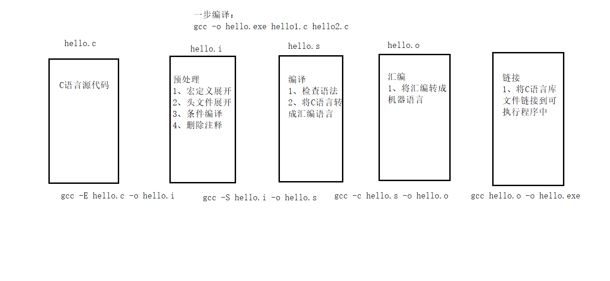
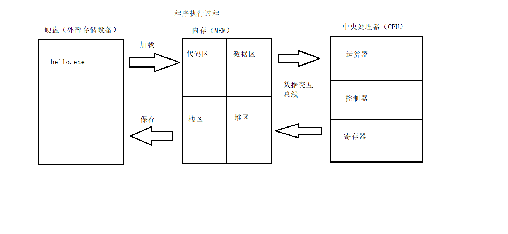
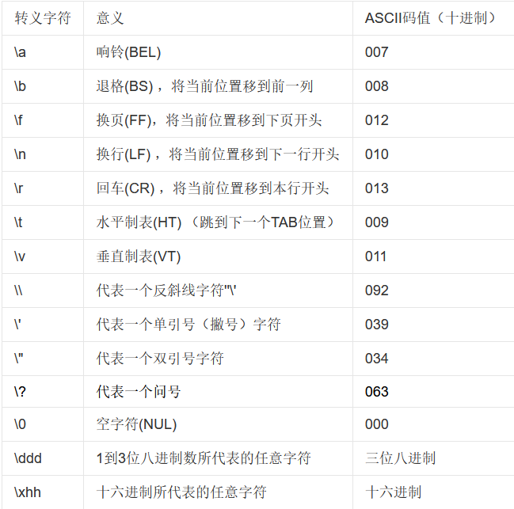
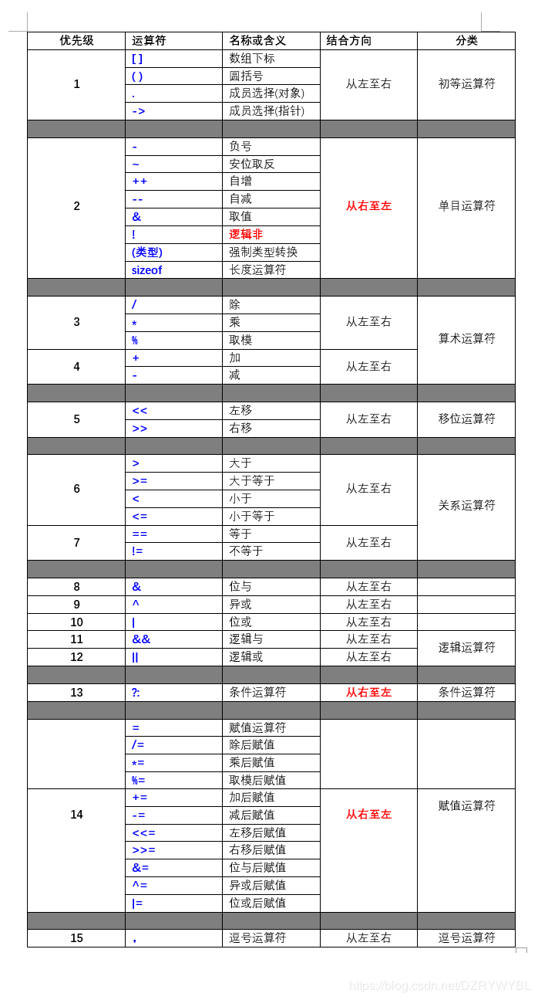
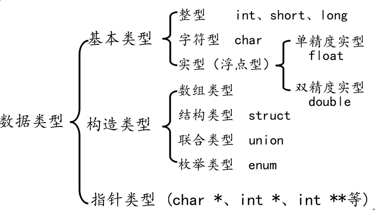
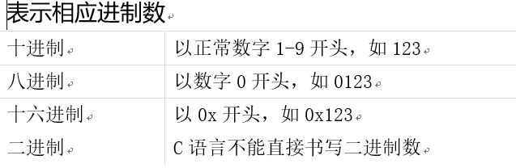

gcc编译过程与执行过程
-

* 1字节（byte） = 8位（bit）

转义字符
-

运算符优先级
-

整数类型
-

|类型|打印格式|存储大小|值范围|
|--- | --- | --- |---|
|char|%c|1字节|-128 到 127 或 0 到 255|  
|字符串|%s|||
|int|%d|4字节|-2147483648 到2147483647|
|short|%d|2字节|-32,768 到 32,767|
|long|%ld|4字节|-2,147,483,648 到 2,147,483,647|
|float|%f|4字节||
|dohble|%lf|8字节||
|unsigned int|%u|4字节|0到4294967295 |
|unsigned short|%hu|2字节|0到65535|
|unsigned long|%lu|4字节|0到4,294,967,295|

进制转换
-

`十进制转化二进制的方法：用十进制数除以2，分别取余数和商数，商数为0的时候，将余数倒着数就是转化后的结果。`   
`十进制的小数转换成二进制：小数部分和2相乘，取整数，不足1取0，每次相乘都是小数部分，顺序看取整后的数就是转化后的结果。`   
`十进制转化八进制的方法：
用十进制数除以8，分别取余数和商数，商数为0的时候，将余数倒着数就是转化后的结果。`  
`十进制转化十六进制的方法：
用十进制数除以16，分别取余数和商数，商数为0的时候，将余数倒着数就是转化后的结果。` 

字符串格式化输出和输入
-

    字符串是内存中一段连续的char空间，以'\0'(数字0)结尾。  
    字符串常量是由双引号括起来的字符序列
    字符串常量与字符常量的不同 
    输出   //输出字符串时只需要给出名字，不能带后边的[]
    puts()：输出字符串并自动换行，该函数只能输出字符串  
    printf()：通过格式控制符%s输出字符串，不能自动换行。除了字符串，printf() 还能输出其他类型的数据
    输入  
    scanf("%s",参数)：通过格式控制符%s输入字符串。除了字符串，scanf() 还能输入其他类型的数据,读取字符串时以空格为分隔，遇到空格就认为当前字符串结束了，所以无法读取含有空格的字符串
    gets()：直接输入字符串，并且只能输入字符串,认为空格也是字符串的一部分，只有遇到回车键时才认为字符串输入结束，所以，不管输入了多少个空格，只要不按下回车键，对 gets() 来说就是一个完整的字符串。换句话说，gets() 用来读取一整行字符串.

类型转换
-
转换的方法有两种
* 自动转换(隐式转换)：遵循一定的规则,由编译系统自动完成。
* 强制类型转换：把表达式的运算结果强制转换成所需的数据类型 ,可以使高类型转换成低类型，但可能会使精度降低。同时不会四舍五入。(相当于算完抹个0成整数)

类型转换的原则:占用内存字节数少(值域小)的类型，向占用内存字节数多(值域大)的类型转换，以保证精度不降低。  
 
强制转换:(要转换的类型) 表达式

函数
=
#include<>与#include ""区别

`<>表示系统直接按系统指定的目录检索
""表示系统先在 "" 指定的路径(没写路径代表当前路径)查找头文件，如果找不到，再按系统指定的目录检索`

程序结束后闪退

    头文件:#include<stdlib.h>
    文件结束:system("pause");

char    数据类型

    char输出%c时打印字符
        //getchar()是从标准输入设备读取一个char。
        输出%d时输出ASCII值
        //putchar()用于输出一个char。

平方根

    头文件:#include<math.h>
    应用:sqrt()

system("")  

    头文件：#include<stdlib.h>
    system("参数"); //参数为外部可执行程序  
    例如:system("1.c")  
         system("calc") //calc是windows内计算器
    
sizeof()  

    sizeof(参数)不是函数,不需要头文件,sizeof得到指定值占用内存的大小，单位：字节,参数可填数据类型或标识符。
    例如：int a=10;
         int arr=[1,2,3];
         char str[]="hello";
         int size_a = sizeof(a);
         int size_arr = sizeof(arr);
         int size_str = sizeof(str)
         printf("size_a=%d,size_arr=%d,size_str=%d\n,size_int=%d",size_a,size_arr,size_str,sizeof(int))
         结果为：size_a=4，size_arr=12，size_str=6,size_int=4;

float，double

    浮点型变量是用来存储小数数值的
    单精度浮点数(float)、 双精度浮点数(double)
    double型变量所表示的浮点数比 float 型变量更精确
    不以f结尾的常量是double类型，以f结尾的常量(如3.14f)是float类型

选择结构
-
if...else

    if(判定条件)   
    {   
        执行语句1
    }  
    else      //如果不符合判定条件则执行语句2
    {
        执行语句2
    } 

switch()....case

    switch(参数)
    {
        case'a':执行语句1；//如果参数等于a内，则执行语句1
        break;  //用于跳出循环体switch
        case'b':执行语句2;  //如果参数等于b内，则执行语句2
        break;
        case'c':执行语句3;  //如果参数等于c内，则执行语句3
        break;
        default:putchar('/a');  //如果参数不属于abc，则实行default:后表达式。
    }
`break 只能跳出一层循环。当有多层循环嵌套的时候，break只能跳出“包裹”它的最里面的那一层循环，无法一次跳出所有循环。`

循环结构
-

while /do...while

    while(循环条件)
    {
        循环操作；
    }
    
    do{
        循环操作；
    }
    while(循环条件)

`while和do..while区别`  
* while先判断后执行，do while先执行后判断
* 当不满足循环条件时，while循环一次都不会执行，do while循环至少执行一次

for (size_t i = 0; i < count; i++)
    {
        循环操作
    }

跳转语句
-
break  
* 当它出现在switch条件语句中时，作用是终止某个case并跳出switch结构。
* 当它出现在循环语句中，作用是跳出当前内循环语句，执行后面的代码
* 当它出现在嵌套循环语句中，跳出最近的内循环语句，执行后面的代码。

continue  
* 立即终止本次循环，并执行下一次循环

goto

    goto 标识符a;
    标识符a:表达式;
* 可以跳出多重循环,尽量少使用；

数组
- 

a[数组元素个数]={数组元素}
* 数组名字符合标识符的书写规定(数字、英文字母、下划线)
* 数组名不能与其它变量名相同，同一作用域内是唯一的
* 方括号[]中常量表达式表示数组元素的个数
* 定义数组时[]内最好是常量，使用数组时[]内即可是常量，也可以是变量

在定义数组的同时进行赋值，称为初始化。全局数组若不初始化，编译器将其初始化为零。局部数组若不初始化，内容为随机值。
    
    int a[10] = { 1, 2, 3, 4, 5, 6, 7, 8, 9, 10 };//定义一个数组，同时初始化所有成员变量
	int a[10] = { 1, 2, 3 };//初始化前三个成员，后面所有元素都设置为0
	int a[10] = { 0 };//所有的成员都设置为0
