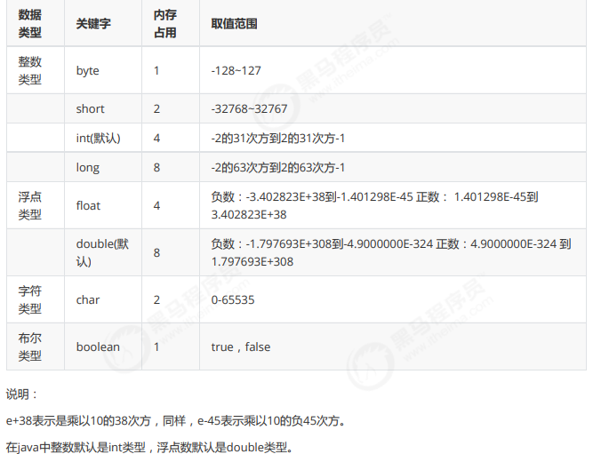

## 常量
常量:在程序运行过程中，其值不可以发生改变的量。  
Java中的常量分类：
* 字符串常量 用双引号括起来的多个字符（可以包含0个、一个或多个），例如"a"、"abc"、"中国"等
* 整数常量 整数，例如：-10、0、88等
* 小数常量 小数，例如：-5.5、1.0、88.88等
* 字符常量 用单引号括起来的一个字符，例如：'a'、'5'、'B'、'中'等
* 布尔常量 布尔值，表示真假，只有两个值true和false
* 空常量 一个特殊的值，空值，值为null  

除空常量外，其他常量均可使用输出语句直接输出

## 数据类型

## 变量
变量：在程序运行过程中，其值可以发生改变的量。  

变量注意事项

* 在同一对花括号中，变量名不能重复。
*  变量在使用之前，必须初始化（赋值）。
*  定义long类型的变量时，需要在整数的后面加L（大小写均可，建议大写）。因为整数默认是int类型，整数太
大可能超出int范围。
* 定义float类型的变量时，需要在小数的后面加F（大小写均可，建议大写）。因为浮点数的默认类型是
double， double的取值范围是大于float的，类型不兼容。

## 标识符
标识符：用户编程时使用的名字，用于给类、方法、变量、常量等命名

* 由字母、数字、下划线“_”、美元符号“$”组成，第一个字符不能是数字
* 不能使用java中的关键字作为标识符。
* 标识符对大小写敏感（区分大小写）
  
Java中标识符的命名约定：、
* 小驼峰式命名：变量名、方法名  
首字母小写，从第二个单词开始每个单词的首字母大写。
* 大驼峰式命名：类名  
每个单词的首字母都大写。

## 类型转换

### 自动类型转换
把一个表示数据范围小的数值或者变量赋值给另一个表示数据范围大的变量。这种转换方式是自动的，直接书写即
可。

        double a=10;
        System.out.println(a);

    输出：10.0

### 强制类型转换
把一个表示数据范围大的数值或者变量赋值给另一个表示数据范围小的变量。   

强制类型转换格式：目标数据类型 变量名 = (目标数据类型)值或者变量;

        //int k=1.1;
        int k=(int)1.1;
        System.out.println(k);

    输出：1

强制类型转换是由大转小，可能会造成数据丢失
