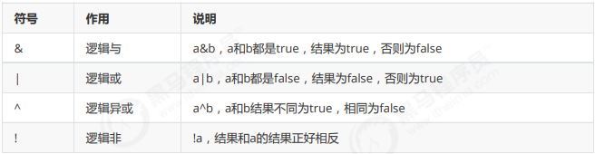
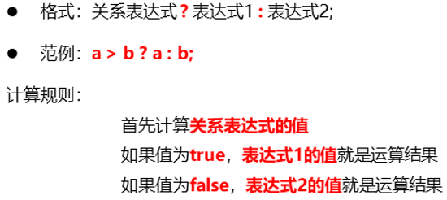

##  运算符

运算符：对常量或者变量进行操作的符号

###  算术运算符

        int a=8;
        int b=6;
        System.out.println(a+b);
        System.out.println(a-b);
        System.out.println(a*b);
        System.out.println(a/b);
        System.out.println(a%b);
        System.out.println((double)a/b);
      
    输出: 14
          2
          48  
          1
          2
          1.3333333333333333
/和%的区别：两个数据做除法，/取结果的商，%取结果的余数。  
整数操作只能得到整数，要想得到小数，必须有浮点数参与运算。

### 字符"+"操作

char类型参与算数运算，需要转换成ASCLL表的数字  

例如：  
'a' -- 97 a-z是连续的，所以'b'对应的数值是98，'c'是99，依次递加  
'A' -- 65 A-Z是连续的，所以'B'对应的数值是66，'C'是67，依次递加  
'0' -- 48 0-9是连续的，所以'1'对应的数值是49，'2'是50，依次递加

 
        int a=10;
        char b='a';//ASCLL中a为97
        System.out.println(a+b);

    输出:107

算术表达式中包含不同的基本数据类型的值的时候，整个算术表达式的类型会自动进行提升。  
提升规则：
* byte类型，short类型和char类型将被提升到int类型，不管是否有其他类型参与运算
* 整个表达式的类型自动提升到与表达式中最高等级的操作数相同的类型
* 等级顺序：byte,short,char --> int --> long --> float --> double

### 字符串"+"操作

当“+”操作中出现字符串时，这个”+”是字符串连接符，而不是算术运算。

注意：  

    System.out.println("ac"+6);//输出ac6
    System.out.println("ac"+6+6);//输出ac66
    System.out.println(6+6+"ac");//输出12ac
    
字符串"+"时为从左到右进行运算

### 赋值运算符

### 自增自减运算符

### 关系运算符

    int a = 10;
    int b = 20;
    System.out.println(a == b); // 输出false            
    System.out.println(a != b); // true
    System.out.println(a > b); // false
    System.out.println(a >= b); //false
    System.out.println(a < b); // true
    System.out.println(a <= b); // true
    // 关系运算的结果肯定是boolean类型，所以也可以将运算结果赋值给boolean类型的变量
    boolean flag = a > b;
    System.out.println(flag); // false

### 逻辑运算符

    int x = 3;
    int y = 4;
    System.out.println((x++ > 4) & (y++ > 5)); // 两个表达都会运算
    System.out.println(x); // 4
    System.out.println(y); // 5
    System.out.println((x++ > 4) && (y++ > 5)); // 左边已经可以确定结果为false，右边不参与运算
    System.out.println(x); // 4
    System.out.println(y); // 4

### 三元运算符

