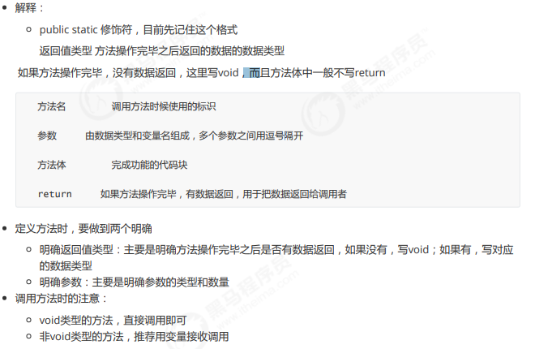
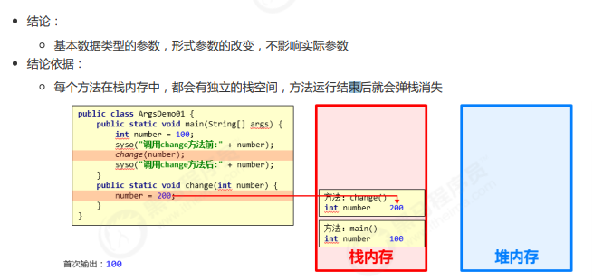

# 方法

## 方法概念

方法（method）是将具有独立功能的代码块组织成为一个整体，使其具有特殊功能的代码集

* 方法必须先创建才可以使用，该过程成为方法定义
* 方法创建后并不是直接可以运行的，需要手动使用后，才执行，该过程成为方法调用

### 方法的定义

格式

    public static void 方法名 ( ) {
    // 方法体;
    }

例

    public static void method ( ) {
    // 方法体;
    }

### 方法的调用

    方法名();

例

    method();

* 注意：
方法必须先定义，后调用，否则程序将报错

### 带参数方法定义和调用

定义格式：

参数：由数据类型和变量名组成 - 数据类型 变量名

    public static void 方法名 (参数1) {方法体;}
    public static void 方法名 (参数1, 参数2, 参数3...) {方法体;}

例：

    public static void isEvenNumber(int number){...}
    public static void getMax(int num1, int num2){...}

调用格式：

    方法名();

例：

    method();   

### 形参与实参

形参：方法定义中的参数  

变量定义的格式，由数据类型与变量名组成  
例如：

    public static void method(int number){...}
    中的int number

实参：就是传给方法调用的参数  
变量或常量 不带数据类型  
例如： 

    method(10)
    method(number)

### 带参数返回值定义与调用

定义格式

    public static 数据类型 方法名 ( 参数 )        //这里的数据类型必须与返回值的类型相同
    {return 数据 ;}

例：

    public static int getMax( int a, int b ) {
    return 100 ;
    }

调用

    方法名 ( 参数 ) ;           //这种一般无意义
    数据类型 变量名 = 方法名 ( 参数 ) ;    //常用方法，使用一个值来接受方法的返回值

例

    isEvenNumber ( 5 ) ;
    boolean flag = isEvenNumber ( 5 );

定义与调用举例

    public static void main(String[] args) {
        Scanner max=new Scanner(System.in);
        int a=max.nextInt();
        int b=max.nextInt();
        int c=getmax(a,b);  //getmax这时候就等于返回的值
        System.out.println(c);
    }
    public  static  int getmax(int a,int b){
        if(a>b)
            return a;
        else
            return b;
    }

## 方法重载

**概念**

方法重载就是一个类下有多个相同名字的方法，但方法之间形参不同，调用这些相同名字的方法时，会根据形参来判断使用哪一个方法

具有以下特点：
* 多个方法在同一个类中  
* 多个方法具有相同的方法名
* 多个方法的参数不相同

例：

    public static void main(String[] args) {
        double sum=sum(1.1 ,2 );    //调用方法时会自动选择方法名相同并可以使用的方法
        System.out.println(sum);    //这时候就会调用sum(double a,double b)这个方法

    }

    public static int sum(int a,int b) {
        return a+b;
    }
    public static double sum(double a,double b) {
        return a+b;
    }
    public static int sum(int a,int b,int c) {
        return a+b+c;
    }

### 方法参数传递基本类型（理解）

- main()函数中调用方法，方法会有一个独立的栈空间，方法中给形参赋值当方法结束时除了返回值都会弹栈消失
- 也就是说方法中给形参赋的值只在方法内有用

例

    public static void main(String[] args) {
    int number = 100;
    System.out.println("调用change方法前：" + number);      //100
    change(number);
    System.out.println("调用change方法后：" + number);      //100
    }
    public static void change(int number) {
    number = 200;
    }

### 方法参数传递引用类型（理解）

- 方法中对于引用类型的调用会影响到实际参数，因为引用类型指代的是地址
- 比如数组，改变数组中的参数会影响到方法外main()函数中的参数

例

    public class ArgsDemo02 {
    public static void main(String[] args) {
    int[] arr = {10, 20, 30};
    System.out.println("调用change方法前：" + arr[1]);  //20    
    change(arr);
    System.out.println("调用change方法后：" + arr[1]);  //200
    }
    public static void change(int[] arr) {
    arr[1] = 200;
    }

引用了地址，change方法内没有改变栈内存地址，改变的是地址内堆内存的值