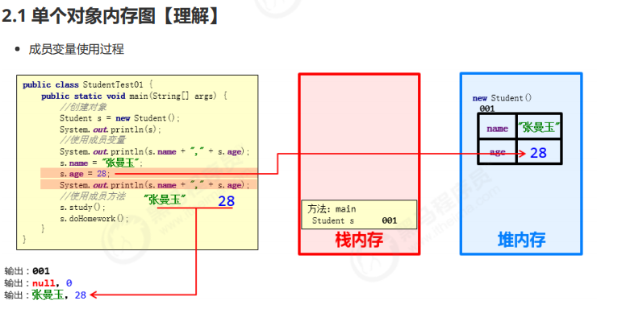
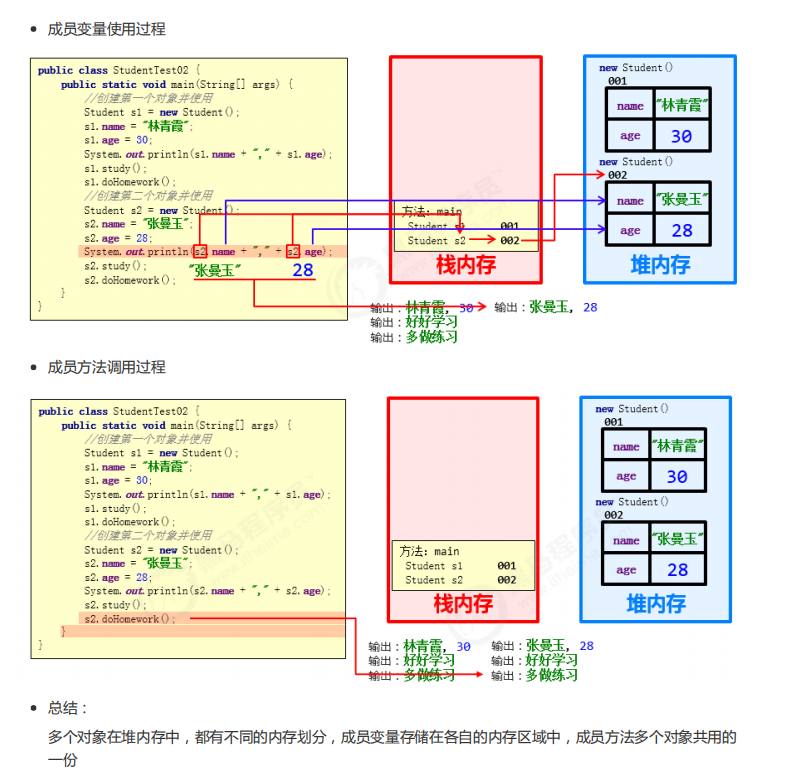

## 类的使用

类的组成是由属性和行为两部分组成

- 属性：在类中通过成员变量来体现（类中方法外的变量） //数据类型 变量名;
- 行为：在类中通过成员方法来体现（和前面的方法相比去掉 static 关键字即可） // public void 方法名(){}

类的定义步骤：

1. 定义类
2. 编写类的成员变量
3. 编写类的成员方法

类的定义

    class 类名{
        数据类型 变量1;
        数据类型 变量2；        //成员变量
        方法1;
        返回类型 方法名(){      //成员方法

        }
    }

    class Phone {
        //成员变量
        String brand;
        int price;
        //成员方法
        void call() {
            System.out.println("打电话");
            }
        void sendMessage() {
            System.out.println("发短信");
            }
    }

## 对象的使用

要想调用其他类，需要先创建一个对象

- 创建对象的格式
  - 类名 对象名=new 类名();
- 调用成员格式
  - 对象名.成员变量
  - 对象名.成员方法();

格式

    创建对象
        格式：类名 对象名 = new 类名();
        范例：Phone p = new Phone();
    使用对象
        1：使用成员变量
            格式：对象名.变量名
            范例：p.brand
        2：使用成员方法
            格式：对象名.方法名()
            范例：p.call()

    public class PhoneDemo {
        public static void main(String[] args) {
            //创建对象
            Phone p = new Phone();
            //使用成员变量
            System.out.println(p.brand);    //null
            System.out.println(p.price);    //0
            p.brand = "小米";
            p.price = 2999;
            System.out.println(p.brand);    //小米
            System.out.println(p.price);    //2999
            //使用成员方法
            p.call();   //打电话
            p.sendMessage();    //发短信
        }
    }

**说明**：可以理解类里面是对象的一些属性参数，在main()函数中调用对象，就可以说是在使用这个类中的参数

## 对象的常见使用问题

**备注**：当使用同一个类创建多个对象时，每个对象都会单独开辟一个堆内存空间，这些对象之间空间互不干扰，但如果有个 B 对象指向 A 对象，那么也就时说 B 对象此时就指向的 A 对象空间

- 对象内存图

- 多个对象内存图

- 多个对象指向同一内存图
  
