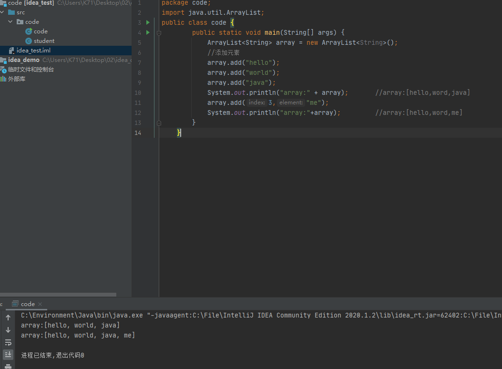
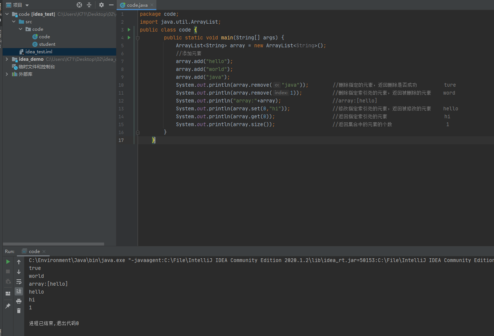

## ArrayList

软件包为java.util包下

    import java.util.ArrayList

Class Arraylist<E>      // E:为列表中元素的类型

Arraylist<E>
* 可调节大小的数组实现 
* <E>:特殊数据类型---泛型

|方法|说明|
|--|--|
|public ArrayList()|创建一个空的集合对象|
|public boolean remove(Object o)|删除指定的元素，返回删除是否|
|public E remove(int index)|删除指定索引处的元素，返回被删除的|
|public E set(int index,E element)|修改指定索引处的元素，返回被修改的元素|
|public E get(int index)|public E get(int index) 返回指定索引处的元素|
|public int size()|返回集合中的元素的个数|
|public boolean add(E e)|将指定的元素追加到此集合的末尾|
|public void add(int index,E element)|在此集合中的指定位置插入指定的元素|

### ArrayList类常用方法

创建与添加

    public class code {
        public static void main(String[] args) {
            ArrayList<String> array = new ArrayList<String>();  //创建一个Arraylist集合array，存储String类型
            //添加元素
            array.add("hello");
            array.add("world");
            array.add("java");
            System.out.println("array:" + array);       //array:[hello,word,java]
            array.add(3,"me");                          //在选定位置修改字符串
            System.out.println("array:"+array);         //array:[hello,word,me]
        }
    }

    package code;
    import java.util.ArrayList;
    public class code {
            public static void main(String[] args) {
                ArrayList<String> array = new ArrayList<String>();  
                //添加元素
                array.add("hello");
                array.add("world");
                array.add("java");
                System.out.println(array.remove("java"));        //删除指定的元素，返回删除是否成功         ture
                System.out.println(array.remove(1));          //删除指定索引处的元素，返回被删除的元素    word
                System.out.println("array:"+array);                 //array:[hello]
                System.out.println(array.set(0,"hi"));              //修改指定索引处的元素，返回被修改的元素    hello
                System.out.println(array.get(0));                   //返回指定索引处的元素                   hi
                System.out.println(array.size());                   //返回集合中的元素的个数                  1
            }
        }

### 字符串遍历

    public class code {
        public static void main(String[] args) {
            ArrayList<String> arrayList=new ArrayList<>();
            arrayList.add("hello");
            arrayList.add("word");
            arrayList.add("arraylist");
            for (int i=0;i<arrayList.size();i++){
                String s=arrayList.get(i);  //可以直接输出，这一步为了拿到字符串后其他操作
                System.out.println(s);
            }
        }
    }