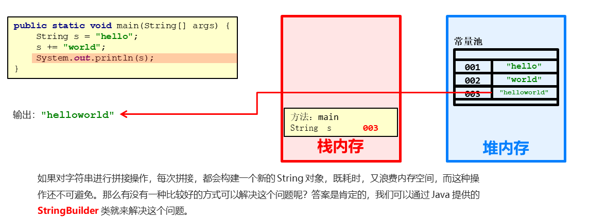

##  StringBuilder类

String类型字符串如果要赋值例如

    String s="hello";
    s+="word";
    System.out.println(s);  //helloword

这样拼接字符串时s时，堆内存会创建三个地址空间，分别为hello,word,和拼接完成后的helloword创建空间

## StringBuilder定义

|方法名|说明|
|--|--|
|public StringBuilder()|创建一个空白可变字符串对象，不含有任何内容|
|public StringBuilder(String str)|根据字符串的内容，来创建可变字符串对象|

    public class StringBuilderDemo01 {
            public static void main(String[] args) {
        
                //public StringBuilder()：创建一个空白可变字符串对象，不含有任何内容
                StringBuilder sb = new StringBuilder();
                System.out.println("sb:" + sb);     //sb:
                //这时sb没有赋值，所以为0；

                //public StringBuilder(String str)：根据字符串的内容，来创建可变字符串对象
                StringBuilder sb2 = new StringBuilder("hello");
                System.out.println("sb2:" + sb2);      //sb:hello
                //赋值为heollo

            }
        }

## StringBuilder拼接与反转

|方法名|说明|
|--|--|
|public StringBuilder append(任意类型)|添加数据，并返回对象|
|public StringBuilder reverse()|返回相反的字符序列|

    public class StringBuilderDemo01 {
        public static void main(String[] args) {
            //创建对象
            StringBuilder sb = new StringBuilder();
            //public StringBuilder append(任意类型)：添加数据，并返回对象本身
            // StringBuilder sb2 = sb.append("hello");
            //
            // System.out.println("sb:" + sb);
            // System.out.println("sb2:" + sb2);
            // System.out.println(sb == sb2);
            // sb.append("hello");
            // sb.append("world");
            // sb.append("java");
            // sb.append(100);      //拼接字符串
            //链式编程
            sb.append("hello").append("world").append("java").append(100);
            System.out.println("sb:" + sb);     //hellowordjava100
            //public StringBuilder reverse()：返回相反的字符序列
            sb.reverse();           //这个用于翻转字符串
            System.out.println("sb:" + sb);       //001avajdlowolleh
        }
    }

### String与StringBuilder相互转化

* StringBuilder转换为String
  * public String toString()：通过 toString() 就可以实现把 StringBuilder 转换为 String
* String转换为StringBuilder
    * public StringBuilder(String s)：通过构造方法就可以实现把 String 转换为 StringBuilder

例

    public class StringBuilderDemo02 {
        public static void main(String[] args) {

            //StringBuilder 转换为 String
            StringBuilder sb = new StringBuilder();
            sb.append("hello");                         //定义一个StringBuilder为sb
            String s = sb.toString();                   //使用toString转化sb
            System.out.println(s);  

            //String 转换为 StringBuilder
            String s="hello"                            //定义一个String为s
            StringBuilder sb = new StringBuilder(s);    //定义一个StringBuilder将s放入
            System.out.println(sb);
        }
    }

字符串反转升级版

定义一个方法，实现字符串反转。键盘录入一个字符串，调用该方法后，在控制台输出结果
例如，键盘录入abc，输出结果 cba

    1:键盘录入一个字符串，用 Scanner 实现
    2:定义一个方法，实现字符串反转。返回值类型 String，参数 String s
    3:在方法中用StringBuilder实现字符串的反转，并把结果转成String返回
    4:调用方法，用一个变量接收结果
    5:输出结果

    public class StringBuilderTest02 {
        public static void main(String[] args) {
            Scanner sc = new Scanner(System.in);    //键盘录入一个字符串，用 Scanner 实现
            System.out.println("请输入一个字符串：");
            String s = myReverse(line);             //调用方法，用一个变量接收结果
            System.out.println("s:" + s);
        }

        public static String myReverse(String s) {
            return new StringBuilder(s).reverse().toString();、
            //在方法中用StringBuilder实现字符串的反转，并把结果转成String返回
            //给的s是String类型，先用new.StringBuilder(s)转换成StringBuidler类型使用
            //.reverse()用于反转.
            //toString()用于转化为String类型适配返回值
            }
}