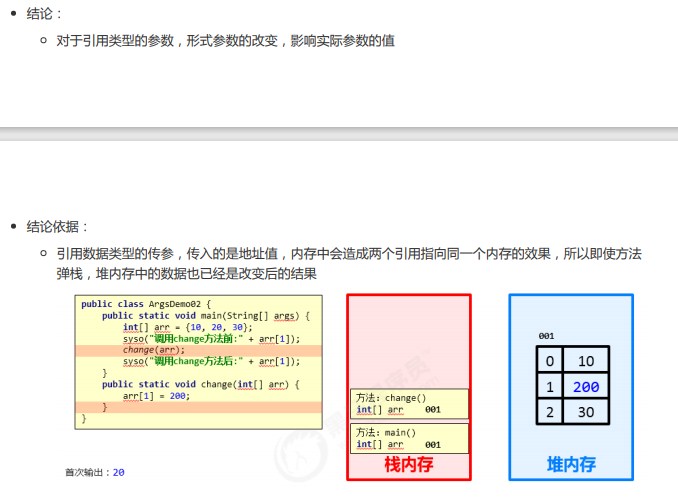

# 方法

## 方法概念

方法（method）是将具有独立功能的代码块组织成为一个整体，使其具有特殊功能的代码集

* 方法必须先创建才可以使用，该过程成为方法定义
* 方法创建后并不是直接可以运行的，需要手动使用后，才执行，该过程成为方法调用

### 方法的定义

格式

    public static void 方法名 ( ) {
    // 方法体;
    }

例

    public static void method ( ) {
    // 方法体;
    }

### 方法的调用

    方法名();

例

    method();

* 注意：
方法必须先定义，后调用，否则程序将报错

### 带参数方法定义和调用

定义格式：

参数：由数据类型和变量名组成 - 数据类型 变量名

    public static void 方法名 (参数1) {方法体;}
    public static void 方法名 (参数1, 参数2, 参数3...) {方法体;}

例：

    public static void isEvenNumber(int number){...}
    public static void getMax(int num1, int num2){...}

调用格式：

    方法名();

例：

    method();   

### 形参与实参

形参：方法定义中的参数  

等同于变量定义格式，由数据类型与变量名组成  
例如：

    public static void method(int number){...}
    中的int number

实参：就是调用的参数  
等同于使用变量或常量 不带数据类型  
例如： 

    method(10}  
    method(number)

输入数求最大

    public static void getmax(int a,int b) {
        if(a>b)
        {System.out.println(a);}else
        {System.out.println(b);}
    }
    public static void main(String[] args) {
        Scanner max = new Scanner(System.in);
        int a=max.nextInt();
        int b=max.nextInt();
        getmax(a,b);
    }

### 带参数返回值定义与调用

定义格式

    public static 数据类型 方法名 ( 参数 ) 
    {return 数据 ;}

例

    public static boolean isEvenNumber( int number ) {
    return true ;
    }
    public static int getMax( int a, int b ) {
    return 100 ;
    }

* 方法定义时return后面的返回值与方法定义上的数据类型要匹配，否则程序将报错

调用

    方法名 ( 参数 ) ;
    数据类型 变量名 = 方法名 ( 参数 ) ;

例

    isEvenNumber ( 5 ) ;
    boolean flag = isEvenNumber ( 5 );

定义与调用举例

    public static void main(String[] args) {
        Scanner max=new Scanner(System.in);
        int a=max.nextInt();
        int b=max.nextInt();
        int c=getmax(a,b);  //getmax这时候就等于返回的值
        System.out.println(c);
    }
    public  static  int getmax(int a,int b){
        if(a>b)
            return a;
        else
            return b;
    }

### 方法注意事项

1. 方法不能嵌套定义
2. void表示无返回值，可以省略return，也可以单独的书写return，后面不加数据

### 方法通用格式

格式:

    public static 返回值类型 方法名(参数) {
    方法体;
    return 数据 ;
    }

### 方法重载

概念

方法重载指同一个类中定义的多个方法之间的关系，满足下列条件的多个方法相互构成重载

* 多个方法在同一个类中  
* 多个方法具有相同的方法名
* 多个方法的参数不相同

注意

* 重载仅对应方法的定义，与方法的调用无关，调用方式参照标准格式
* 重载仅针对同一个类中方法的名称与参数进行识别，与返回值无关，换句话说不能通过返回值来判定两
个方法是否相互构成重载

例：

    public static void main(String[] args) {
        double sum=sum(1.1 ,2 );    //调用方法时会自动选择方法名相同并可以使用的方法
        System.out.println(sum);

    }

    public static int sum(int a,int b) {
        return a+b;
    }
    public static double sum(double a,double b) {
        return a+b;
    }
    public static int sum(int a,int b,int c) {
        return a+b+c;
    }

### 方法参数传递基本类型（理解）

例

    public static void main(String[] args) {
    int number = 100;
    System.out.println("调用change方法前：" + number);      //100
    change(number);
    System.out.println("调用change方法后：" + number);      //100
    }
    public static void change(int number) {
    number = 200;
    }

### 方法参数传递引用类型（理解）

例

    public class ArgsDemo02 {
    public static void main(String[] args) {
    int[] arr = {10, 20, 30};
    System.out.println("调用change方法前：" + arr[1]);  //20    
    change(arr);
    System.out.println("调用change方法后：" + arr[1]);  //200
    }
    public static void change(int[] arr) {
    arr[1] = 200;
    }

引用了地址，change方法内没有改变栈内存地址，改变的是地址内堆内存的值