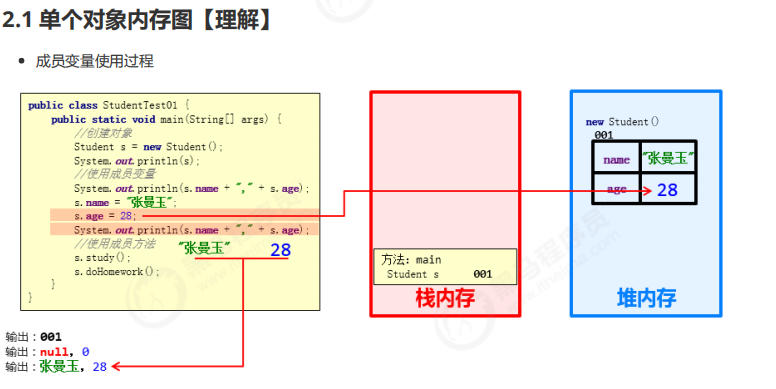
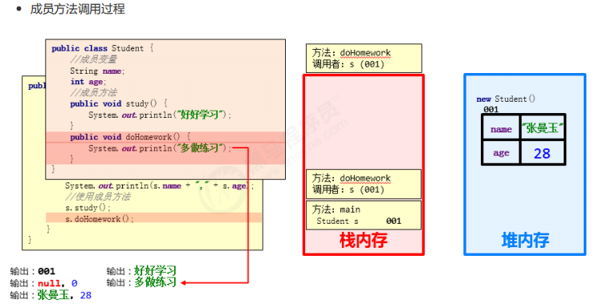
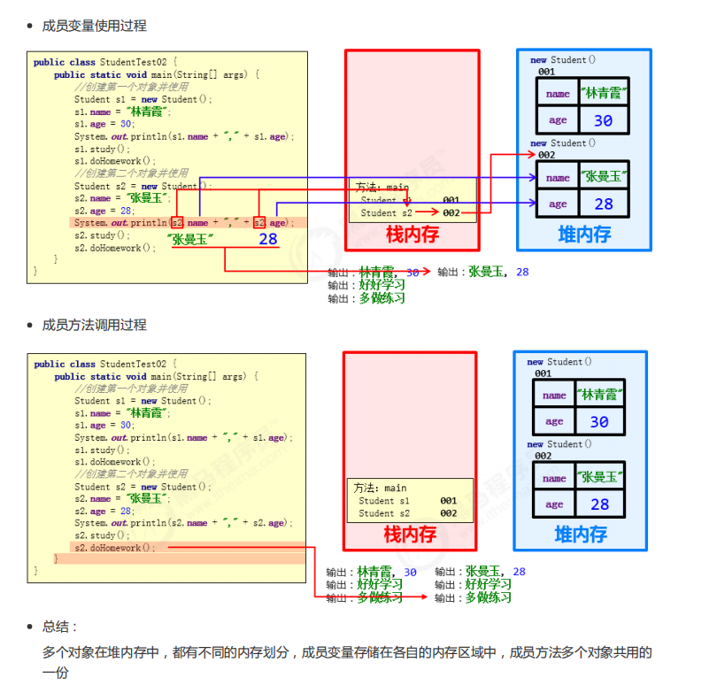
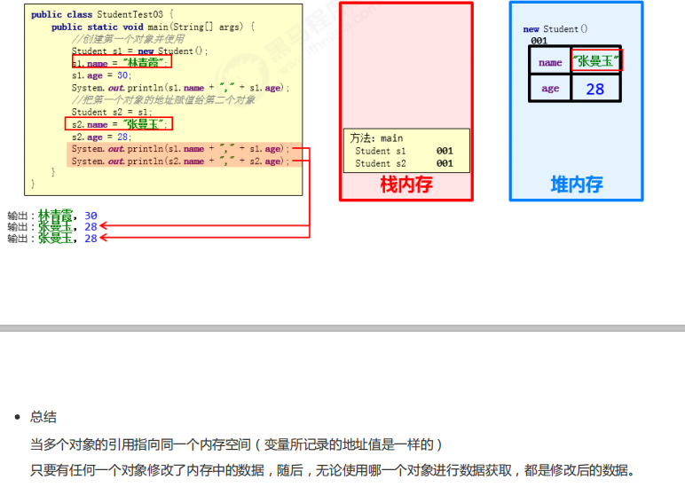

## 类的使用

类的组成是由属性和行为两部分组成
* 属性：在类中通过成员变量来体现（类中方法外的变量）
* 行为：在类中通过成员方法来体现（和前面的方法相比去掉static关键字即可）

类的定义步骤：
1. 定义类
2. 编写类的成员变量
3. 编写类的成员方法

类的定义

    public class 类名{
        数据类型 变量1; 
        数据类型 变量2；        //成员变量
        方法1;
        方法2;                 //成员变量
    }

    public class Phone {
        //成员变量
        String brand;
        int price;
        //成员方法
        public void call() {
            System.out.println("打电话");
            }
        public void sendMessage() {
            System.out.println("发短信");
            }
    }

## 对象的使用

* 创建对象的格式
   * 类名 对象名=new 类名();
* 调用成员格式
  * 对象名.成员变量
  * 对象名.成员方法();

格式

    创建对象
        格式：类名 对象名 = new 类名();
        范例：Phone p = new Phone();
    使用对象
        1：使用成员变量
            格式：对象名.变量名
            范例：p.brand
        2：使用成员方法
            格式：对象名.方法名()
            范例：p.call()

    public class PhoneDemo {
        public static void main(String[] args) {
            //创建对象
            Phone p = new Phone();
            //使用成员变量
            System.out.println(p.brand);    //null
            System.out.println(p.price);    //0
            p.brand = "小米";
            p.price = 2999;
            System.out.println(p.brand);    //小米  
            System.out.println(p.price);    //2999
            //使用成员方法
            p.call();   //打电话    
            p.sendMessage();    //发短信
        }
    }

## 对象内存图

### 多个对象内存图

### 多个对象指向想用内存图
