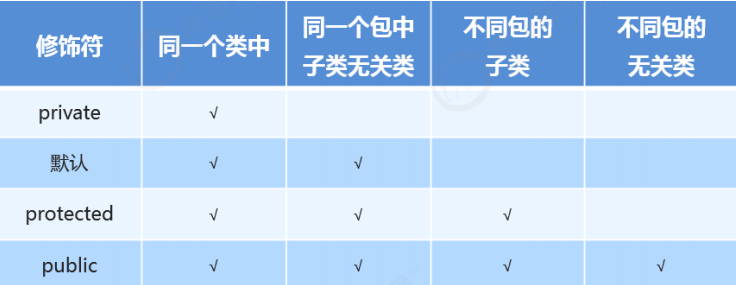

## 修饰符

### package

* package是指包，包就是文件夹，用于管理类文件
* 包的定义格式
  * package 包名;(多级包用.分开)
  * 例如：package com.heima.demo;
* 带包编译&带包运行
  * 带包编译：javac –d . 类名.java
    * 例如：javac -d . com.heima.demo.HelloWorld.java
  * 带包运行：java 包名+类名
    * 例如：java com.heima.demo.HelloWorld

### import

* 导包
  * 当要使用在不同包下的类时，要将类的路径写全，简化操作，在包的开始就将其他包导入，
* 导包格式
  * 格式：import 包名;
  * 例如：import java.util.Scanner;

例如

    package Code
    import java.util.Scanner;       //这一步就是将Scanner包导入

    public class Demo{
        public static void main(String[] args){
            //java.util.Scanner sc = new java.util.Scanner(System.in); //如果上面没有导包则需要这样写
            Scanner sc=new Scanner(System.in);
        }
    }

### 权限修饰符

用以上几个权限修饰符创建的方法

    private void show1(){}
    这个只能在同一个类中才能使用

    void show2(){}
    这个只能在同一个包中使用

    protected void show3(){}
    这个可以在不同包下有联系的子类中使用(导包后继承)

    public void show4(){}
    这个可以在不同包下没关系的类中使用(导包后没有继承)

### final

* fianl关键字的作用
  * final代表最终的意思，可以修饰成员方法，成员变量，类
* final修饰类、方法、变量的效果
  * fianl修饰类：该类不能被继承（不能有子类，但是可以有父类）
  * final修饰方法：该方法不能被重写
  * final修饰变量：表明该变量是一个常量，不能再次赋值

final修饰局部变量
* fianl修饰基本数据类型变量
  * final 修饰指的是基本类型的数据值不能发生改变
* final修饰引用数据类型变量
  * final 修饰指的是引用类型的地址值不能发生改变，但是地址里面的内容是可以发生改变的   
  
 例

    public static void main(String[] args){
        final Student s = new Student(23);
        s = new Student(24);    //s有final，无法重新给s定义一个地址，这是错误的
    }

###  static

static关键字是静态的意思，可以修饰成员方法，成员变量

* static修饰的特点
  * 被类的所有对象共享，这也是我们判断是否使用静态关键字的条件
  * 可以通过类名调用当然，也可以通过对象名调用(推荐使用类名调用)

例：

    public class Student {
        public String name; //姓名
        public int age; //年龄
        public static String university; //学校 共享数据！所以设计为静态！
        public void show() {
            System.out.println(name + "," + age + "," + university);
        }
    }

    public class StaticDemo {
        public static void main(String[] args) {
            // 为对象的共享数据赋值
            Student.university = "123大学";
            Student s1 = new Student();
            s1.name = "321";
            s1.age = 30;
            s1.show();
            Student s2 = new Student();
            s2.name = "456";
            s2.age = 33;
            s2.show();
        }
    }

这个例子中university在Student类中被static修饰了，在下面s1中被赋值"123大学"，在s2中则不需要再赋值

### static访问特点

* 非静态的成员方法
  * 能访问静态的成员变量
  * 能访问非静态的成员变量
  * 能访问静态的成员方法
  * 能访问非静态的成员方法
* 静态的成员方法
  * 能访问静态的成员变量  
  * 能访问静态的成员方法

总结：  
    被static的成员变量方法可以被任何方法成员方法访问，但只能访问同被static修饰的成员