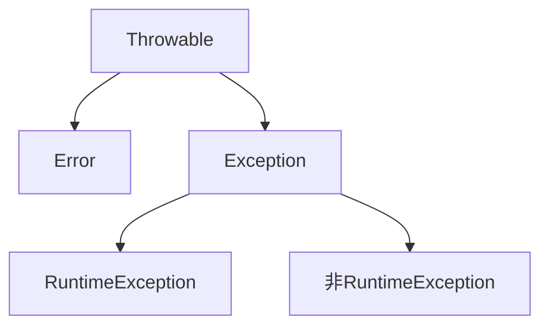

## 异常

异常：就是程序出现不正常的情况

Error：严重问题，不需要处理
Exception：异常类，程序本身可以处理的问题

- RuntimeException：编译期间不检查，出现问题，需要回来修改
- 非 RuntimeException：编译期间就需要处理，否则无法通过编译，不能正常运行

### Throwable

| 方法名                         | 说明                                          |
| ------------------------------ | --------------------------------------------- |
| public Stirng getMessage()     | 返回此 throwable 的详细消息字符串（异常原因） |
| public Stirng toString()       | 返回此可抛出的简短描述 (异常原因和异常类名)   |
| public void print StackTrace() | 把异常的错误信息输出在控制台(异常原因,异常类名,异常位置)                  |

### 异常处理

当遇到异常的时候系统会执行默认操作

- 将异常名称，原因和出现位置输出控制台
- 程序停止运行

除了系统默认处理方式，还可以自行处理

#### Try...catch...

    try{
        可能出现异常的代码
    }catch(异常类名 变量名){
        异常的处理代码
    }

    // 程序冲try执行
    // 出现异常，自动生成一个异常类对象，并提交给java运行时系统
    // java接收岛异常对象时，到catch中寻找匹配的异常类，找到后进行异常的处理，
    // 执行完毕后，程序可以继续往下执行
