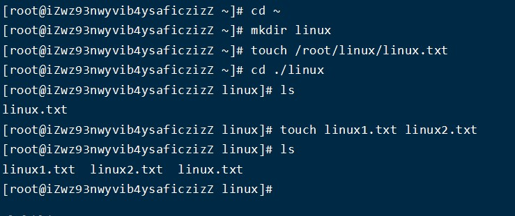

## 目录管理

    ls: 列出目录

    cd：切换目录

    pwd：显示目前的目录

    mkdir：创建一个新的目录

    rmdir：删除一个空的目录

    cp: 复制文件或目录

    rm: 移除文件或目录

    mv: 移动文件与目录，或修改文件与目录的名称

### 列出目录

    语法：ls 选项 路径
    可选项
        -l:表示list，表示以详细列表的形式进行展示
        -a:表示显示所有的文件/文件夹（包含了隐藏文件/文件夹）

- -l 详细显示中,第 1 位字母为文件类型，其中“-”表示普通文件，“d”表示文档类型为文件夹，"l"为链接,"b"块设备文件,"p"管道文件,"c"字符设备文件,例如键盘鼠标。"s"套接口文件
- 后面三组 rwx 中"r"为可读，"w"为可写,"x"为可执行。第 2-4 位(user)表示这个文件的属主拥有的权限，第 5-7 位(group)表示和这个文件属主所在同一个组的用户所具有的权限，第 8-10 位(other)表示其他用户所具有的权限
- ls 列出的结果颜色说明，其中蓝色的名称表示文件夹，青色的表示文件，绿色的其权限为拥有所有权限。

### 切换目录

    切换当前路径
    语法：#cd 路径
        cd ~    当前用户的家目录
        cd ..   回到上一级目录
        cd /    回到根目录

### 显示目前的目录

- 打印当前工作目录

### 创建文件夹

    语法：#mkdir 选项 路径
    选项：-p：一次性创建多层不存在的目录的时候

  **说明**: mkdir 可以-p 直接创建一条路径，也可以一个目录下以空格区分创建多个文件夹

### 删除文件夹

    语法：rmdir
        可选项：-p 删除不为空的目录

### 复制文件/文件夹到指定位置

      语法：#cp 被复制的文档路径 文档被复制到的路径
      选项:“-r”文件夹复制操作的时候需要添加
  *Linux 在复制过程中是可以重新对新位置的文件进行重命名的*

### 移动文件/文件夹

    语法：#mv 需要移动的文档路径 需要保存的位置路径
        可选项
            -f 强制
            -u 只替换已经更新过的文件

_在 Linux 中重命名的命令也是 mv，语法和移动语法一样_

### 创建文件

    语法：#touch 文件路径(可以是文件名，也可以是文件路径)

### 删除文件

    语法：#rm 选项 需要移除的文档路径
        选项：
        -f：force，强制删除，不提示是否删除
        -r：表示递归
        -i：删除询问是否删除