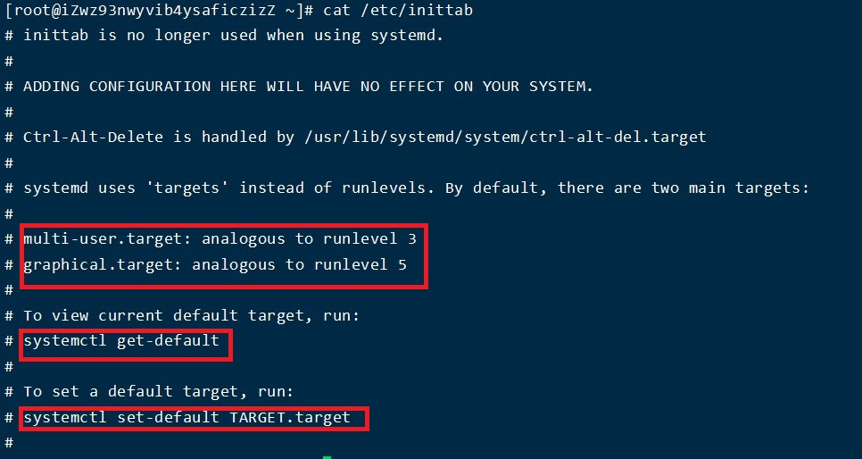

Linux自有服务
=
linux运行模式 
-
在linux使用ps -ef|grep init查看  
该进程存在一个对应的配置文件:inittab(系统运行级别配置文件，位置/etc/inittab)

linux共有7种运行级别  
* 0—表示关机级别(不要将默认的级别设置成这个级别)
* 1—单用户模式
* 2—多用户模式，不带NFS(Network File System)
* 3—多用户模式，完全的多用户模式
* 4—没有被使用的模式
* 5—X11，完整的图形化界面模式
* 6—表示重启级别(不要将默认的级别设置成这个级别)

相关的命令
* #init 0 关机
* #init 3 切换到终端界面
* #init 5 切换到图形界面
* #init 6 重启电脑

查看当前模式id   
`#runlevel`  
切换当前运行模式  
`#init id`  
查看当前启动模式  
`#systemctl get-default`  
修改开机启动模式  
`#systemctl get-default 命令启动的语句`  
例如:  
`systemctl set-default multi-user.target `

inittab文件

添加用户

    #useradd 选项 用户名
    选项：
	    -g：表示指定用户的用户主组，选项的值可以是用户组的id，也可以是组名
	    -G：表示指定用户的用户附加组，选项的值可以是用户组的id，也可以是组名
	    -u：uid，用户的id（用户的标识符），系统默认会从500之后按顺序分配uid，如果不想使用系统分配的，可以通过该选项自定义
	    -c comment：添加注释
验证是否成功：
* 验证/etc/passwd的最后一行，查看是否有zhangsan的信息；
* 验证是否存在家目录（在Centos下创建好用户之后随之产生一个同名家目录）

在不添加选项的时候，执行useradd之后会执行一系列的操作  
1. 创建同名的家目录；
2. 创建同名的用户组；

修改用户

    #usermod 选项 用户名
    Usermod：user modify，用户修改
    选项：
	    -g：表示指定用户的用户主组，选项的值可以是用户组的id，也可以是组名
	    -G：表示指定用户的用户附加组，选项的值可以是用户组的id，也可以是组名
	    -u：uid，用户的id（用户的标识符），系统默认会从500之后按顺序分配uid，如果不想使用系统分配的，可以通过该选项自定义
	    -l：修改用户名

设置密码

	#passwd 用户名

切换用户命令

	#su 用户名
**如果用户名不指定则表示切换到root用户**

删除用户

	#userdel 选项 用户名
	选项：
		-r：表示删除用户的同时，删除其家目录
**已经登录的用户删除的时候提示删除失败，但是没有登录的用户可以正常删除,可以kill对应用户的全部进程**

用户组管理

网络设置
=
网卡配置文件位置：/etc/sysconfig/network-scripts

* ONBOOT：是否开机启动
* BOOTPROTO：ip地址分配方式，DHCP表示动态主机分配协议
* HWADDR：硬件地址，MAC地址

重启网卡  
#service network restart

临时单个网卡  
* 停止某个网卡：#ifdown 网卡名
* 开启某个网卡：#ifup 网卡名  
例如：需要停止-启动（重启）eth0网卡，则可以输入  
#ifdown eth0  
#ifup eth0
