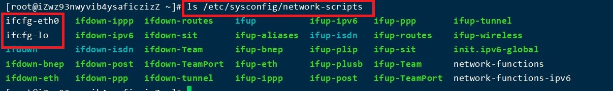
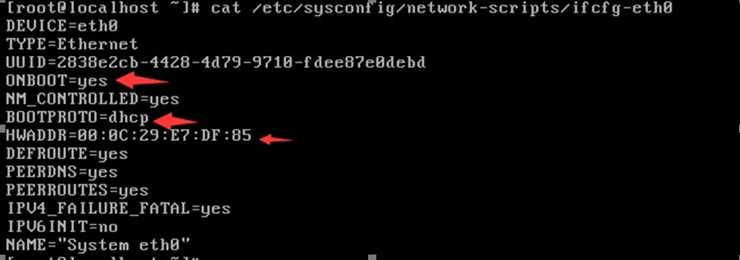
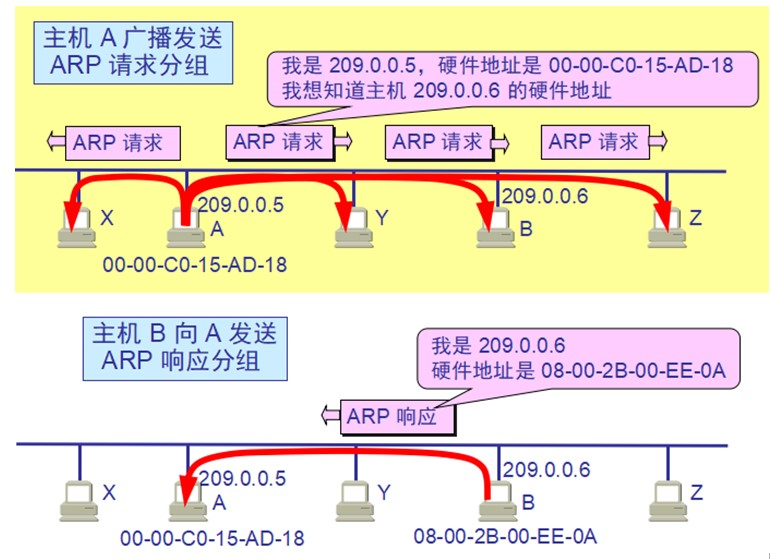

## Linux网络

### 网络设置

网卡配置文件位置：/etc/sysconfig/network-scripts

* ONBOOT：是否开机启动
* BOOTPROTO：ip地址分配方式，DHCP表示动态主机分配协议
* HWADDR：硬件地址，MAC地址

### 查看网络接口属性

    ipconfig
        后可接网卡例如eth0来单独查看    

### 查看路由表

    route 
        可选
            -n  解析域名

### 查看端口

    netstart
        选项
            -a (all)显示所有选项，默认不显示LISTEN相关
            -t (tcp)仅显示tcp相关选项
            -u (udp)仅显示udp相关选项
            -n 拒绝显示别名，能显示数字的全部转化成数字。
            -l 仅列出有在 Listen (监听) 的服務状态
            -p 显示建立相关链接的程序名
            -r 显示路由信息，路由表
            -e 显示扩展信息，例如uid等
            -s 按各个协议进行统计
            -c 每隔一个固定时间，执行该netstat命令。
    常用
            -lntp   产看所有监听端口
            -antp   查看已经建立的tcp链接
            -lutp   查看TCP/UDP状态信息

### 网卡

    ifup [网卡]     启用网卡
    ifdown [网卡]   关闭网卡

### 测当前主机与目标主机之间的连通性（不是100%准确，有的服务器是禁ping）

    语法：#ping 主机地址（ip地址、主机名、域名等）

### 表示查看网络的连接信息

    #netstat  -tnlp		
        -t：tcp协议
        -n：将字母转化成数字
        -l：列出状态为监听
        -p：显示进程相关信息
    #netstat  -an
        -a：表示全部
        -n：将字母转化为数字
    TCP/IP协议需要使用这个命令

### 查找当前主机与目标主机之间所有的网关

    语法：#traceroute  主机地址

    windows下也有类似的命令：tracert  主机地址

地址解析协议即 ARP（Address Resolution Protocol），是根据IP地址获取（MAC）物理地址的协议。

**当一个主机发送数据时，首先查看本机MAC地址缓存中有没有目标主机的MAC地址， 如果有就使用缓存中的结果；如果没有，ARP协议就会发出一个广播包，该广播包要求查询目标主机IP地址对应的MAC地址，拥有该IP地址的主机会发出回应，回应中包括了目标主机的MAC地址，这样发送方就得到了目标主机的MAC地址。如果目标主机不在本地子网中，则ARP解析到的MAC地址是默认网关的MAC地址**

    语法：#arp -a		查看本地缓存mac表
		  #arp -d 主机地址			删除指定的缓存记录

### 抓包，抓取数据表

    语法：
	#tcpdump 协议 port 端口
	#tcpdump 协议 port 端口 host 地址
	#tcpdump -i 网卡设备名

