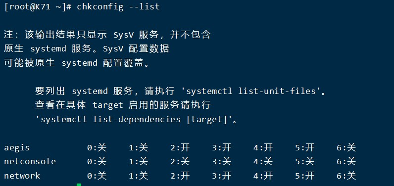

## 常见的系统服务命令

|常用命令|作用|
|---|---|
|chkconfig --list|列出系统服务|
|service <服务名> status|查看某个服务|
|service <服务名> start|启动某个服务|
|service <服务名> stop|终止某个服务|
|service <服务名> restart|重启某个服务|
|systemctl status <服务名>|列出系统服务|
|systemctl start <服务名>|启动某个服务|
|systemctl stop <服务名>|终止某个服务|
|systemctl restart <服务名>|重启某个服务|
|systemctl enable <服务名>|开启自服务|
|systemctl disable <服务名>|关闭自服务|

systemctl是centos7更新的服务，集合了service和chkconfig

这里0-6对应Linux7个运行级别