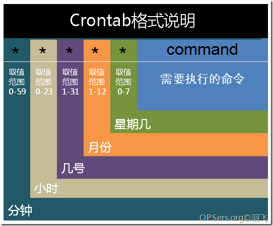

## 包管理分为RPM和YUM

rpm适用所有环境，yum需要先安装本地yum源才可以，yum自动解决依赖性，rpm不可以。就是说当安装软件时需要依赖文件，yum可以直接解决，rpm则需要先安装依赖再安装软件

## rpm   
        -qa                     查询系统中安装的rpm包 
        -q pkg_name             查看查询某个rpm包
        -q -whatprovides xxx    查看xxx功能是由哪个包提供的
        -q -whatrequires xxx    查看xxx功能被哪个程序包依赖着
        -q -changelog xxx       查看xxx包的更改记录
        -qi pkg_name            查询一个包的详细信息
        -qd pkg_name            查询一个包所提供的文档
        -qc pkg_name            查询已安装rpm包所提供的配置文件
        -ql pkg_name            查看一个包安装了哪些文件
        -qlp pkg_name           查询软件安装后会生成什么文件
        -qp  pkg_name           查询软件安装包安装后的名字
        -qf filename            查看某个文件属于哪个包
        -qR pkg_name            查询包的依赖关系
        -ivh xxx.rpm            安装rpm包
        -qa |grep name          查询软件是否安装
        -ivh --test xxx.rpm     测试安装的rpm包       
        -ivh --nodeps xxx.rpm   安装rpm包忽略依赖关系
        -e xxx                  卸载程序包
        -Fvh pkg_name           升级确定已安装的rpm包
        -Uvh pkg_name           升级rpm包(若未安装则安装)
        -V pkg_name             rpm包详细校验信息

        -i    install，安装
	    -v    显示进度条
	    -h    表示以“#”形式显示进度条
        -q    查询(query)
        -a    所有
        -i    查询软件信息（information）
        -l    列表（list）
        -f    查询系统文件属于哪个RPM包（file）
        -R    查询软件包的依赖性（requires）

## yum
    repolist enabled                显示可用的仓库源
    search pkg_name                 搜索软件包
    install pkg_name                安装软件包
    install --downloadonly pkg_name 只下载不安装
    list                            显示所有程序包
    list installed                  显示当前程序已安装包
    list update                     显示可以更新的包列表
    check-update                    查看可升级的软件包
    update                          更新所有软件包
    update pkg_name                 升级指定软件包
    deplist pkg_name                列出软件包依赖关系
    remove pkg_name                 删除软件包
    clean all                       清楚缓存
    clean packlages                 清楚缓存中的软件包
    clean headers                   清楚缓存中的header

# cron/crontab计划任务

**cron机制:cron可以让系统在指定的时间，去执行某个指定的工作，我们可以使用crontab指令来管理cron机制**  
系统默认crontab文件为/etc/crontab,以及/etc/cron.d/目录下的文件，有些程序会把自己的crontab文件放在/etc/cron.d/目录下。要修改/etc/crontab以及/etc/cron.d/目录下的文件需要root权限。cron守护进程会检查/etc/crontab以及/etc/cron.d/目录下的文件，根据这些文件中的cron任务所设置的执行时间决定是否执行任务，如果当前时间与cron任务所设置的执行时间相同，则执行任务。

    #crontab 选项
    选项：
		-e：edit，编辑指定用户的计划任务列表
		-l：list，列出指定用户的计划任务列表
		-u：user，可以让我们去编辑其他人的crontab，如果没有加上这个参数的话就会开启自己的crontab
		-r：remove，删除指定用户的计划任务列表

**Crontab权限问题：本身是任何用户都可以创建自己的计划任务**  
但是超级管理员可以通过配置来设置某些用户不允许设置计划任务  
配置文件位于（黑名单）：
	/etc/cron.deny			里面写用户名，一行一个
