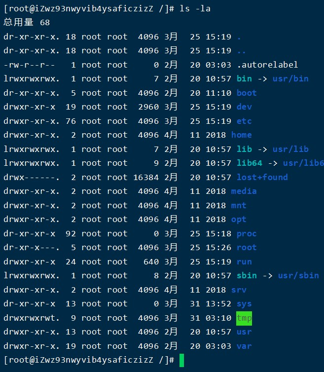
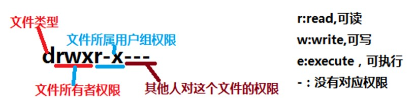
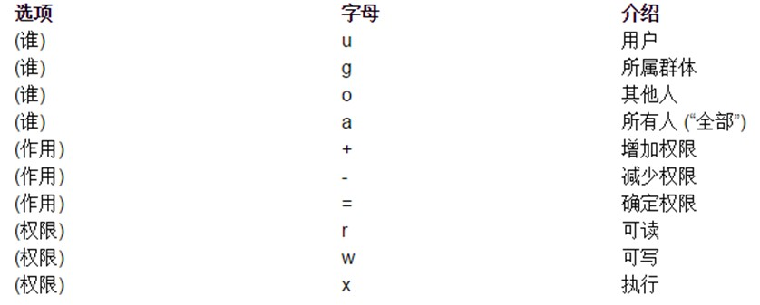
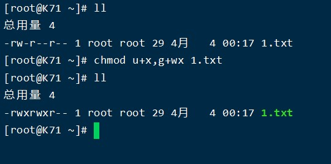
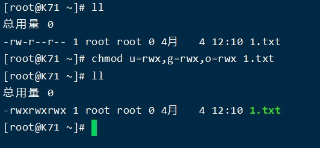
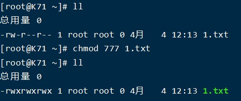
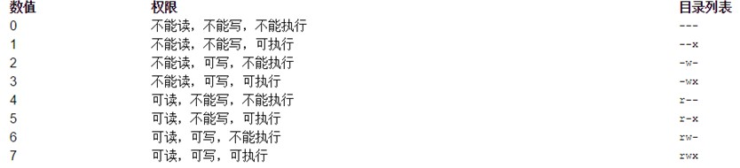
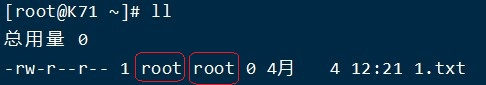
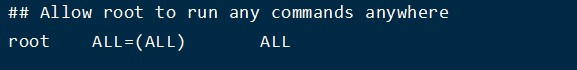

Linux的权限管理操作
=
Linux系统一般将文件可存/取访问的身份分为3个类别
* Owner身份（文件所有者，默认为文档的创建者）
* Group身份（与文件所有者同组的用户）
* Others身份（其他人，相对于所有者）

    **Root用户（超级用户）**

在linux中#ls -l可以查看文件的属性以及权限

十位字符表示含义：
* 第1位：表示文档类型，取值常见的有“d表示文件夹”、“-表示文件”、“l表示软连接”、“s表示套接字”等等；
* 第2-4位：表示文档所有者的权限情况，第2位表示读权限的情况，取值有r、-；第3位表示写权限的情况，w表示可写，-表示不可写，第4位表示执行权限的情况，取值有x、-。
* 第5-7位：表示与所有者同在一个组的用户的权限情况，第5位表示读权限的情况，取值有r、-；第6位表示写权限的情况，w表示可写，-表示不可写，第7位表示执行权限的情况，取值有x、-。
* 第8-10位：表示除了上面的前2部分的用户之外的其他用户的权限情况，第8位表示读权限的情况，取值有r、-；第9位表示写权限的情况，w表示可写，-表示不可写，第10位表示执行权限的情况，取值有x、-。

### 权限设置

    语法：#chmod 选项 权限模式 文档
    可选项
		-R：递归设置权限	（当文档类型为文件夹的时候）

**如果想要给文档设置权限，操作者要么是root用户，要么就是文档的所有者。**

设置：
* u：表示所有者身份owner（user）
* g：表示给所有者同组用户设置（group）
* o：表示others，给其他用户设置权限
* a：表示all，给所有人（包含ugo部分）设置权限  
  
如果在设置权限的时候45不指定给谁设置，则默认给所有用户设置

权限字符：
* r：读
* w：写
* x：表示执行
* -：表示没有权限

权限分配方式：
* +：表示给具体的用户新增权限（相对当前）
* -：表示删除用户的权限（相对当前）
* =：表示将权限设置成具体的值（注重结果）【赋值】

数字形式

* 读：r=4
* 写：w=2
* 执行：x=1
* 没有任何权限：0

**权限数字中不要出现2与3的数字**

**在Linux中，如果要删除一个文件，不是看文件有没有对应的权限，而是看文件所在的目录是否有写权限，如果有才可以删除**

**当一个用户非文件创建者，文档所有者也不是同组用户，other部分。一个文件权限为777，这个用户可以打开编辑此文件，但无法删除**

属主与属组设置
-
属主：所属的用户（文件的主人）  
属组：所属的用户组

前面的那个root就是属主，文件创建者  
后面的那个root就是属组，文件创建者所属的组

更改文档的所属用户组

    语法：#chgrp  -R  groupname  文档的路径

更改文档的所属用户

    语法：#chown  -R  username 文档路径

更改文档所属的用户以及用户组

    语法：#chown  -R  username:groupname   文档路径

### 扩展

当普通用户需要执行reboot、shutdown、init、halt、user管理，root用户不能将密码告知时
，可以使用sudo（switch user do）命令来进行权限设置。Sudo可以让管理员（root）事先定义某些特殊命令谁可以执行。

`Sudo配置文件：/etc/sudoers`  
`配置sudo文件可以使用“#visudo”，打开之后其使用方法和vim一致`

Root表示用户名，如果是用户组，则可以写成“%组名”  
ALL：表示允许登录的主机（地址白名单）：  s
(ALL)：表示以谁的身份执行，ALL表示root身份  
ALL：表示当前用户可以执行的命令，多个命令可以使用“,”分割

在写sudo规则的时候不建议写直接形式的命令，而是写命令的完整路径。
路径可以使用which命令来查看

    语法：#which 指令名称

