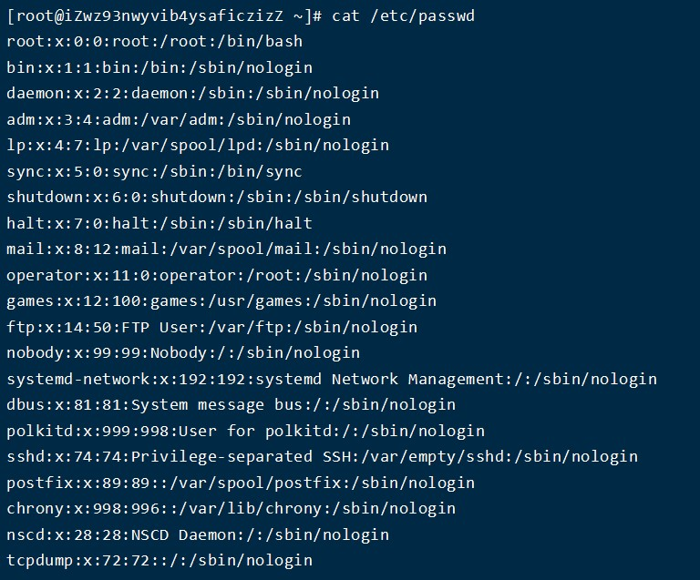
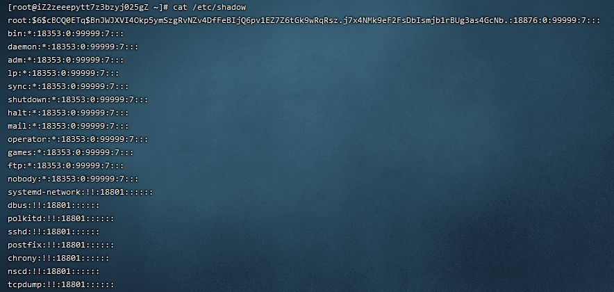
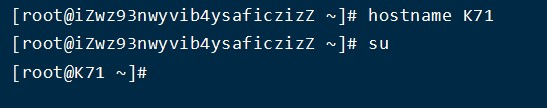

## 用户管理

* /etc/passwd 存储用户的关键信息  
* /etc/group 存储用户组的关键信息  
* /etc/shadow 存储用户的密码信息  

### passwd文件
* 用户名:密码:用户ID:用户组ID:注释:家目录:解释器shell

1. 用户名：创建新用户名称，后期登录的时候需要输入；
2. 密码：此密码位置一般情况都是“x”，表示密码的占位；
3. 用户ID：一般情况下它与用户名是一一对应的。如果几个用户名对应的用户标识号是一样的，系统内部将把它们视为同一个用户，但是它们可以有不同的口令、不同的主目录以及不同的登录Shell等。
通常用户标识号的取值范围是0～65 535。0是超级用户root的标识号，1～99由系统保留，作为管理账号，普通用户的标识号从100开始。在Linux系统中，这个界限是500。
4. 用户组ID：该用户所属的主组ID；
5. 注释：解释该用户是做什么用的；
6. 家目录：用户的起始工作目录。用户登录进入系统之后默认的位置；
7. 解释器shell：等待用户进入系统之后，用户输入指令之后，该解释器会收集用户输入的指令，传递给内核处理；

### shadow文件

* 登录名:加密口令:最后一次修改时间:最小时间间隔:最大时间间隔:警告时间:不活动时间:失效时间:标志

### 暂时设置主机名

    #hostname  
    #hostname -f  查看FQDN（全限定域名）

### 永久设置主机名  

/etc/hostname	(主机名的配置文件)

    #vim /etc/hostname
    K71
**为centos7的修改方法，修改后需要重启**

### 查看一个用户的一些基本信息
  
    语法:id  用户名		显示指定用户的基本信息

**如果不指定用户则默认当前用户**

### 添加用户

    添加用户

    #useradd 选项 用户名
    选项：
        -m　使用者目录如不存在则自动建立。
        -g：表示指定用户的用户主组，选项的值可以是用户组的id，也可以是组名
        -G：表示指定用户的用户附加组，选项的值可以是用户组的id，也可以是组名
        -u：uid，用户的id（用户的标识符），系统默认会从500之后按顺序分配uid，如果不想使用系统分配的，可以通过该选项自定义
        -c comment：添加注释

验证是否成功：

- 验证/etc/passwd 的最后一行，查看是否有新账户的信息；
- 验证是否存在家目录（在 Centos 下创建好用户之后随之产生一个同名家目录）

### 删除用户

    #userdel 选项 用户名
    选项：
    	-r：表示删除用户的同时，删除其家目录

**说明**:已经登录的用户删除的时候提示删除失败，但是没有登录的用户可以正常删除,可以 kill 对应用户的全部进程，或者使用ctrl+d退出root用户，回到user1用户；第二次使用ctrl+d退出user1用户，此时会返回到root用户，第三次ctrl+d退出连接重连后可删除

### 修改用户

    #usermod 选项 用户名
    Usermod：user modify，用户修改
    选项：
        -g：表示指定用户的用户主组，选项的值可以是用户组的id，也可以是组名
        -G：表示指定用户的用户附加组，选项的值可以是用户组的id，也可以是组名
        -u：uid，用户的id（用户的标识符），系统默认会从500之后按顺序分配uid，如果不想使用系统分配的，可以通过该选项自定义
        -l：修改用户名

### 切换用户

    切换用户命令

	#su 用户名
**如果用户名不指定则表示切换到root用户**
$表示普通用户，#表示超级用户，也就是root用户

### 设置密码

	passwd 可选项 用户名
        可选项
            -l  冻结这个账户
            -d  清空密码，同样无法登陆
