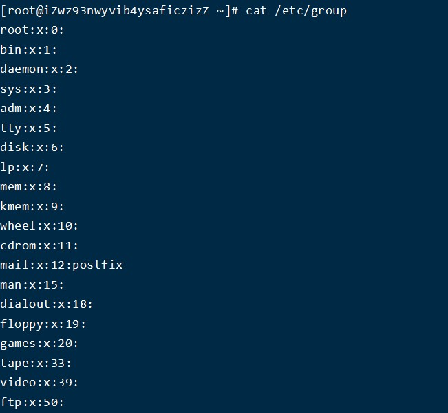
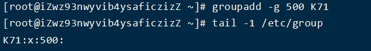
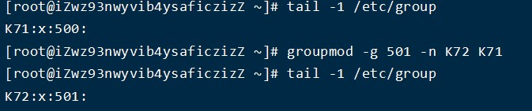

## 用户组

用户组的管理涉及用户组的添加、删除和修改。组的增加、删除和修改实际上就是对/etc/group文件的更新  

文件结构：  
**用户组名:密码:用户组ID:组内用户名**
* 密码：X表示占位符，虽然用户组可以设置密码，但是绝大部分的情况下不设置密码；
* 组内用户名：表示附加组是该组的用户名称；

### 创建用户组

    groupadd 组名
        选项    
            -g  指定一个组名。一般默认从1000开始

### 删除用户组

    groupdel 组名
**当如果需要删除一个组，但是这个组是某个用户的主组时，则不允许删除；如果确实需要删除，则先从组内移出所有用户**

### 修改用户组权限信息和名字

	#groupmod 选项 用户组名
	选项：
		-g：类似用户修改里的“-u”，-g表示选择自己设置一个自定义的用户组ID数字
		-n：类似于用户修改“-l”，表示设置新的用户组的名称

### 切换用户组

newgrp 组名