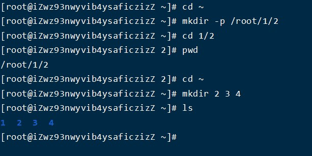
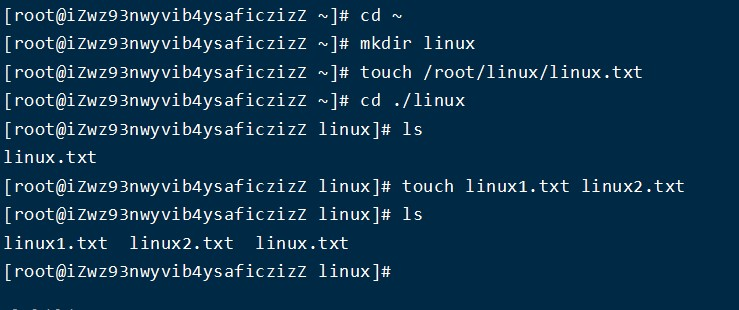

linux根目录下个文件
-
* Bin：全称binary，含义是二进制。该目录中存储的都是一些二进制文件，文件都是可以被运行的。  
* Dev：该目录中主要存放的是外接设备，例如盘、其他的光盘等。在其中的外接设备是不能直接被使用的，需要挂载（类似windows下的分配盘符）。  
* Etc：该目录主要存储一些配置文件。  
* Home：表示“家”，表示除了root用户以外其他用户的家目录，类似于windows下的User/用户目录。  
* Proc：process，表示进程，该目录中存储的是Linux运行时候的进程。  
* Root：该目录是root用户自己的家目录。  
* Sbin：全称super binary，该目录也是存储一些可以被执行的二进制文件，但是必须得有super权限的用户才能执行。  
* Tmp：表示“临时”的，当系统运行时候产生的临时文件会在这个目录存着。  
* Usr：存放的是用户自己安装的软件。类似于windows下的program files。  
* Var：存放的程序/系统的日志文件的目录。   
* Mnt：当外接设备需要挂载的时候，就需要挂载到mnt目录下。  

Linux基础命令
=
#ls
- 

    含义：在列出指定路径下的文件/文件夹的名称，并以指定的格式进行显示。
    语法：ls 选项 路径
    选项：-l:表示list，表示以详细列表的形式进行展示
        -a:表示显示所有的文件/文件夹（包含了隐藏文件/文件夹）

* -l详细显示中,第1位字母为文件类型，其中“-”表示普通文件，“d”表示文档类型为文件夹，"l"为链接,"b"块设备文件,"p"管道文件,"c"字符设备文件,"s"套接口文件
* 后面三组rwx中"r"为可读，"w"为可写,"x"为可执行。第2-4位(user)表示这个文件的属主拥有的权限，第5-7位(group)表示和这个文件属主所在同一个组的用户所具有的权限，第8-10位(other)表示其他用户所具有的权限 
* ls列出的结果颜色说明，其中蓝色的名称表示文件夹，青色的表示文件，绿色的其权限为拥有所有权限。

#pwd 
- 
    打印当前工作目录
    
#cd	
-	
    切换当前路径
    语法：#cd 路径
    
**在Linux中“~”，表示当前用户的家目录**
**../为上一级目录**

#mkdir
-
    创建文件夹
    语法：#mkdir 选项 路径
    选项：-p：一次性创建多层不存在的目录的时候

**mkdir可以-p直接创建一条路径，也可以一个目录下以空格区分创建多个文件夹**

#touch
-
    创建文件
    语法：#touch 文件路径(可以是文件名，也可以是文件路径)

#cp
-
    复制文件/文件夹到指定位置
    语法：#cp 被复制的文档路径 文档被复制到的路径
    选项:“-r”文件夹复制操作的时候需要添加
**Linux在复制过程中是可以重新对新位置的文件进行重命名的**

#mv
-
    移动文件/文件夹
    语法：#mv 需要移动的文档路径 需要保存的位置路径
**在Linux中重命名的命令也是mv，语法和移动语法一样**

#rm
-
    移动/删除文件
    语法：#rm 选项 需要移除的文档路径
    选项：
	-f：force，强制删除，不提示是否删除
	-r：表示递归

输出重定向
-
    将输出结果保存到文件中  
    >：覆盖输出，会覆盖掉原先的文件内容
    >>：追加输出，不会覆盖原始文件内容，会在原始内容末尾继续添加
    语法：#正常执行的指令 > / >> 文件的路径

cat 
-
    直接打开一个文件的功能或合并文件
    语法1：#cat 文件的路径
    语法2：#cat 待合并的文件路径1 待合并的文件路径2 …. 文件路径n > 合并之后的文件路径

linux进阶指令
=
#df
-
    查看磁盘空间大小
    语法：#df -h		-h表示以可读性较高的形式展示大小

#free
-
    查看内存使用
    语法：#free -m   -m表示以mb为单位查看
Swap：用于临时内存，当系统真实内存不够用的时候可以临时使用磁盘空间来充当内存**

#head
-
    查看文件前n行，不指定则显示前10行
    语法：#head -n 文件路径(这里n表示数字行数)

#tail
-
    查看文件后n行，不指定则显示后10行
    语法：#tail -n 文件的路径  (n同样表示数字)
        #tail -f 文件的路径
        -f是循环读取，会把 filename 文件里的最尾部的内容显示在屏幕上，并且不断刷新

#less
-
    查看文件，以较少的内容进行输出
    语法：#less 需要查看的文件路径

#wc
-
    统计文件内容信息
    语法：#wc -lwc 需要统计的文件路径
    -l：表示lines，行数
	-w：表示words，单词数   依照空格来判断单词数量
	-c：表示bytes，字节数

#date
-
    表示操作时间日期
    语法1：#date

#cal
-
    日历
    语法1：#cal	  等价于 #cal  -1		直接输出当前月份的日历
    语法2：#cal  -3			表示输出上一个月+本月+下个月的日历
    语法3：#cal  -y 年份  		表示输出某一个年份的日历

#clear/ctrl+l指令
-
    清除终端中已经存在的命令和结果
    语法：clear 或者快捷键：ctrl + L

|   (管道)
-
    管道符：|
    一般可以用于“过滤”，“特殊”，“扩展处理”

**以管道作为分界线，前面的命令有个输出，后面需要先输入，然后再过滤，最后再输出，通俗的讲就是管道前面的输出就是后面指令的输入.  
grep指令：主要用于过滤**