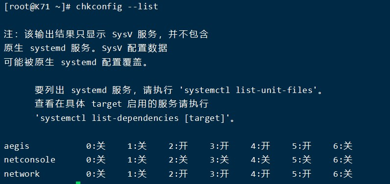

# 设置主机名

### 暂时设置主机名

    #hostname  
    #hostname -f  查看FQDN（全限定域名）

### 永久设置主机名  

/etc/hostname	(主机名的配置文件)

    #vim /etc/hostname
    K71
**为centos7的修改方法，修改后需要重启**

# 开机启动

### 开机启动服务查询  

    #chkconfig --list

这里0-6对应Linux7个运行级别

### 删除服务

    #chkconfig --del 服务名

 ### 添加开机启动服务

    #chkconfig --add 服务名

## 设置服务在某个级别下开机启动/不启动

    #chkconfig --level 连在一起的启动级别 服务名on/off
    例:#chkconfig --level 35 httpd on

# ntp服务
ntp主要是用于对计算机的时间同步管理操作。  
同时服务器时间方式有2个：
* 一次性同步（手动同步）  

    #ntpdate 时间服务器的域名或ip地址

* 通过服务自动同步。
  
    
    centos7可用  
    systemctl status ntpd(查看ntpd运行状态)  
    systemctl start ntpd(运行ntpd)  
    ntp -p(查看服务)

# 防火墙服务

centos7.x中默认是firewalld
(centos6.x中防火墙叫iptables)

centos7

    #systemctl status firewalldc(查看防火墙状态)
    #firewall-cmd --state(查看防火墙运行状态)
    #systemctl start firewalld(开启)
    #systemctl stop firewalld(关闭)
    #service firewalld restart(重启)
    systemctl disable firewalld(开机禁用)
    systemctl enable firewalld(开机启用)

    启动一个服务：systemctl start firewalld.service
    关闭一个服务：systemctl stop firewalld.service
    重启一个服务：systemctl restart firewalld.service
    显示一个服务的状态：systemctl status firewalld.service
    在开机时启用一个服务：systemctl enable firewalld.service
    在开机时禁用一个服务：systemctl disable firewalld.service
    查看服务是否开机启动：systemctl is-enabled firewalld.service
    查看已启动的服务列表：systemctl list-unit-files|grep enabled
    查看启动失败的服务列表：systemctl --failed

    查看版本： firewall-cmd --version
    查看帮助： firewall-cmd --help
    显示状态： firewall-cmd --state
    查看所有打开的端口： firewall-cmd --zone=public --list-ports
    更新防火墙规则： firewall-cmd --reload
    查看区域信息: firewall-cmd --get-active-zones
    查看指定接口所属区域： firewall-cmd --get-zone-of-interface=eth0
    拒绝所有包：firewall-cmd --panic-on
    取消拒绝状态： firewall-cmd --panic-off
    查看是否拒绝： firewall-cmd --query-panic

    firewall-cmd --zone=public --add-port=80/tcp --permanent （–permanent永久生效，没有此参数重启后失效）
    重新载入:firewall-cmd --reload
    删除：firewall-cmd  --remove-port=80/tcp --permanent

# rpm

查询某个软件的安装情况

    #rpm -qa|grep 关键词
    单个包查询：rpm -q 包名  
    查询包详情:rpm -qi 包名 
    查询所有包：rpm -qa  
    安装位置:rpm -ql 包名 
    查询系统文件属于哪个RPM包:rpm -qf 系统文件名  
    查询软件包的依赖性:rpm -qR 包名 
    选项：
	    -q    查询(query)
        -a    所有
        -i    查询软件信息（information）
        -l    列表（list）
        -f    查询系统文件属于哪个RPM包（file）
        -R    查询软件包的依赖性（requires）

卸载某个软件

    #rpm -e 软件的名称
    当软件存在依赖关系，无法直接卸载，懒得解决麻烦可以
    #rpm -e 软件包名 --nodeps
    --nodeps不检测依赖关系

安装软件的命令

    #rpm -ivh 软件包完整名称
    选项：
	    -i：install，安装
	    -v：显示进度条
	    -h：表示以“#”形式显示进度条

# cron/crontab计划任务

**cron机制:cron可以让系统在指定的时间，去执行某个指定的工作，我们可以使用crontab指令来管理cron机制**  
系统默认crontab文件为/etc/crontab,以及/etc/cron.d/目录下的文件，有些程序会把自己的crontab文件放在/etc/cron.d/目录下。要修改/etc/crontab以及/etc/cron.d/目录下的文件需要root权限。cron守护进程会检查/etc/crontab以及/etc/cron.d/目录下的文件，根据这些文件中的cron任务所设置的执行时间决定是否执行任务，如果当前时间与cron任务所设置的执行时间相同，则执行任务。

    #crontab 选项
    选项：
		-e：edit，编辑指定用户的计划任务列表
		-l：list，列出指定用户的计划任务列表
		-u：user，可以让我们去编辑其他人的crontab，如果没有加上这个参数的话就会开启自己的crontab
		-r：remove，删除指定用户的计划任务列表

**Crontab权限问题：本身是任何用户都可以创建自己的计划任务**  
但是超级管理员可以通过配置来设置某些用户不允许设置计划任务  
配置文件位于（黑名单）：
	/etc/cron.deny			里面写用户名，一行一个
