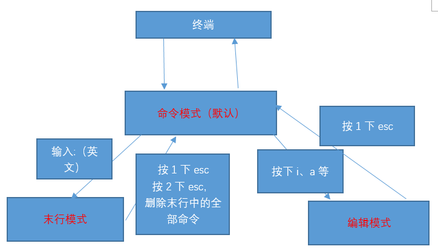
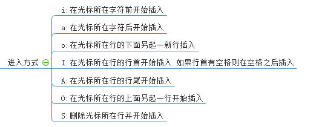
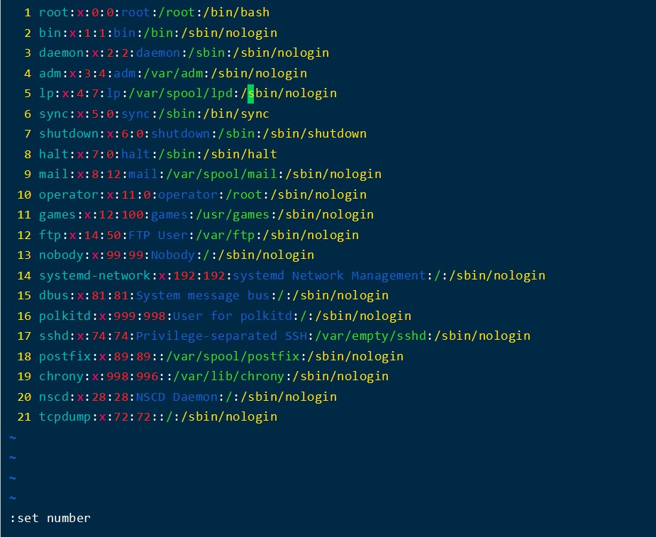
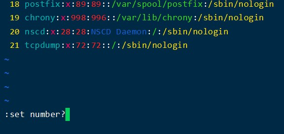

vim介绍
=
Vim中存在三种模式

* 命令模式（Command mode）
* 输入模式（Insert mode）
* 底线命令模式（Last line mode）

命令模式
-
用户刚刚启动 vi/vim，便进入了命令模式。

这时候输入不会被认为输入字符，而是命令。

以下是常用的几个命令：

* i 切换到输入模式，以输入字符。
* x 删除当前光标所在处的字符。
* : 切换到底线命令模式，以在最底一行输入命令。

若想要编辑文本：启动Vim，进入了命令模式，按下i，切换到输入模式。 

输入模式
-
在命令模式下按下i就进入了输入模式。

在输入模式以下按键：

* 字符按键以及Shift组合，输入字符
* ENTER，回车键，换行
* BACK SPACE，退格键，删除光标前一个字符
* DEL，删除键，删除光标后一个字符
* 方向键，在文本中移动光标
* HOME/END，移动光标到行首/行尾
* Page Up/Page Down，上/下翻页
* Insert，切换光标为输入/替换模式，光标将变成竖线/下划线
* ESC，退出输入模式，切换到命令模式

底线命令模式
-
在命令模式下按下:（英文冒号）进入了底线命令模式。

底线命令模式可以输入单个或多个字符的命令，可用的命令非常多。

在底线命令模式中，基本的命令有（已经省略了冒号）：

* q 退出程序
* w 保存文件

按ESC键可随时退出底线命令模式。

vim基础操作
=
Vim的打开文件

    #vim 文件路径					作用：打开指定的文件
    #vim  +数字  文件的路径			作用：打开指定的文件，并且将光标移动到指定行
    #vim  +/关键词  文件的路径		作用：打开指定的文件，并且高亮显示关键词
    #vim 文件路径1 文件路径2 文件路径3   作用：同时打开多个文件

命令模式
-
光标移动
1. 光标移动到行首
按键：shift + 6 或 ^（T字母上面的6，不要按小键盘的6）

2. 光标移动到行尾
按键：shift + 4 或 $（R字母的左上角的4，不是小键盘的4）

3. 光标移动到首行
按键：gg

4. 光标移动到末行
按键：G

5. 翻屏
向上翻屏：按键ctrl + b   （before）	或 		PgUp
向下翻屏：按键ctrl + f	   （after）		或		PgDn

复制操作
1. 复制光标所在行
按键：yy
粘贴：在想要粘贴的地方按下p键

2. 以光标所在行为准（包含当前行），向下复制指定的行数
按键：数字yy

3. 可视化复制
按键：ctrl + v（可视块）或V（可视行）或v（可视），然后按下↑↓←→方向键来选中需要复制的区块，按下y键进行复制，最后按下p键粘贴

剪切/删除  
1. 剪切/删除光标所在行
按键：dd			（删除之后下一行上移）
注意：dd严格意义上说是剪切命令，但是如果剪切了不粘贴就是删除的效果。

2. 剪切/删除光标所在行为准（包含当前行），向下删除/剪切指定的行
按键：数字dd		（删除之后下一行上移）

3. 剪切/删除光标所在的当前行之后的内容，但是删除之后下一行不上移
按键：D				（删除之后当前行会变成空白行）

4. 可视化删除
按键：ctrl + v（可视块）或V（可视行）或v（可视），上下左右移动，按下D表示删除选中行，d表示删选中块

撤销/恢复
1. 撤销：输入:u （不属于命令模式）  或者   u			（undo）
2. 恢复：ctrl + r			恢复（取消）之前的撤销操作

光标的快速移动
1. 快速将光标移动到指定的行
按键：数字G    

2. 以当前光标为准向上/向下移动n行
按键：数字↑，数字↓

3. 以当前光标为准向左/向右移动n字符
按键：数字←，数字→

4. 末行模式下的快速移动方式：移动到指定的行
按键：输入英文“:”，其后输入行数数字，按下回车

末行模式
-
进入方式：由命令模式进入，按下“:”或者“/（表示查找）”即可进入  
退出方式：
1. 按下esc
2. 连按2次esc键
3. 删除末行全部输入字符

保存操作（write）  
* 输入：“:w”				保存文件  
* 输入：“:w  路径”		另存为

退出（quit）  
* 输入：“:q”				退出文件

保存并退出
* 输入：“:wq”				保存并且退出

强制 （!）
* 输入：“:q!”				表示强制退出，刚才做的修改操作不做保存

 vim还支持另外一个保存退出方法“:x”
 说明：
1. “:x”在文件没有修改的情况下，表示直接退出，在文件修改的情况下表示保存并退出；
2. 如果文件没有被修改，但是使用wq进行退出的话，则文件的修改时间会被更新；但是如果文件没有被修改，使用x进行退出的话，则文件修改时间不会被更新的；主要是会混淆用户对文件的修改时间的认定。  
因此建议以后使用“:x”来进行对文件的保存退出  
**但是：不要使用大写X，不要使用大写X，不要使用大写X，大写X表示对文件进行加密操作**

**末行模式外部指令**  
输入：“:!外部命令”  
外部指令结束后任意键回到vim编辑器打开的内容

编辑模式

vim扩展
=
**全局配置一般在/etc/vim/vimrc或者/etc/vimrc，对所有用户生效。用户个人的配置在~/.vimrc。**

如果只对单次编辑启用某个配置项，可以在命令模式下，先输入一个冒号，再输入配置。举例来说，set number这个配置可以写在.vimrc里面，也可以在命令模式输入。

查询某个配置项是打开还是关闭，可以在命令模式下，输入该配置，并在后面加上问号。

如果想查看帮助，可以使用help命令

    example
    :help number

