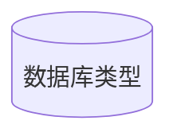

## Mermaid

Mermaid 是一种类似于 Markdown 的脚本语法，通过 javascript 语言，将文本转换为图片，通常用于制作思维导图

### 开始使用

    ```mermaid  //声明mermaid的开始
    图的类型 值;
        表达式1-->表达式2 //表达式用-->指引
    ```         //mermaid的结束

### 箭头的类型

| length     | 1      | 2       | 3        |
| ---------- | ------ | ------- | -------- |
| 默认无箭头 | `---`  | `----`  | `-----`  |
| 有箭头     | `-->`  | `--->`  | `---->`  |
| 加粗无箭头 | `===`  | `=====` | `=====`  |
| 加粗有箭头 | `==>`  | `===>`  | `====>`  |
| 虚线无箭头 | `-.-`  | `-..-`  | `-....-` |
| 虚线有箭头 | `-.->` | `-..->` | `-..->`  |

### 节点形状

##### 圆形的节点

    ID(圆角的节点)  //使用括号括起来 ID是节点名字


##### 椭圆形节点

    ID([椭圆形节点])        //括号里面加个中括号


##### 子程序形状的节点

    ID[[子程序形状的节点]]  //双中括号


##### 数据库类型

    ID[(数据库类型)]


