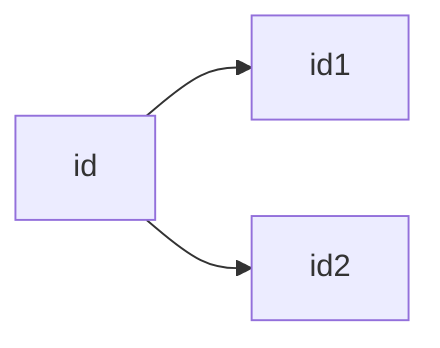
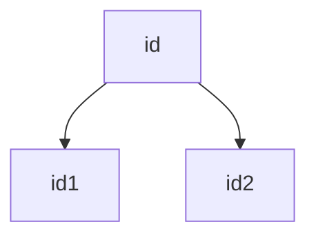

### 流程图

    graph 值;       //graph表示是一张流程图，值有以下
                        TB - 从上到下
                        TD - 自上而下/与自上同
                        BT - 从下到上
                        RL - 从右到左
                        LR - 从左到右
        id-->id1
        id-->id2

