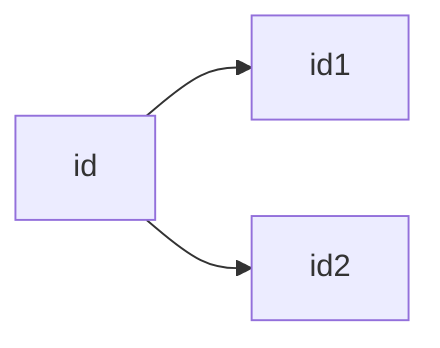
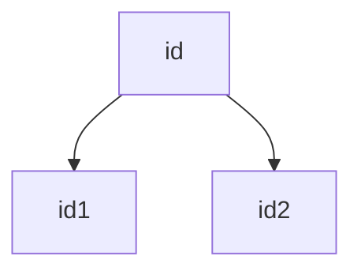

### 流程图

    flowchart       //flowchart表示是一张流程图，
        id-->id1
        id-->id2

```mermaid
    flowchart LR;
        id-->id1
        id-->id2
```

```mermaid
    flowchart TD;
        id-->id1
        id-->id2
```
