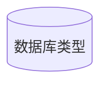
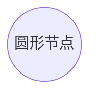
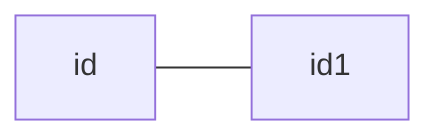
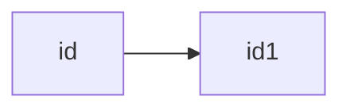
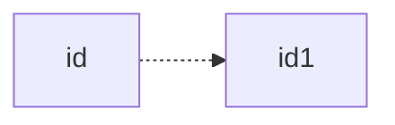
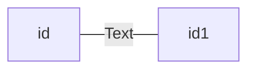
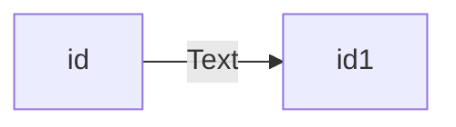
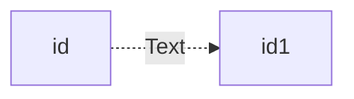
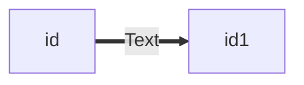
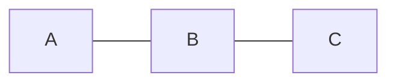

## Mermaid

Mermaid 是一种类似于 Markdown 的脚本语法，通过 javascript 语言，将文本转换为图片，通常用于制作思维导图

### 开始使用

    ```mermaid  //声明mermaid的开始
    图的类型 值;
        表达式1-->表达式2 //表达式用-->指引
    ```         //mermaid的结束

### 流程图方向

- TB - 从上到下
- TD - 自上而下/与自上同
- BT - 从下到上
- RL - 从右到左
- LR - 从左到右

### 节点形状

##### 圆形的节点

    ID(圆角的节点)  //使用括号括起来 ID是节点名字


##### 椭圆形节点

    ID([椭圆形节点])        //括号里面加个中括号


##### 子程序形状的节点

    ID[[子程序形状的节点]]  //双中括号


##### 数据库类型

    ID[(数据库类型)]



##### 圆形节点

    ID((圆形节点))



##### 书签节点

    ID>书签节点]


##### 菱形节点

    ID{菱形节点}


##### 六边形节点

    ID{{六边形节点}}


##### 平行四边形

    ID[/平行四边形/]


##### 平行四边形 alt

    ID[\平行四边形\]


##### 梯形

    ID[/梯形\]


##### 梯形 alt

    ID[\梯形/]


### 节点之间的链接使用

#### 普通箭头

##### 无箭头



##### 有箭头



##### 虚线箭头



#### 链接上文本

##### 实线带文本

        id--Text---id1
    或者
        id---|Text|id1



##### 带文本实线

        id--Text-->id1
    或者
        id-->|Text|id1



##### 带文本虚线链接

    id-.Text.->id1



##### 带文本粗链接



#### 链接方式

##### 常见链接

    A---B---C



##### 逻辑与

    A---B & C---D     //&的左右要有空格

```mermaid
    flowchart LR
        A-->B & C-->D
```

    A & B--> C & D

```mermaid
    flowchart
        A & B--> C & D
```

#### 新的箭头类型

    A--o B--x D

```mermaid
    flowchart LR
        A--o B--x D
```

    A o--o B <--> C x--x D

```mermaid
    flowchart LR
         A o--o B <--> C x--x D
```

#### 链接长度

    A--> B---> D ---->E    //可以多使用一个短横线来使链接长度比其他同类型更长

```mermaid
    flowchart LR
        A--> B---> D ---->E
```

| length     | 1      | 2       | 3        |
| ---------- | ------ | ------- | -------- |
| 默认无箭头 | `---`  | `----`  | `-----`  |
| 有箭头     | `-->`  | `--->`  | `---->`  |
| 加粗无箭头 | `===`  | `=====` | `=====`  |
| 加粗有箭头 | `==>`  | `===>`  | `====>`  |
| 虚线无箭头 | `-.-`  | `-..-`  | `-....-` |
| 虚线有箭头 | `-.->` | `-..->` | `-..->`  |

### 特殊字符

可以将文本放入双引号中来显示些特殊符号

    ID["显示(括号)"]

```mermaid
    flowchart LR
        ID["显示(括号)"]
```

转义字符

    ID["心形：#9829;"]  //字符可以对照HTML字符表

```mermaid
    flowchart LR
        ID["心形：#9829;"]
```
