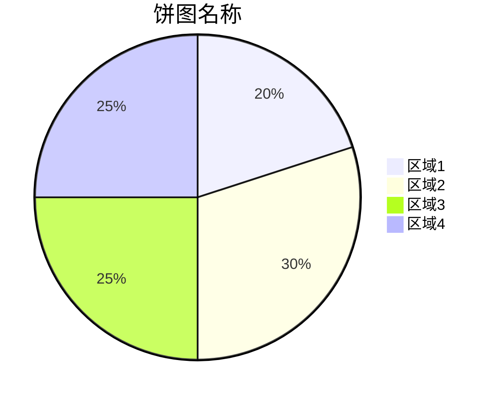

### 饼图

    pie     //表示是饼图
        title 饼图名称  //给饼图命名
        "区域1":20      //划分区域,冒号后面的值是该区域占的百分比
        "区域2":30
        "区域3":25
        "区域4":25

```mermaid
    pie
        title 饼图名称
        "区域1" : 20
        "区域2" : 30
        "区域3" : 25
        "区域4" : 25
```