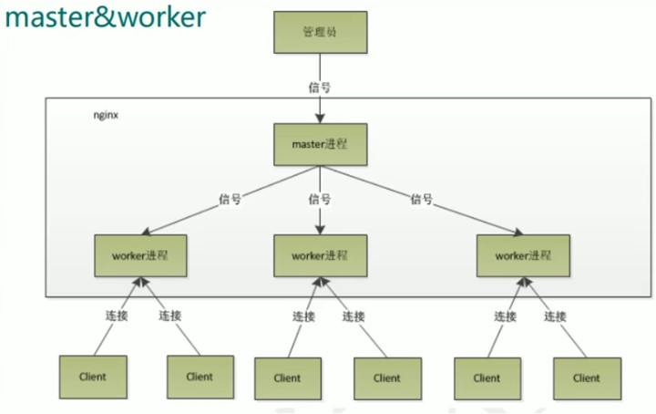

## master&worker

nginx 启动后会有 master 和 worker 进程

一个 master 进程管理着多个 worker 进程，(这里截图只有一个)

当客户端发送请求，nginx 接收后会被 master 进程分发给 worker 进程，然后 worker 进程进行争抢，争抢到的则再进行 nginx 或 tomcat 进行响应

### nginx -s reload 进行热部署

当 nginx -s reload 时，其中一个 worker 会依旧处理他的任务，其他 worker 会进行配置的重加载。然后第一个 worker 会再之后进行加载。

### worker 的数量

worker 的数量最好和 cpu 的核心数量相同  
设置 worker 数量

worker_processes n;(默认是 1)

### 每个 worker 的连接数量

当发送一个请求，只会占用 worker 的两个或者四个连接数，请求静态资源时，worker 接受客户端请求并从 nginx 拿取数据并返回响应，占用两个，访问动态资源时，worker 还会访问 tomcat 并拿取资源就是四个。  
设置单个 worker 连接数

    worker_connection n;(默认是1024)

静态访问最大并发数是：worker_connection*worker_processes/2  
动态访问最大并发数是：worker_connection*worker_processes/4
