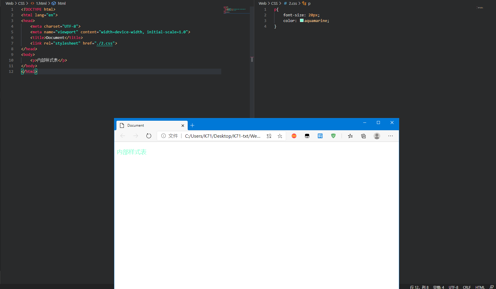

## CSS

当我要编写一个网站，HTML用来给这个网站提供内容，而CSS则将这些内容美化整理

### CSS的三种样式

**1. 内联样式**

   直接在元素上通过`style`的形式

例

    
内联样式

内联样式

内联样式优点是十分的便捷、高效；但是同时如何代码行数多会很麻烦，代码重复多，所以不建议使用

**2. 内部样式表**

放在head标签里边的，在style标签里边定义样式，作用范围限于本页面的元素，好处是可以统一本页标签

    <head>
        
    </head>
    <body>

    </body>
    </html>

**3. 外部样式表 **

单独创建一个.css文件来进行内容的修改，然后在html文件中使用link标签进行导入css文件

    link:<link rel="stylesheet" type="text/css" href="*.css" />

### CSS的单位

html中的单位只有一种，那就是像素px，所以单位是可以省略的，但是在CSS中不一样。 CSS中的单位是必须要写的，因为它没有默认单位。

1 in=2.54cm=25.4mm=72pt=6pc。

* in：英寸Inches (1 英寸 = 2.54 厘米)
* cm：厘米Centimeters
* mm：毫米Millimeters
* pt：点Points，或者叫英镑 (1点 = 1/72英寸)
* pc：皮卡Picas (1 皮卡 = 12 点)

### CSS语法

CSS共由两大块组成分别是选择器与声明块

    p{                          //这时候的p是选择器，用于选择页面中的指定元素
        font-size: 20px;
        color: aquamarine;
    }                           //而{}内的则是声明块，给选择的元素设置样式

声名块中的每个声明由;分开，声明的名与值用：连接