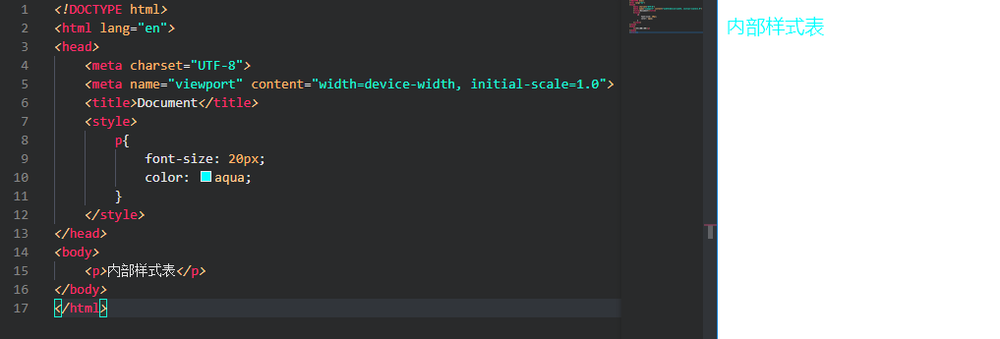

## CSS

当我要编写一个网站，HTML 用来给这个网站提供内容，而 CSS 则将这些内容美化整理

## CSS 的三种样式

### 1. 内联样式

**直接在元素上通过`style`的形式**

例

    
内联样式

内联样式

### 2. 内部样式表

**放在 head 标签里边的，在 style 标签里边定义样式，可以同时定义一整页**

    <head>
        
    </head>
    <body>

    </body>
    </html>

### 3. 外部样式表

**单独创建一个.css 文件来进行内容的修改，然后在 html 文件中使用 link 标签进行导入 css 文件**

    <link rel="stylesheet" type="text/css" href="*.css" />

### CSS 的单位

HTML 中的单位只有一种，那就是像素 px，所以单位是可以省略的，但是在 CSS 中不一样。 CSS 中的单位是必须要写的，因为它没有默认单位。

1 in=2.54cm=25.4mm=72pt=6pc。

- in：英寸 Inches (1 英寸 = 2.54 厘米)
- cm：厘米 Centimeters
- mm：毫米 Millimeters
- pt：点 Points，或者叫英镑 (1 点 = 1/72 英寸)
- pc：皮卡 Picas (1 皮卡 = 12 点)

### CSS 语法

CSS 共由两大块组成分别是选择器与声明块

    p{                          //这时候的p是选择器，用于选择页面中的指定元素
        font-size: 20px;
        color: aquamarine;
    }                           //而{}内的则是声明块，给选择的元素设置样式

声名块中的每个声明由;分开，声明的名与值用：连接
