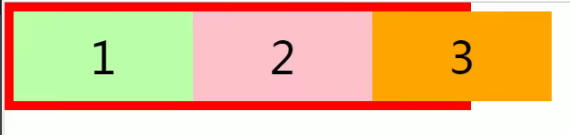
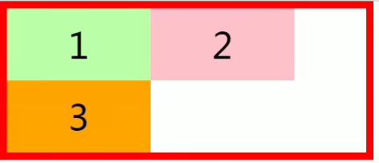
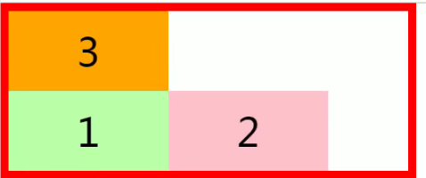
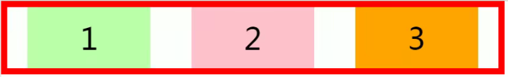
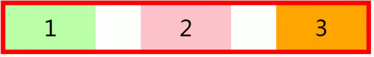
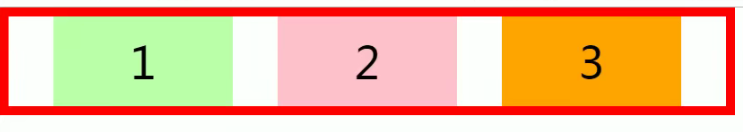

## 弹性盒子Flex布局

可以将元素设置为弹性盒子来适应网页的变化

## flex
- 是css中的一种布局方式，主要用来替代浮动来完成网页布局
- flex可以是元素具有弹性，可以让元素跟着页面大小改变
- 弹性容器
  - 要使用弹性盒子，必须要先将一个元素设置为弹性容器
  - 可以通过`display:;`来设置弹性容器
    - `display:flex;`设置为块级弹性容器
    - `display:inline-flex;`设置为行内的弹性容器
  - 弹性元素
    - 弹性容器的<b>子元素</b>是弹性元素
    - 弹性元素同时也可以设置为弹性容器

### 弹性容器的属性
#### `flex-direction:;`元素在容器中排列方式
- `row`默认，弹性元素在容器中中水平排列
  - 主轴是由左向右
- `row-reverse` 弹性元素在容器中反向水平排列
  - 主轴是由右向左
- `column`弹性元素纵向排列
  - 主轴自上向下
- `column-reverse` 弹性元素纵向排列
  - 主轴自下向上

**备注**：  弹性容器内的元素排列方向就是主轴，垂直于主轴的就是辅轴

#### `flex-wrap:;`设置弹性元素在容器空间不够时是否换行
- `nowrap` 默认值，元素不会自动换行

- `wrap`元素沿着辅轴方向自动换行

- `wrap-reverse`元素沿着辅轴的反方向换行

#### `flex-flow:wrap direction;`：`flex-wrap:;`与`flex-direction:;`的简写

#### `justify-content:;`当弹性容器大于内的弹性元素，而弹性元素不设置伸展，那吗右侧便会留有多余的空白，这个参数用于部署这多余的空白，也可以说是将里面的弹性元素放置的位置
- `flex-start`元素沿着主轴起边排序，空白在右边
- `flex-end`元素沿着主轴终点排序，空白在左边
- `center`元素居中排序，空白均分在容器的两边
- `space-around`空白分布到每个元素的两侧，但容器内左右两边的空白偏小，元素之间的空白偏大

- `space-between`空白分布到元素两侧，容器内左右两边没有空白

- `space-evenly`空白均匀分布到每个元素的两侧和容器内左右两边，

#### `align-items:;`元素在辅轴上如何对齐，也可以理解为高度上的对齐
- `stretch` 默认值，元素的高度都设置为相同的值，自动填满高度
- `flex-start`元素的高度不会拉伸，沿着辅线对齐，也就是沿着顶端对齐
- `flex-end`元素的高度不会拉伸，沿着辅线终边对齐，也就是沿着底部对齐
- `center`元素的高度不会拉伸，居中对齐，上下高度对齐
- `beseline`基线对齐，沿着字的基线对齐

#### `align-content`,和`justify-content:;`的功能差不多，不过是用来设置高度上下的空白的,参数一样

- `flex-start`元素沿着辅轴起边排序，空白在下边
- `flex-end`元素沿着辅轴终边排序，空白在上边
- `center`元素居中排序，空白均分在容器的上下边
- `space-around`空白分布到每个元素的上下两边，但容器内上下两边的空白偏小，元素之间的空白偏大
- `space-between`空白分布到元素两侧，容器内左右两边没有空边
- `space-evenly`空白均匀分布到每个元素的两侧和容器内左右两边，

### 弹性元素的属性
#### `flex-basis:;`元素的基础长度
- 默认值是auto，
- 如果主轴是**横向**的，则该值指定的就是元素的宽度
- 如果主轴是**纵向**的，则该值指定的就是元素的高度

#### `flex-grow` 指定元素的伸展系数
- 当父元素有多余空间时，子元素如何伸展
- 父元素的剩余空间会按照比例分配
- 默认值为0，为不伸展，为1时则填满父元素，值越大，占比越大
#### `flex-shrink:;`指定元素的收缩系数
- 当父元素空间不足以容纳所有子元素时，会让子元素进行收缩
- 默认值为1，自动收缩，当为0时不做收缩，

#### `flex:grow shrink basis;`元素三种样式的简写
- `flex:;`也有三种属性值可以选，三个值可以看作简写
  - `initial`:"flex: 0 1 auto"
  - `auto`:"flex: 1 1 auto"
  - `none`"flex: 0 0 auto"
  

#### `order:;`属性规定了弹性容器中的元素在布局时的顺序
- `order:;`初始值为0，
- 值越小，顺序越朝前，值可以为负数