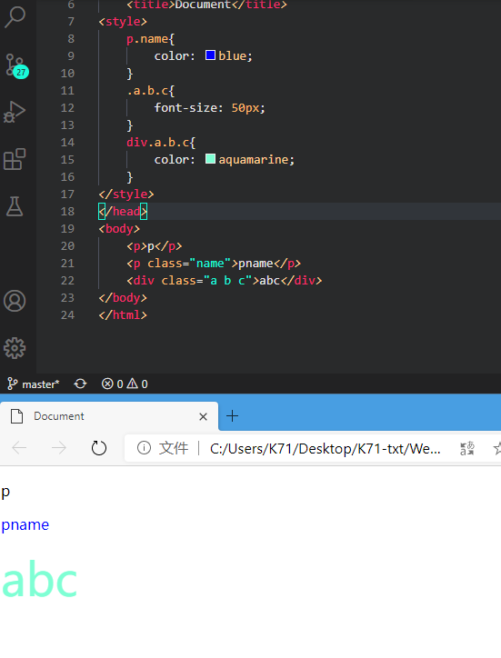
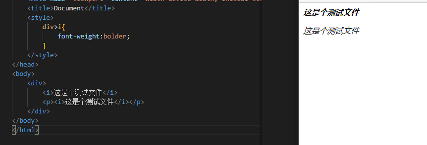

## 常用选择器

### 元素选择器

根据标签内元素名指定选择器

比如`

`标签，在style中则是

    p{
        font-size: 20px;
        color: aquamarine;
    }

这样就可以将所有的`
`标签套用这个css

### id选择器

在html中id是唯一的，可以在标签中加入id，在css中就可以根据id来使用

html

    
id选择器

css

    #name{
        font-size: 20px;
        color: aquamarine;
    }

#name表示选择所有id为name的标签来使用

### 类选择器

id虽好，但因为唯一性只能对一个标签使用，这是就要用到类选择器class

html

    
类选择器1

    
类选择器2

css

    .name{
        font-size: 20px;
        color: aquamarine;
    }

类选择器与id一样，但可以对多个标签命名使用，#则变成了.

### 通配选择器

*通配选择器可以对页面所有元素进行使用，

    *{
        font-size: 20px;
        color: aquamarine;
    }

## 关系选择器

### 交集选择器

同时选择符合多个元素额标签

    选择器1选择器2选择器3{

    }

以上例子中,p.name就是选择的同时满足`
`以及`class="name"`

### 并集选择器

同时选择多个选择器对应的元素

    选择器1，选择器2，选择器3{

    }

上面例子中选择器选择了包含name与a的

## 关系选择器

### 子元素选择器

用于选择元素内的其中一个元素

    父元素 > 子元素 > 子元素{

    }

### 后代选择器

    父元素 子元素{

    }

## 属性选择器

## 伪类选择器

## 超链接伪类

    <a href="https://www.baidu.com">百度</a>

a:link{  }  ：表示没访问过的  
a:visited{  }   ：表示访问过的链接   
a:honver{  } :表示鼠标移动到这里的状态
a:active{ }:表示鼠标点击时候额状态