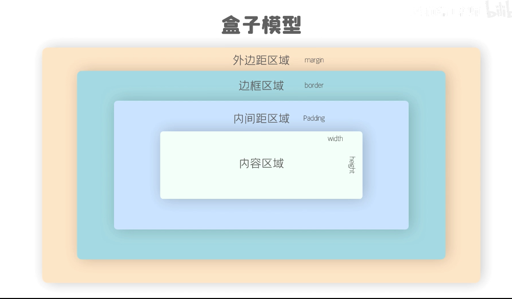
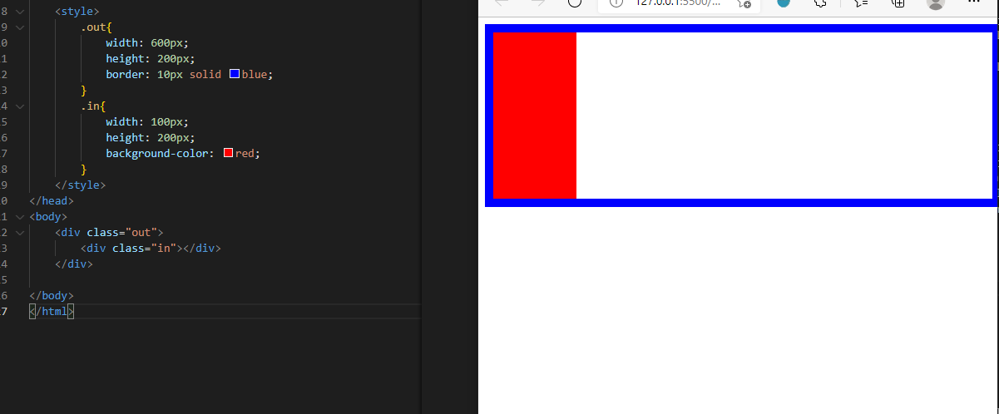

### 内容区
* width 内容区宽度
* height 内容区高度

### 边框（border）
* `border-width` 边框的高度
  * 一般默认会有这个参数
  * 多个值来设置
    * border:上,右,下,左;
    * border:上,左右,下;
    * border:上下,左右;
    * border：上下左右;
  * 也可以使用`border-top/right/bottom/left-width`来分别设置
* `border-color` 边框的颜色
  * 和`border-width`一样可以分别设置四个边框
* `border-style` 边框的样式
  * solid 实线
  * dottod 点状虚线
  * dashed 虚线
  * double 双虚线

<b>可以使用`border:width color type;`来简写同时设置三个参数，三个参数的顺序无所谓</b>
<b>可以使用border-right:none;来删除右边的设置</b>

### 内边距（padding）

* 内容区和边框之间的距离就是内边距
* padding-top/right/bottom/left:;来分别设置四个边
* 盒子的大小是由内容区，内边距，边框总体来决定的
* padding:top,right,bottom,left;简写来设置内边距大小

### 外边距（margin）

- 这个盒子与其他元素的距离就是外边距
- 外边距不会影响盒子的大小但会影响盒子的位置
- 盒子外边距同样有四个方向，margin-top/right/bottom/left:;
- 盒子设置左边和上边（margin-left/top）会改变盒子的位置，但如果设置盒子的右边距和下边距（margin-right/bottom）则会挤开其他元素
- 盒子margin可以设置为负值

## 水平和垂直布局
### 水平布局

- 盒子的水平位置由盒子的外边距，边框，内边距，内容区的宽度共同决定，就是盒子的宽加起来。而盒子的水平距离一定会占用一整行。
- 盒子会占用一整行，就算看起来右边还有很多的空位，实际上盒子会默认自动改变`margin-right:;`属性来让右边占满
  - 也可以使用`auto`来让出了`margin-right:;`以外的属性随着盒子而变化。例如上图out盒子内容区为600像素，将in盒子`border-right:auto;`则右边框则会自动补满
    - 如果一个宽度和一个外边距调整为auto，则宽度则会调整最大，填补整行
    - 如果三个值设置为auto，则外边距都为0，则宽度最大
    - 如果两个外边距设置为auto，则需要补满的长度则平均分给左右外边距

### 垂直布局
- 盒子的垂直布局，需要说的就如果盒子的子元素大于父元素设置的值，则子元素会溢出，可以使用`overflow:;`来处理溢出的部分
  - `overflow:visible;`默认，溢出部分显示
  - `overflow:hidden;`溢出部分会被裁剪
  - `overflow:scroll;`生成水平和垂直两个滚动条，
  - `overflow:auto;`根据需要生成水平和垂直滚动条
- 还可以使用`overflow-x/y:;`来单独设置水平或垂直的滚动条

### 行内块元素
一般元素分为两种，一种是块级元素`
`一种是行内元素``.
- 块级元素`
`
  - 独占一行，不能与其他元素并列
  - 可以设置宽weidth高height。不设置默认变成父级的100%
- 行内元素``
  - 与其他元素并排显示
  - 不能设置宽weidth高height，默认的大小就是内容区大学奥

可以使用`display:;`来改变元素是行内还是块
- `inline`将元素设置为行内元素
- `block`将元素设置为块元素
- `inline-block`设置为行内块元素，既可以设置宽高，还不会独占一行
- `table`将元素设置为一个表格
- `none`元素不在页面中显示

关于元素的显示状态，除了使用`display:none;`还可以使用`visibility`来设置
- `visible` 默认值，正常显示
- `hidden`元素在页面中隐藏，不显示，跟`display:none;`比但依旧会占有空间
  
## 浏览器默认样式
**一般浏览器的盒子模型的外边框和内边距以及字体间距默认会有一定的值，需要重置浏览器的默认样式**

## 盒子大小

盒子的大小一般是由内容区，内边距，边框共同决定的。
- `box-sizing:;`
  - `content-box`默认值，width和height用于设置内容区大小
  - `border-box`width和height用于设置整个盒子的大小，包括内容区，内边距和边框。
  
## 轮廓，阴影，圆角

### 轮廓(ontline)
轮廓和边框（border）差不多，同样的设置方法，但当使用边框border时候，设置边框border会推开周围的元素，而轮廓不会，轮廓只是作为一个显示的作用，

`outline:width color type;`

### 阴影（box-shadow）

`box-shadow:水平偏移量 垂直偏移量 阴影的模糊半径 阴影的颜色`

- **水平偏移量** 阴影的水平位置，一般默认实在盒子的右边，如果设置负值，则会在左边
- **垂直偏移量** 阴影的垂直位置，一般默认咋在盒子的下边，如果设置负值，则会在盒子上边
- **阴影的模糊半径** 这个参数可以省略，这个值就是指阴影的渐变效果，值越大渐变效果越好
- **阴影的颜色** 

### 圆角（border-radius）

`border-radius:;`用来设置盒子的圆角，值的大小就是圆的半径
值可以有多个
- 四个值 左上 右上 右下 左下
- 三个值 左上 右上/左下 右下
- 两个值 左上/右下 右上/左下

`border-top/bottom-left/right-radius:;`可以分别设置圆的四个角。
- 单独设置一个角的时候如果有两个值可以设置为椭圆的角，第一个值是角的水平，第二个值是角的垂直
  
