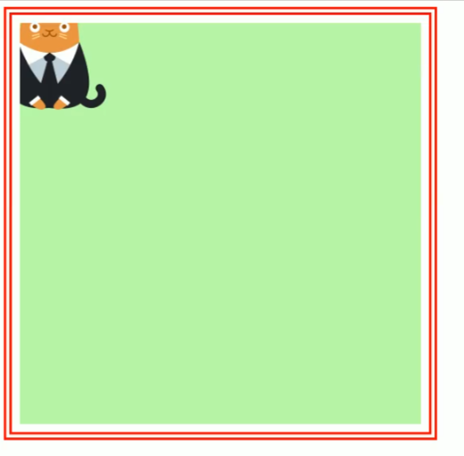

## CSS 设置背景

### 背景颜色

`background-color:rgb;`

### 背景图片

`background-image:url("./xx/xx.png"); `图片的地址

### 背景图片重复

`background-repeat`

- repeat 默认值
- repeat-x 沿着 x 轴重复
- repeat-y 沿着 y 轴重复
- no-repeat 不重复

### 背景图片的位置

`background-position`背景图片的位置

- 使用 top right left bottom center 其中两个来指定
  - 使用这个参数时必须指定两个值，如果不指定第二个值，第二个则默认 center
- 还可以使用偏移量`background-position:水平偏移量 垂直偏移量;`

### 背景图片的范围

`background-clip`

- border-box 背景图片默认会占用边框 内边距 内容区的地方
- padding-box 背景图片不会占用边框 只占用内容区和内边距
- content-box 背景图片只出现在内容区

### 背景图片偏移量的原点

当修改`background-clip`这个值的时候，虽然可以使背景图片不占用边框，但背景图片会被裁剪，可以使用`background-origin`这个值来修改背景图片的位置使其不会被裁剪
`background-origin`

- border-box 默认背景图片默认会以边框为原点
- padding-box 背景图片以内边距为原点
- content-box 背景图片以内容区为原点

**说明**比如上边这张图就是图片偏移量原点默认，然后改变背景图片范围为内容区，使得背景图被裁切，

### 背景图片的大小

`background-size`

- 使用两个值来表示图片大小
- 第一个值表示宽度，第二个值表示高度
  - 如果只写一个值，那吗第二个值为 auto
- `background-size:cover;`图片比例不变，将元素铺满，可能导致图片宽被裁剪
- `background-size:contain;`图片比例不变，使图片完整显示，可能使得图片无法将背景铺满

### 背景是否跟着元素移动

`background-attachment:;`

- scroll 默认值 背景图片跟着页面移动
- fixed 背景被固定在视口中，不会跟着元素移动

### 背景简写

背景共有八个属性

    background-color    背景颜色
    background-position    背景图像的位置
    background-size     背景图片的尺寸
    background-repeat    如何重复背景图像
    background-origin     背景图片的定位区域
    background-clip      背景的绘制区域  /* 底部详细说明 */
    background-attachment 背景图像是否固定或者随着页面的其余部分滚动
    background-image    背景图像
    background        简写属性

简写的顺序为`background：background-color background-image background-repeat background-attachment background-position;`

## 背景颜色渐变

`background:linear-gradient();`可以设置背景颜色的渐变

- 括号内可以设置两个或以上的颜色，使用逗号`,`分开。
- 渐变的角度，可以在括号内第一个值使用以下参数来改变渐变方向
  - to left 向左渐变
  - to right 向右渐变
  - to bottom 向下渐变
  - to top 向上渐变
  - xx deg 指定渐变的角度
  - turn 表示圈

还可以在颜色后空格加尺寸来表示每种颜色渐变的位置

`background-image:repeating-linear-gradient()`可以使渐变颜色多次重复
