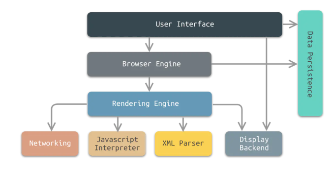

## W3C
* W3C 指万维网联盟（World Wide Web Consortium）
* W3C 创建于1994年10月
* W3C 由 Tim Berners-Lee 创建
* W3C 的工作是对 web 进行标准化，创建并维护 WWW 标准
* W3C 标准被称为 W3C 推荐（W3C Recommendations）

### 浏览器

市场统计：https://tongji.baidu.com/research/site

工作原理

1、User Interface 用户界面，我们所看到的浏览器

2、Browser engine 浏览器引擎，用来查询和操作渲染引擎

3、Rendering engine 用来显示请求的内容，负责解析HTML、CSS

4、Networking 网络，负责发送网络请求

5、JavaScript Interpreter(解析者) JavaScript解析器，负责执行JavaScript的代码

6、UI Backend UI后端，用来绘制类似组合框和弹出窗口

7、Data Persistence(持久化) 数据持久化，数据存储 cookie、HTML5中的sessionStorage

### 软件架构
* CS即Client/Server(客户端/服务器)结构
  * 就是使用软件来连接服务器。
* BS即Browser/Server(浏览器/服务器)结构
  * 就是只安装维护一个服务器(Server)，而客户端采用浏览器(Browse)运行软件。