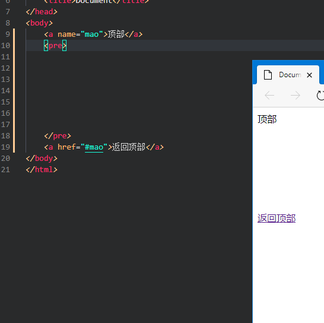

## 超链接

``  
 a 是英语 anchor“锚”的意思，用于跳转网页或导向其他地址
href（hypertext reference）

- `href`=""：（hypertext reference）目标 URL
- `title=""`：悬停文本。(鼠标放上去后会显示)
- `dowload=""` 下载超链接目标（需要与链接同源）
- `target=""`告诉浏览器用什么方式来打开目标页面。target 属性有以下几个值：
  - \_self：在同一个网页中显示（默认值）
  - \_blank：在新的窗口中打开。
  - \_parent：在父窗口中显示
  - \_top：在顶级窗口中显示
- `rel` 指定当前文档与被链接文档的关系

### 特殊链接链接``

电子邮件链接：``
手机链接：``
短信链接：``

### 锚链接``

用于在网页一处设置一个锚，可以从这个网页或其他网页任意位置利用超链接``跳跃到这里,可以用于返回首页或者返回顶部

第 9 行 name 后的 mao 即为锚的名称，19 行超链接指向的就是名为 mao 的点。超链接指向#mao 前的#不能省略，不然会指向 mao 这个文件或文件夹。

    <a href="1.html#mao">
    这个是指跳转到1.html页面中的mao

注：name 也可以用 id 代替，如``
