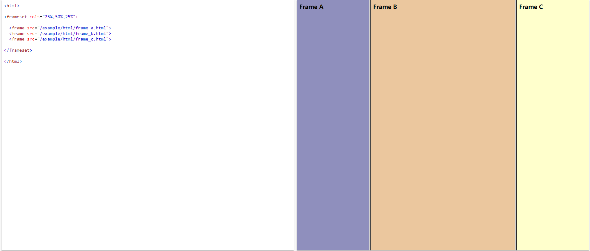
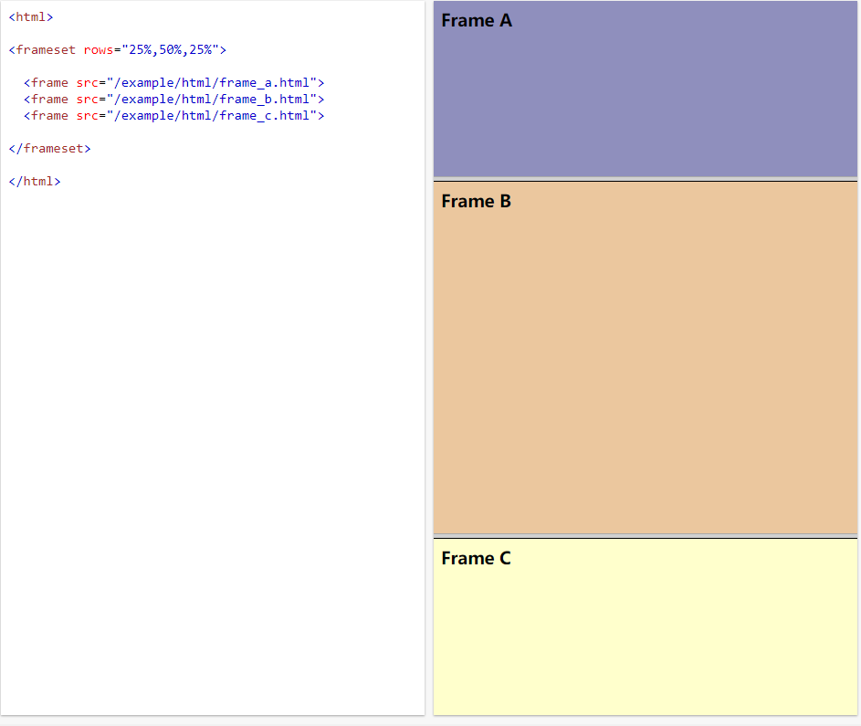
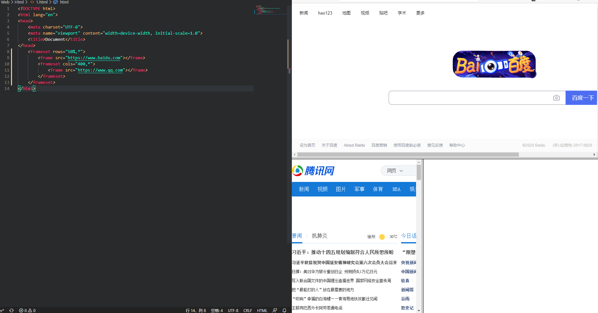

## 框架标签

用于在以一个网页中显示多个网页
* `注意，框架标签不能放在<body>标签里面，因为<body>标签代表的只是一个页面，而框架标签代表的是多个页面。于是：<frameset>和<body>只能二选一。`
* `框架的集合用<frameset>表示，然后在<frameset>集合里放入一个一个的框架<frame>`
* `frameset和frame已经从 Web标准中删除，建议使用 iframe 代替。`

### **`<frameset><frame></frame></frameset>`**

`<frameset></frameset>`是一个大的框架,而内部的`<frame></frame>`用来在这个框架内切分这个网页，使其每个部分显示其他的网页。

* `<frameset>`
  * rows:水平分割，将框架分为上下部分
    * rows="200,*"`*`代表剩余的,分割上下两页面，上页面占200像素，剩余的为下页面
    * rows="30%,*"`*`代表剩余的，分割上下两页面，上页面占总页面的30%，剩余的为下页面
    * 如果你想将框架分成很多行，在属性值里用逗号隔开就行了、
  * cols:垂直分割，将框架分为左右部分。
    * cols="200,*"`*`代表剩余的,分割左右两页面，左页面占200像素，剩余的为右页面
    * cols="30%,*"`*`代表剩余的,分割左右两页面，左页面占总页面的30%，剩余的为右页面
    * 如果你想将框架分成很多列，在属性值里用逗号隔开就行了

### `<frame></frame>   `

* scrolling="no"：是否需要滚动条。默认值是true。
* noresize：不可以改变框架大小。默认情况下，单个框架的边界是可以拖动的，这样的话，框架大小就不固定了。如果用了这个属性值，框架大小将固定。
举例：

  `<frame src="top.html" noresize></frame>`
* bordercolor="#00FF00"：给框架的边框定义颜色。这个属性在框架集合`<frameset>`中同样适用。 颜色这个属性在IE浏览器中生效，但是在google浏览器中无效，不知道为啥。

* frameborder="0"或frameborder="1"：隐藏或显示边框（框架线）。

* name：给框架起一个名字。利用name这个属性，我们可以在框架与target搭配进行超链

### `<iframe>`

同样用于在当前页面引入其他页面

* src="subframe/the_second.html"：内嵌的那个页面
* width=800：宽度
* height=“150：高度
* scrolling="no"：是否需要滚动条。默认值是true。
* name="mainFrame"：窗口名称。公有属性。
