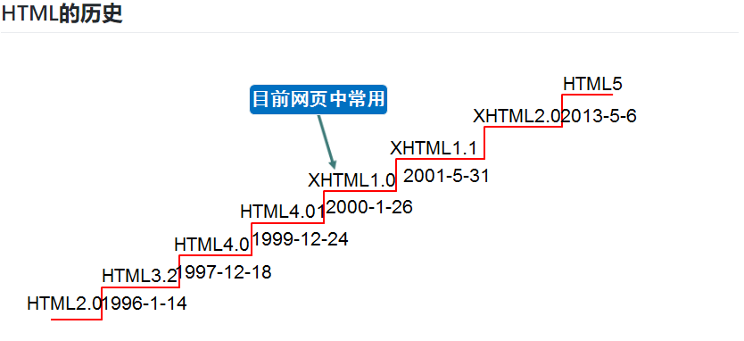

## HTML的概述
* HTML 指的是超文本标记语言 (Hyper Text Markup Language)
* HTML 不是一种编程语言，而是一种标记语言 (markup language)
* 标记语言是一套标记标签 (markup tag),HTML使用标记标签来描述网页.
* HTML 标签是由尖括号包围的关键词，比如 `<html>`
* HTML 标签通常是成对出现的，比如`<b>`和`</b>`,标签对中的第一个标签是开始标签，第二个标签是结束标签
* 开始和结束标签也被称为开放标签和闭合标签
* 也有非成对的标签，叫做自结束标签，例如`或`这两种写法都可以

    XHTML介绍： XHTML：Extensible Hypertext Markup Language，可扩展超文本标注语言,是一种置标语言，表现方式与超文本标记语言（HTML）类似，不过语法上更加严格。从继承关系上讲，HTML是一种基于标准通用置标语言的应用，是一种非常灵活的置标语言，而XHTML则基于可扩展标记语言，可扩展标记语言是标准通用置标语言的一个子集。

### Html骨架

    <html>
        <head>
            <title></title>
        </head>
        <body>
        </body>
    </html>

|标签名|定义|说明|
|-|-|-|
|`<html>`|HTML标签|页面中最大的标签，我们成为根标签|
|`<head></head>`|文档的头部|head标签中我们必须要设置的标签是title|
|`<titile></title>`|文档的标题|网页标题|
|`<body></body>`|文档的主体|元素包含文档的所有内容，页面内容 基本都是放到body里面的|

### 快速生成 html 的骨架

在 VS Code 中新建 html 文件，输入html:5，按 Tab键后

    <!DOCTYPE html>
    <html lang="en">
    <head>
        <meta charset="UTF-8">
        <meta name="viewport" content="width=device-width, initial-scale=1.0">
        <title>Document</title>
    </head>
    <body>
        
    </body>
    </html>

### 文档声明头

任何一个标准的HTML页面，第一行一定是一个以`<!DOCTYPE ……>`开头的语句。这一行，就是文档声明头，即 DocType Declaration，简称DTD。

**DTD可告知浏览器文档使用哪种 HTML 或 XHTML 规范**

在HTML5中极大的简化了DTD，HTML5的DTD（文档声明头）：如下

    <!DOCTYPE html>

### 页面语言 `lang`

    <html lang="en">    英文
    <html lang="zh-CN"> 中文

在`<html></html>`标签内，用于指定页面的语言

### 头标签 `head`

头标签内部的常见标签如下
* `<meta>`：提供有关页面的基本信息
* `<title>`：指定整个网页的标题，在浏览器最上方显示。
* `<base>`：为页面上的所有链接规定默认地址或默认目标。
* `<body>`：用于定义HTML文档所要显示的内容，也称为主体标签。我们所写的代码必须放在此标签內。
* `<link>`：定义文档与外部资源的关系。

`meta`

    <meta http-equiv="Content-Type" content="text/html;charset=UTF-8">
    字符集用meta标签中的charset定义，charset就是character set（即“字符集”），即网页的编码方式。
    <meta http-equiv="refresh" content="3;http://www.baidu.com">
    这是做了一个界面的跳转，表示30s不运行的话就跳转到指定的URL

    <meta name="viewport" content="width=device-width, initial-scale=1.0">
    width=device-width ：表示视口宽度等于屏幕宽度。

    <meta name="Keywords" content="网易,邮箱,游戏,新闻,体育,娱乐,女性,亚运,论坛,短信" />
    网页关键词，用于提高网页搜索命中率

    <meta name="Description" content="网易是中国领先的互联网技术公司，为用户提供免费邮箱、游戏、搜索引擎服务，开设新闻、娱乐、体育等30多个内容频道，及博客、视频、论坛等互动交流，网聚人的力量。" />
    设置关键字和页面描述，只要设置Description页面描述，那么百度搜索结果，就能够显示这些语句，这个技术叫做SEO（search engine optimization，搜索引擎优化）。

`title`

设置网页标题

    <title>网页的标题</title>

`base`  

base 标签用于指定基础的路径。指定之后，所有的 a 链接都是以这个路径为基准。

    <base href="/">

`<body>`

`<body>`标签的属性

* bgcolor：设置整个网页的背景颜色。
    * `<body bgcolor="red">`
* background：设置整个网页的背景图片。
* text：设置网页中的文本颜色。
* leftmargin：网页的左边距。IE浏览器默认是8个像素。
* topmargin：网页的上边距。
* rightmargin：网页的右边距。
* bottommargin：网页的下边距。
* link:表示默认显示的颜色
* alink:属性表示鼠标点击但是还没有松开时的颜色
* vlink:属性表示点击完成之后显示的颜色

