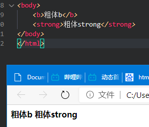

## 字体标签

字体标签：`、 <b>、 <u> 、 、`  
超链接: `<a>`

### 特殊字符（转义字符）

  
|特殊字符	|描述|	字符的代码|
|-|-|-|
||空格符|`&nbsp;`|
|<|	小于号|	`&lt;`|
|>| 大于号|	`&gt;`|
|&|	和号|	`&amp;`|
|"|双引号"|`&quot`|
|'|单引号'|`&apos`|
|￥|	人民币|	`&yen;`|
|©|	版权|	`&copy;`|
|®|	注册商标|	`&reg;`|
|°|	摄氏度|	`&deg;`|
|±|	正负号|	`&plusmn;`|
|×|	乘号|	`&times;`|
|÷|	除号|	`&divide;`|
|²|	平方2（上标2）|	`&sup2;`|
|³|	立方3（上标3）|	`&sup3;`|
|N|unicode编码字母N|`&#78`|

### 下划线、中划线、斜体

* `<u>`：下划线标记
* `<s>`或`<del>`：中划线标记（删除线）
* `<i>`或`<em>`：斜体标记
  

### 粗体标签

* `<b>`标签定义粗体的文本
* `<strong>`
  * 在 HTML 4.01 中，`<strong>` 标签定义加粗的被强调的文本
  * 在 HTML 5 中，`<strong>` 标签定义重要的文本。
  

### 字体标签

* ``
  * color="红色"/"#ff00cc"/"new rgb(0,0,255)"
  * face="微软雅黑"(字体类型)
  * size="1~7"

__font现在html5以废弃，建议使用css完成字体__

### 上标下标

* ``上标
* ``下标

01  
02

