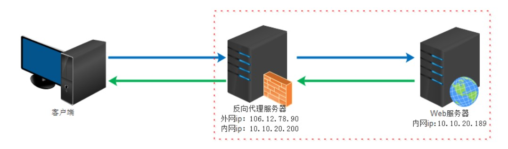
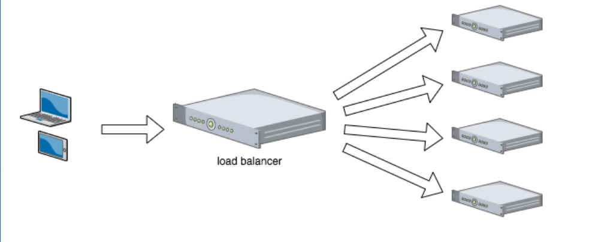
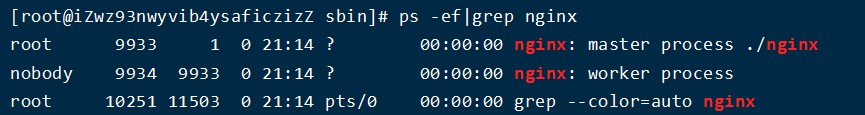

## Nginx 概念

https://www.bilibili.com/video/BV1zJ411w7SV?p=1

### 正向代理

当客户端无法直接访问服务器时(例如 www.google.com)在其中间搭建一个我能访问的代理服务器，这个代理服务器可以访问我不能访问的网站，当我要访问网站时，会先连上代理服务器,告诉代理服务器我需要那个无法访问网站的内容，代理服务器去取回来,然后返回给我。从网站服务器的角度看，代理服务器也隐藏了用户的资料，这取决于代理服务器告不告诉服务器  
总结：正向代理 是一个位于客户端和原始服务器(origin server)之间的服务器，为了从原始服务器取得内容，客户端向代理发送一个请求并指定目标(原始服务器)，然后代理向原始服务器转交请求并将获得的内容返回给客户端。客户端必须要进行一些特别的设置才能使用正向代理。

正向代理常用于

- 访问特殊网站
- 作用于缓存
- 对客户端访问授权认证
- 记录用户上网行为，隐藏用户信息

### 反向代理

反向代理同样是在服务器与客户端之间搭建一个桥梁，只不过是服务器端搭建的，客户端在可以正常访问 服务器时，服务器端搭建反向代理客户端是不知道的，访问者并不知道自己访问的是一个代理，因为客户端不需要任何配置就可以访问。

### 负载均衡

负载均衡就是在反向代理的基础上使用多个服务器分摊大量的客户端请求，用户发出的请求会统一到代理服务器并由代理服务器

### 动静分离

动静分离指将服务端的动态资源(jsp,ftl.servlet)与静态资源(html,css,js)分开部署，提高用户访问静态代码的速度，降低对后台应用访问。

## Nginx 安装

Nginx 官网:http://nginx.org/

Nginx 依赖

- pcre http://www.pcre.org/
- openssl https://www.openssl.org/
- zlib http://zlib.net/

pcre 安装

    cd usr/src
    wget https://ftp.pcre.org/pub/pcre/xxx.tar.gz   安装pcre的tar包
    tar -xvf xxx.tar.gz     解压tar包
    cd xxx  进入解压好的包内
    ./configure
    make && make install
    pcre-config --version   检查安装版本

**注意./configure 与 make 需要使用 gcc 与 gcc-c++。可用 yum install gcc gcc-c++来使用**

zlib

    wget  http://www.zlib.net/zlib-1.2.11.tar.gz    下载链接为官网首页上的版本加tar.gz(zlib与版本号中间还有个-)
    tar -xvf zlib 1.2.11.tar.gz
    cd zlib-1.2.11
     ./configure
     make && make install
     whereis zlib   检测

openssl

    https://www.openssl.org/source/xxx.tar.gz
    tar -xvf xxx.tar.gz
    cd xxx
    ./config
    openssl version -a  查看openssl版本

openssl: error while loading shared libraries: libssl.so.1.1: cannot open shared object file: No such file or directory 错误问题，这是由于 openssl 库的位置不正确造成的,解决方法为将 openssl 文件下的 libssl.so.x.x,libcrypto.so.x.x 软链接到/usr/lib64/下

如果不在意版本问题，可以

    yum -y install gcc zlib zlib-devel pcre-devel openssl openssl-devel 一键安装依赖

### 安装 Nginx

    nginx压缩包放入linux
    tar -xvf nginx-x.x.x.tar.gz
    cd nginx-x.x.x
    ./congigure
    make && make install

安装完成后,/usr/local 下多出一个 nginx 文件，nginx 下 sbin 有启动脚本

检测 nginx

    cd /usr/local/nginx/sbin
    ./nginx
    ps -ef|grep nginx

/usr/local/nginx/conf/nginx.conf 文件为 nginx 配置文件

## nginx 常用命令

    nginx -v    查看nginx版本
    ps -ef|grep nginx   查看nginx进程
    ./nginx 开启nginx
    ./nginx -s stop 关闭nginx
    ./nginx -s reload 重加载nginx配置文件

nginx 命令需要在/usr/local/nginx/sbin 目录下才可以使用，可以创建软链接来解决这一问题

    ln -s /usr/local/nginx/sbin/nginx /usr/local/bin/nginx
