# 第一章：计算机系统的概述

## 计算机的发展

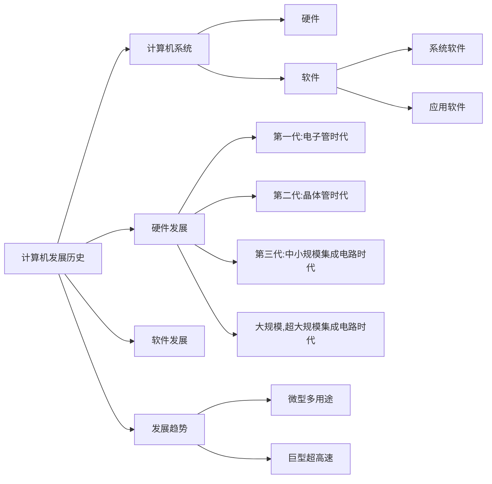

#### 计算机硬件的发展

| 发展阶段 | 时间      | 逻辑元件                 | 速度(次/秒)   | 内存           | 外存                           |
| -------- | --------- | ------------------------ | ------------- | -------------- | ------------------------------ |
| 第一代   | 1946-1957 | 电子管                   | 几千-几万     | 汞延迟线，磁鼓 | 穿孔卡带                       |
| 第二代   | 1958-1964 | 晶体管                   | 几万-几十万   | 磁芯存储器     | 磁带                           |
| 第三代   | 1964-1971 | 中小规模集成电路         | 几十万-几百万 | 半导体存储器   | 磁带，磁盘                     |
| 第四代   | 1972-现在 | 大规模，超大规模集成电路 | 上千万=万亿   | 半导体存储器   | 磁盘，磁带，光盘，半导体存储器 |

**微处理器的发展**：微型计算机的发展以微处理器技术为标志

**摩尔定律**：电路上可以容纳的晶体管数量，每搁 18 个月(两年)会增加一倍，整体性能也会增加一倍

#### 计算机软件的发展


目前计算机软件发展逐渐**两极化**

- 一种是更微型化，网络化，高性能，多用途
- 另一种是巨型机更巨型化，超高速，并行处理，只能化方向发展

## 计算机硬件的基本组成

#### 冯·诺依曼结构

冯·诺依曼提出了**存储程序**这个概念

存储程序指将<mark>**指令**以二进制代码的形式事先输入计算机的**主存储器(内存)**</mark>，然后按照在存储器中的首地址执行程序的第一条指令，然后按照该程序的顺序来执行其他指令，直到程序执行结束

随后第一台冯·诺依曼结构的计算机**EDVAC**诞生了

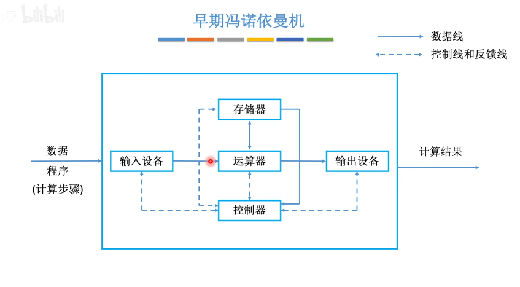

- 输入设备：将计算机要处理的信息转换为机器能识别的二进制形式
- 运算器：将数据存放入存储器中，主要用来执行算数与逻辑运算并将数据送到输出设备
- 存储器：存放程序和数据
- 控制器：使用电信号协调其他部件工作，并解析存储器中的程序，比如解析到存储器中的加减乘除，在调用运算器来执行
- 输出设备：用来将二进制再次转化为人们能识别的语言

**计算机系统中**：软件和硬件在逻辑上是等效的

**冯·诺依曼计算机特点**

- 计算机由五大部分组成
  - 存储器，运算器，控制器，输入设备与输出设备(可以并称 i/o 设备)
- 指令和数据同等地位存于存储器，可按地址寻访
- 指令和数据都是用二进制表示
- 指令由操作码和地址码组成
  - 操作码：指令要进行什么样的操作，例如加减乘除
  - 地址码：操作的数据存放于内存的地址
- **以运算器为中心**

#### 现代计算机结构

传统冯·诺依曼结构以运算器为核心，以运算器来做中转，效率低
<mark>现代计算机以存储器为核心</mark>

- 以存储器为核心可以直接将数据放入存储器，运算器处理完数据后，输出设备也可以直接从存储器取走，

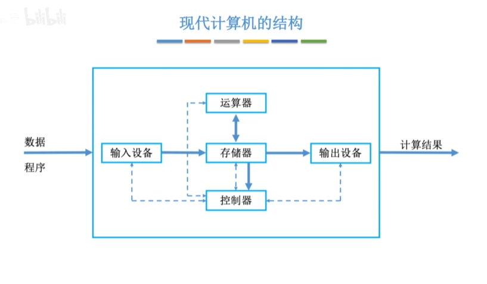

运算器和控制器之间联系很紧密，所以一半也是集成在一块芯片中(CPU)

**CPU=运算器+控制器**

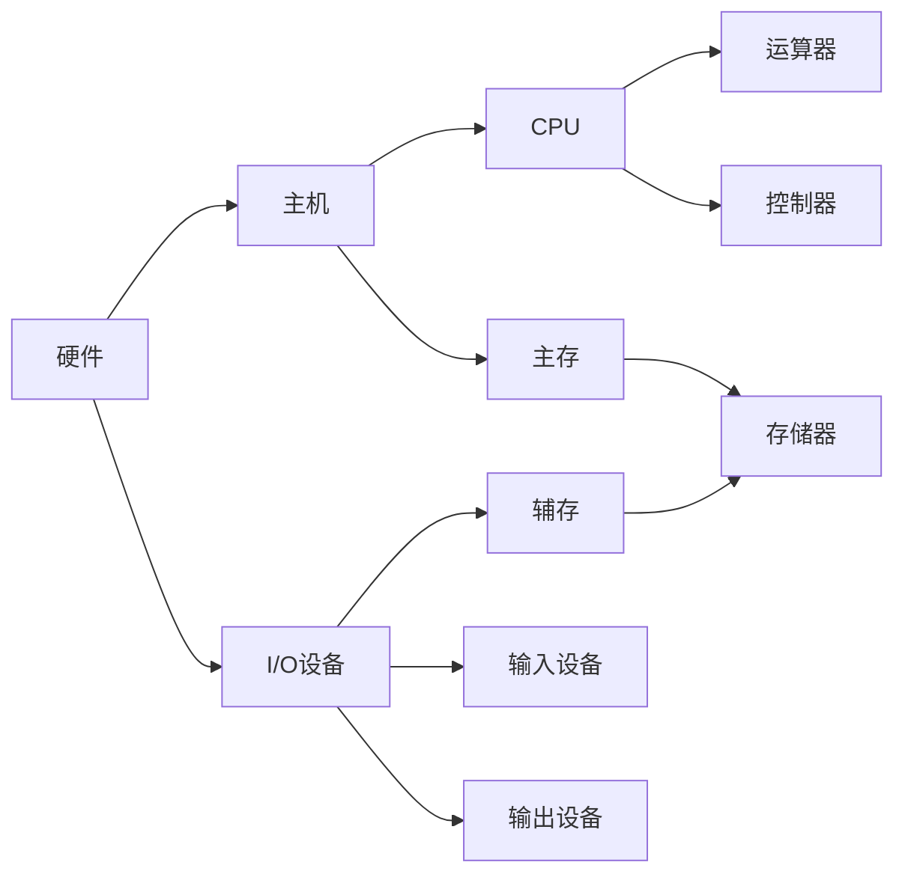

## 计算机硬件的组成

### 主存储器(内存)

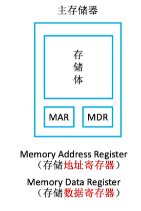

#### 寄存器

寄存器的主要作用是用来暂时存放参与运算的数据和运算结果，一般在 CPU 中

- 地址寄存器 ：MAR (Memort address Register)
- 数据寄存器 : MDR (Memort Data Register)

当 CPU 需要某个数据时，将这段数据存放的地址传给 MAR，然后 MAR 去存储体中对应地址来找，当 MAR 找到数据时会将数据放在 MDR，随后由 CPU 来取走。同样，当 CPU 要将数据放在存储体中时，会把地址传给 MAR，数据传给 MDR。随后 MAR 会将数据从 MDR 传给存储体

#### 存储体

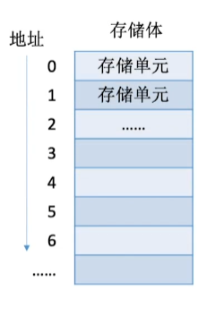

存储体与地址寄存器和数据寄存器相互联系

每一个地址有一个存储单元

- **存储单元**:用来存放一串二进制代码
- **存储字(word)**:一个存储单元里有一个存储字，存储字就是存放在存储单元里二进制的组合
- **存储字长**:存储字或者说存储单元里有多少位二进制
- 存储元：存储器的最小存储单元-电子元件

**特别备注**：

- MAR 用于寻址，有多少个存储单元就会有多少位地址，MAR 位数反映了存储单元的个数
  - 比如 MAR 有 4 位，那么 2<sup>4</sup>=16,MAR 最大只能找到 16 位地址
- 因为存储单元存放或者取数据是要放在 MDR 中的，所以一般**MDR 位数=存储字长**
- 现在计算机通常把 MAR 和 MDR 也集成到 CPU 中

#### 运算器和控制器

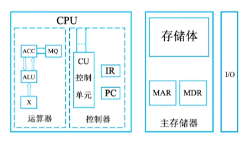

##### 运算器

用于算数运算(加减乘除)，逻辑运算(与或非)

- ACC:累加器，用于存放操作数，或运算结果
- MQ:乘商寄存器，乘除运算时，用来存放操作数或运算结果
- X:通运操作寄存器，用来存放操作数
- **ALU:算数逻辑单元**通过内部电路实现算数与逻辑运算

可以理解位 ACC，MX，X 都是用来存放操作中的数，而 ALU 才是用来进行运算的

|                            |     | 加        | 减        | 乘            | 除          |
| -------------------------- | --- | --------- | --------- | ------------- | ----------- |
| Accumulator                | ACC | 被加数,和 | 被减数,差 | 乘积高位      | 被除数,余数 |
| Multiple-Quotient Register | MQ  |           |           | 乘数,乘积低位 | 商          |
| Arithmetic and Logic Unit  | X   | 加数      | 减数      | 被乘数        | 除数        |

##### 控制器

用于调控指令

- PC(Program Counter):程序计数器，存放下一条指令地址，有自动加 1 功能
- IR(Instruction Register):指令寄存器，存放当前指令
- CU(Control Unit):控制单元，分析指令，给出新号

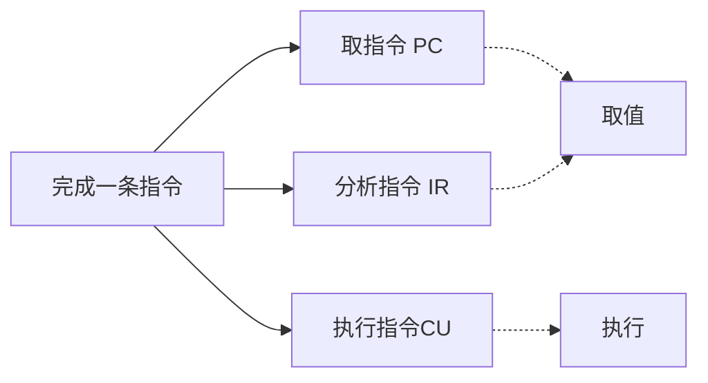

**程序取值执行顺序**：
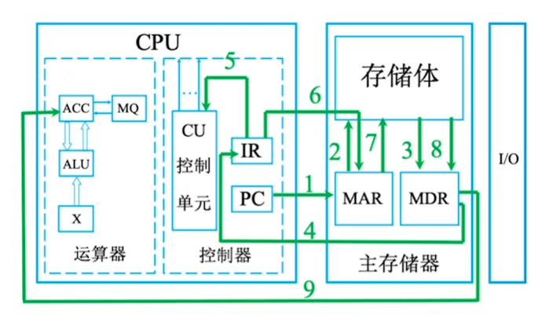

取值指令

1. 首先 PC 将第一条指令的位置发送给 MAR 选址
2. 从 MAR 选择的地址中获得指令数据，
3. 指令数据并存入 MDR 中
4. MDR 获得的指令数据再传回 CPU 的 IR 中存放
5. 指令数据包括操作码(取值)和地址码(需要取得值的地址)，将操作码传给 CU 控制单元，
6. CU 控制单元分析操作码，得出是取值，并将值用于放在 ACC 中用于乘法运算，CU 让 IR 将之前获得的地址码再次传给 MAR 中，
7. MAR 将需要用于乘法的值从地址中取出
8. MAR 将值放入 MDR 中
9. 将 MDR 中的值放入 ACC 中用于运算

- 其中 1~4 用于取指令
- 5 用于分析指令
- 6~9 执行指令
- 指令完成后 PC 会自动加一，来执行下一条指令

**程序乘法执行顺序**：

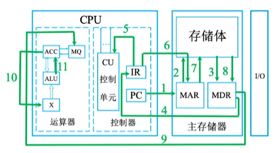

乘法指令

1~4. 此前已经取了一个值放在 ACC 中用于运算，PC 自动加一读取下一条指令，MAR 获取指令数据的地址，指令数据传给 MDR，MDR 再传到 CPU 中的 IR 中存放。 5. IR 再传给 CU 控制单元来操作码得出是乘法操作， 6. IR 将地址码发给 MAR 来获取乘数 7. MAR 去存储体中取值， 8. 存储体中乘数放入 MDR 中 9. MDR 将乘数值放在 MQ 中 10. 因为是乘法，所以将之前 ACC 中的被乘值被放入 X 中 11. CU 通过控制线告诉 ALU 是乘法来让 ALU 进行运算，并将乘积放入 ACC 中，如果乘积很大，则需要 MQ 来进行辅存

**CPU 区分指令和数据的依据：指令周期的不同阶段**

- 指令周期就是指取指令-分析指令-执行指令

## 计算机系统层次

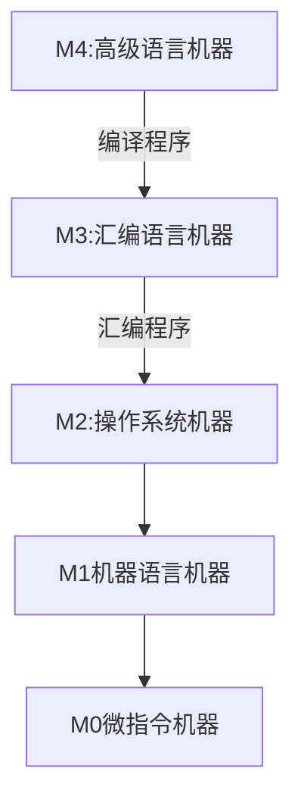

- 高级语言机器,汇编语言机器，操作系统机器都是软件
- 机器语言机器和微指令机器都是硬件方面
- 下层是上层的基础，上层是下层的扩展\*
- 微指令是指一条指令划分为更多步骤(比如上面取值和乘法分别划分了 9 条和 11 条微指令)

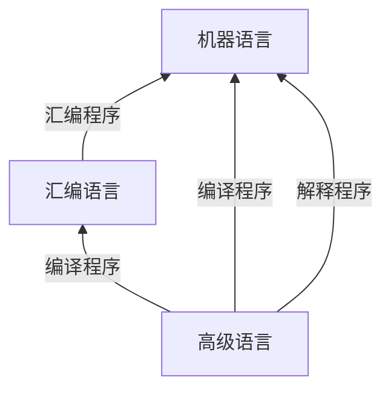

- 高级语言可以经过编译语言到汇编语言，然后汇编语言再由汇编程序转化为机器可以读懂的机器语言
- 高级语言也可以经过编译或者解释直接到达机器语言
  - 编译程序：将高级语言一次全部翻译为机器语言再执行
  - 解释程序：将程序一句一句的翻译并执行机器语言

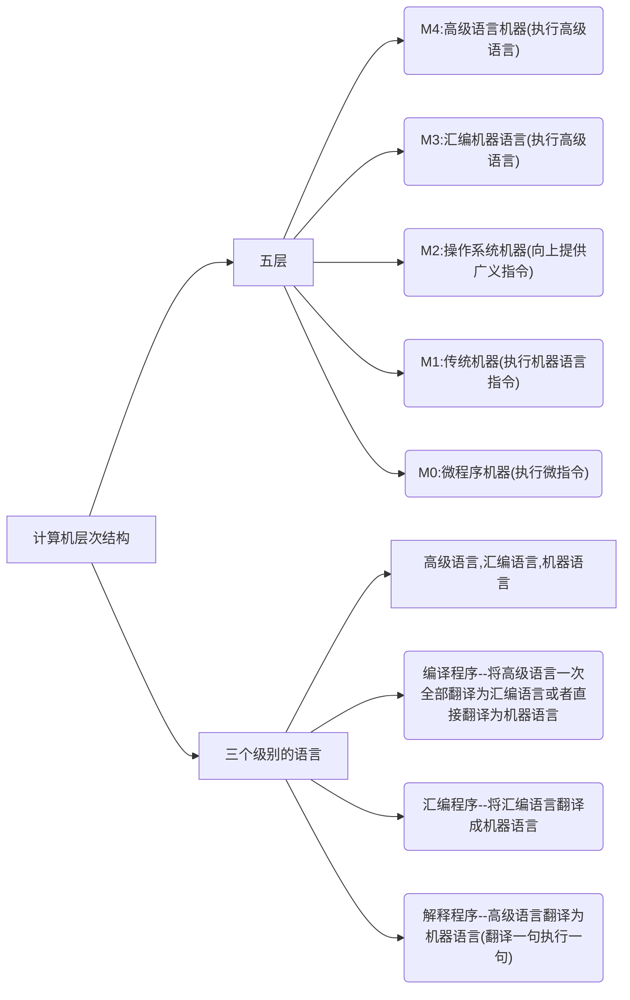

## 计算器性能指标

### 存储器性能指标

存储器中由存储体，MAR 和 MDR

- 存储体用于存储数据，里面又划分多个存储单元,一个存储单元里有一个存储字，存储字的长度就是存储字长
- MAR：地址寄存器，用于寻址，位数反应了存储单元的个数
- MDR：数据寄存器，用于将数据从存储体中放入或取出，MDR 位数=存储字长=每个存储单元大小

**总容量的计算=存储单元个数 x 存储字长(bit)=存储单元个数 x 存储字长/8**

### CPU 性能指标

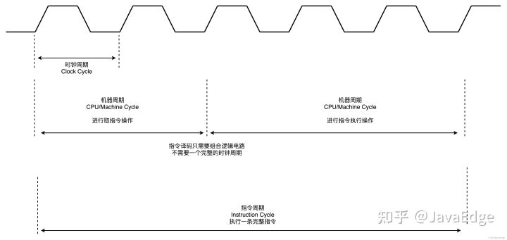
CPU 需要一个同步机制用来使所有设备来统一协调,**时钟发生器**完成这一工作，不停给芯片发送一个连续的脉冲信号，**每次脉冲到来，芯片内晶体管发生一次改变来完成任务**

**CPU 主频**：CPU 内数字脉冲信号振荡的频率(一秒内，震荡周期(时钟周期)的个数称为时钟频率，俗称主频)
**CPU 时钟周期**:振荡周期，越小，那么 CPU 执行速度越快

- 每一个脉冲新号成为 CPU 时钟周期---单位：微秒,纳秒
- **CPU 主频(时钟频率)=1/CPU 时钟周期=每秒钟有多少脉冲信号**---单位：赫兹 HZ

**备注**：主频不等于处理器一秒钟执行的指令条数，因为一条指令的执行可能需要多个时钟周期

- CPI(Clock cycle per Instruction):执行一条指令需要的时钟周期数(同一块 CPU 不同指令甚至相同指令 CPI 也会不同，因为会有负载等各种因素影响)
  - CPIxCPU 时钟周期=执行一条指令的耗时(一般说执行一条指令耗时指的是平均)

**CPU 执行时间(整个程序)=CPU 时钟周期/主频=(指令条数 xCPI)/主频**

- IPS(Instructions Per Second)每秒执行多少条指令
- FLOPS（Floating-point Operations Per Second）:每秒执行多少次浮点运算
  - IPS=主频/平均 CPI
  - 前面或许会有 K,M,G,T 等前缀
    - K=千=10<sup>3</sup> //例如：1KIPS=每秒可以指令 1 千条指令
    - M=百万=10<sup>6</sup>
    - T=万亿=10<sup>12</sup>

### 系统整体性能指标

- 数据通路带宽：数据总线一次能并行传送信息的位数
- 吞吐量：单位时间内系统能处理的请求数量，系统吞吐量主要取决于主存的存取周期
- 响应时间：指从用户向计算机发送一个请求到得到系统给出的响应之间的等待时间

### 系统整体性能指标 (动态测试)

**基准测试**：就是常见的跑分软件，用来测量计算机处理速度

```mermaid
graph LR
	计算机性能指标-->存储的容量 & CPU & 其他 & 常用单位
	存储的容量-->MAR:反映射存储单元的数量 & MDR:每个存储单元的大小
	CPU-->主频 & 时钟周期 & CPI & IPS & FLOPS & CPU执行时间
	主频-->=1/时钟周期,单位:HZ
	时钟周期-->CPU最小时间单位,每个指令最小一个周期
	CPI-->执行一条指令要花费的时钟周期数
	CPU执行时间-->运行一个程序花费时间 & =ID["=(指令条数*CPI)/主频"]
	IPS-->每秒执行多少条指令=主频/平均CPI
	FLOPS-->每秒执行多少次浮点运算
	其他-->数据宽路,吞吐量,响应时间,基准测试
	常用单位--> K,M,G,T
```
