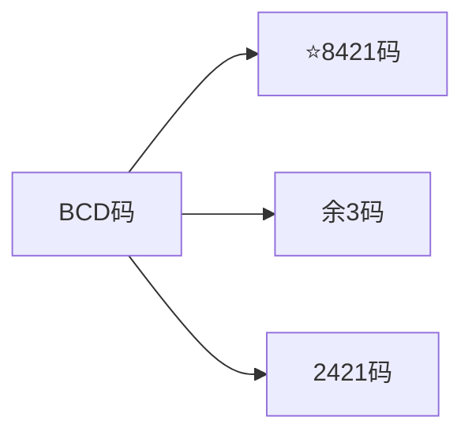
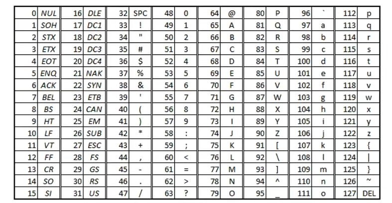
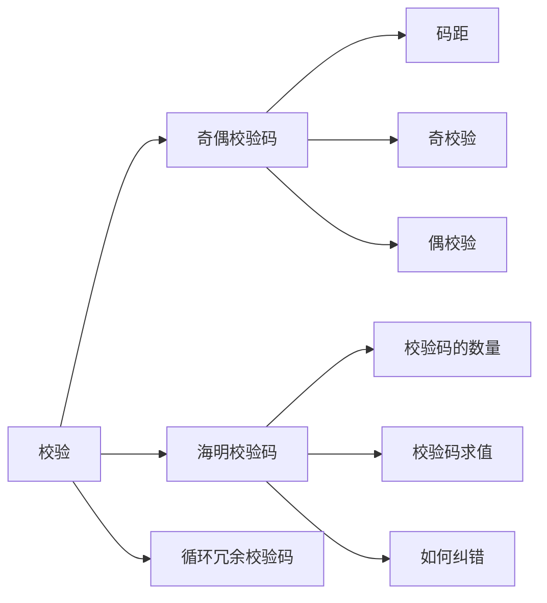
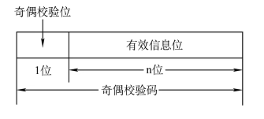
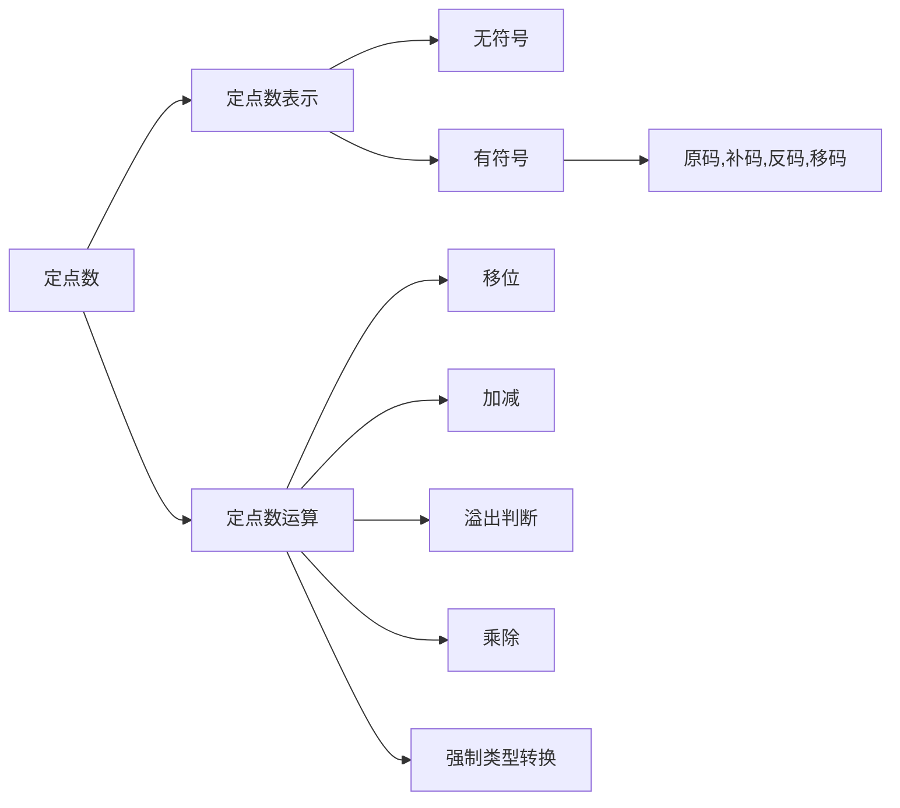

## 进制转化

#### 进制书写方式

| 进制     | 方式             |
| -------- | ---------------- |
| 二进制   | 后缀 B           |
| 八进制   | 前缀 0           |
| 十六进制 | 前缀 0x & 后缀 H |
| 十进制   | 后缀 D           |

### 任何进制 --> 十进制

首先两个属性

- 位权：数字位置固定的单位值(例如 10 进制)
  | | 千 | 百 | 十 | 个 | 负一 |
  | ------ | -------------- | -------------- | -------------- | -------------- | --------------- |
  | 权值 | 103 | 102 | 101 | 100 | 10-1 |
  | 对应值 | 1000 | 100 | 10 | 1 | 1/10 |
- 基数：每个数码位所用到不同符号的个数，r 进制基数为 r(例如十进制包括 0~9，基数为 10)

r 进制计算转为 10 进制

- 用数码位的值乘以这个位置的权值
  K3K2K1K0K-1
  =K3 _ r3+K2 _ r2+K1 _ r1+K0 _ r0+K-1 \* r-1

例如
八进制的 324.23 转为 10 进制
=3 _ 82+2 _ 81+4 _ 80 + 2 _ 8-1+3 \* 8-2
**备注**：n-m=1/nm

#### 十进制 <--> 任意进制

**整数部分使用除基取余法**
除以基数取余，然后倒着排列
**小数部分使用乘基取整法**
乘以基数取整数，正常排列，如果无限循环代表无法表示，列出后一次循环即可

#### 二进制<-->八进制

3 位一组，每组转换为对应的八进制

| 二进制 | 011 | 001 | 110 | .   | 100 | 010 |
| ------ | --- | --- | --- | --- | --- | --- |
| 八进制 | 3   | 1   | 6   | .   | 4   | 2   |

#### 二进制<-->十六进制

4 位一组，每组转换为对应的十六进制

| 二进制   | 0101 | 1010 | 0111 | .   | 1011 |
| -------- | ---- | ---- | ---- | --- | ---- |
| 十六进制 | 5    | A    | 7    | .   | B    |

## BCD 码

### 8421 码

| 0    | 1    | 2    | 3    | 4    | 5    | 6    | 7    | 8    | 9    |
| ---- | ---- | ---- | ---- | ---- | ---- | ---- | ---- | ---- | ---- |
| 0000 | 0001 | 0010 | 0011 | 0100 | 0101 | 0110 | 0111 | 1000 | 1001 |

- 用 4 位 2 进制表示 1 位 10 进制
  - 就是将每个数拆开个位十位百位...，每位再用 4 位 2 进制表示

| 1   | 1   | 1   | 1   |
| --- | --- | --- | --- |
| 8   | 4   | 2   | 1   |

**说明**：4 位 2 进制可以表示 0~15，但不需要 10~15，所以从 1010~1111 是冗余的

例子

- 437
  - 二进制：110110101
  - 8421 码：0100.0011.0111 ---每四位代表一个数

### 余三码

- 余三码是在 8421 码的基础上+3 (0011)
  - 8421 码从 0000 至 1001，而余三码从 0011 至 1100

| 0    | 1    | 2    | 3    | 4    | 5    | 6    | 7    | 8    | 9    |
| ---- | ---- | ---- | ---- | ---- | ---- | ---- | ---- | ---- | ---- |
| 0011 | 0100 | 0101 | 0110 | 0111 | 1000 | 1001 | 1010 | 1011 | 1100 |

### 2421 码

8421 使用分别对应 4 位 2 进制，2421 同样对应
| 1 | 1 | 1 | 1 |
| --- | --- | --- | --- |
| 2 | 4 | 2 | 1 |

| 0    | 1    | 2    | 3    | 4    | 5    | 6    | 7    | 8    | 9    |
| ---- | ---- | ---- | ---- | ---- | ---- | ---- | ---- | ---- | ---- |
| 0000 | 0001 | 0010 | 0011 | 0100 | 1011 | 1100 | 1101 | 1110 | 1111 |

## 字符与字符串

### ASCLL

一般 ASCLL 使用 7 位，为了存入计算机会在最高位补一个 0，凑满 8 位一个字节存入计算机

### 汉字的表示和编码

- GB2312 编码
  - 第一个汉字编码国家标准
  - 1980 年发布,收录汉字 6763 个

GB2312 公有 94 个区，每个区有 94 个位，每个位存放一个汉字，要想定位到某一个汉字，需要两个 8 进制来分别指向区和位，

- 区位码：两个 8 进制，例如 16 01H，便指向 16H 区 01H 位
- 国标码：区位码的基础上增加 20 20H，因为前 32 位为控制指令，为了防止信息交换时与"控制/通信符号"冲突
- 汉字内码(汉字机内码)：国标码的基础上加 80 80H,保证高位为 1，与 ASCLL 区分，让计算机知道还需要读出下一个字节

## 校验

### 校验原理

| 信息 | A   | B   | C   | D   |
| ---- | --- | --- | --- | --- |
| 码字 | 00  | 01  | 10  | 11  |

2bit 码字：共有 4 种状态，都是有效状态，当传输时可能会因为某些原因导致传输错误例如 10 传为 01，因为 01 也为有效状态所以计算机会认为传输的是 B

| 信息 | A   | B   | C   | D   |
| ---- | --- | --- | --- | --- |
| 码字 | 100 | 001 | 010 | 111 |

3bit 码字：在 2bit 码字加一位，有 8 种状态，其中 4 种为合法状态，另外 4 种为冗余的非法状态，当传输错误，例如 100 传输错误为 101，101 为非法冗余状态，所以计算机会检测到错误，重新传输。

- **码距**
  - 将两个码字进行比较，状态不同位数的个数称为两个码字之间的距离--码距

当码距位数=2 时，可以有检错的能力，当码距位数>=3 时，设计合理，可以有检测纠错能力。

### 奇偶校验位

**码距为 2**

- 在整个码字前加上 1bit 的奇偶校验位
- 奇校验码：整个校验码中 1 的个数为奇数
- 偶校验码：整个校验码中 1 的个数为偶数

#### 计算机的实现

使用异或运算来进行证

- 异或的符号 ⊕
- 当两个值相同，则结果为 0，不同时则为 1

计算机会对整个校验码(包括前缀校验位)进行异或运算，

- 奇数校验码当每一位进行完异或运算结果为 1 时代表没问题
- 偶数校验码当每一位进行完异或运算结果为 0 时代表没问题

例：
| 二进制 | 10101 |
| ------ | ------ |
| 奇校验 | 010101 |
| 偶校验 | 110101 |

奇校验：0&oplus;1&oplus;0&oplus;1&oplus;0&oplus;1=1
偶校验：1&oplus;1&oplus;0&oplus;1&oplus;0&oplus;1=0

### 海明码

#### 海明码介绍

奇偶校验码使用 1bit 校验位，但 1bit 只能判断对错两种状态，所以需要更多的校验位来判断哪一位出了错误

#### 海明码的位置与数量

假设有
信息位数：n
校验位数：k

**2k=n+k+1**

- 校验位既需要检测信息位还需要检测校验位的对错所以 2k=n+k，还需要一位判断数据的对错所以再+1
- 海明码的校验位不是直接放在信息码的前面或后面，而是放在海明码中 2i-1的位置上，也就是 1，2，4，8，16....等位置上

#### 海明码求值

**例子**：以 1010110 为例

| 位置 | 1             | 2             | 3   | 4             | 5   | 6   | 7   | 8             | 9   | 10  | 11  |
| ---- | ------------- | ------------- | --- | ------------- | --- | --- | --- | ------------- | --- | --- | --- |
| 内容 | k1 | k2 | 1   | k3 | 0   | 1   | 0   | k4 | 1   | 1   | 0   |

- 这时候有四个 k 校验位，满足 24>=7+4+1

然后将位置转为 2 进制

| 位置 | 0001          | 0010          | 0011 | 0100          | 0101 | 0110 | 0111 | 1000          | 1001 | 1010 | 1011 |
| ---- | ------------- | ------------- | ---- | ------------- | ---- | ---- | ---- | ------------- | ---- | ---- | ---- |
| 内容 | k1 | k2 | 1    | k3 | 0    | 1    | 0    | k4 | 1    | 1    | 0    |

求 k2值为例，需要将所有信息位中位置的第二位为 1 的内容进行异或 ，也就是找出\**1*的内容

分别有 0011，0110，0111，1010，1011 五个位置，取出里面的值异或
k2=&0011⊕&0110⊕&0111⊕&1010⊕&1011 = 1⊕1⊕0⊕1⊕0=1
得出 k2的内容为 1

以此类推

    ***1：k1=&0011⊕&0101⊕&0111⊕&101⊕&1011=1⊕0⊕0⊕1⊕0=0
    *1**：k3=&0101⊕&0110⊕&0111=0⊕1⊕0=1
    1***：k4=&1001⊕&1010⊕&1011=1⊕1⊕0=0

| 位置 | 1   | 2   | 3   | 4   | 5   | 6   | 7   | 8   | 9   | 10  | 11  |
| ---- | --- | --- | --- | --- | --- | --- | --- | --- | --- | --- | --- |
| 内容 | 0   | 1   | 1   | 1   | 0   | 1   | 0   | 0   | 1   | 1   | 0   |

#### 纠错

海明码纠错是将所校验码与原本各自用的信息码进行异或

S1=k1⊕n1⊕n2⊕n4⊕n5⊕n7=0⊕1⊕0⊕0⊕1⊕0=0
S2=k2⊕n1⊕n3⊕n4⊕n6⊕n7=1⊕1⊕1⊕0⊕1⊕0=0
S3=k3⊕n2⊕n3⊕n4=1⊕0⊕1⊕0=0
S4=k4⊕n5⊕n6⊕n7=0⊕1⊕1⊕0=0

异或结果为 0 则数据无错误

若有一个值出错，例如位置 6 信息位 n3 原本为 1，传输错误为 0
则异或后
S1=k1⊕n1⊕n2⊕n4⊕n5⊕n7=0⊕1⊕0⊕0⊕1⊕0=0
S2=k2⊕n1⊕n3⊕n4⊕n6⊕n7=1⊕1⊕0⊕0⊕1⊕0=1
S3=k3⊕n2⊕n3⊕n4=1⊕0⊕0⊕0=1
S4=k4⊕n5⊕n6⊕n7=0⊕1⊕1⊕0=0

将 S 倒叙排列，S4,S3,S2,S1=0110=6,则可以得出位置 6 错误，直接进行纠错，不用重新发送

**补充**：为了知道是两个位出错还是一个位出错，通常还会在首部添加一个全校验位，值就是将所有信息位和校验位进行偶校验

### 循环冗余校验码

## 定点数和浮点数

定点数：小数点的位置固定---------------321.4
浮点数：小数点的位置不固定------------3.214\*102

### 定点无符号

- 无符号就是指没有正负符号，所有位全部用显示数，也就相当于绝对值
- 通常只有无符号整数，没有无符号小数

### 定点有符号

有符号就是第一位用于表示正负，剩下的位数用于表示数值

| 位置 | x0 | x1 | x2 | x3 | x4 | x5 | x6 | x7 | 定点整数，小数点隐藏在这 |
| ---- | ------------- | ------------- | ------------- | ------------- | ------------- | ------------- | ------------- | ------------- | ------------------------ |

| 位置 | x0 | 定点数，小数点隐藏在这 | x1 | x2 | x3 | x4 | x5 | x6 | x7 |
| ---- | ------------- | ---------------------- | ------------- | ------------- | ------------- | ------------- | ------------- | ------------- | ------------- |

**书写方式**
- [X]原=1,1100000
  - 用逗号区分定点整数符，并划分出符号位和数值位
- [X]原=1.1100000
  - 用小数点来告知是定点小数

- x0为符号位，用于确定正负
  - 1 表示负，0 表示正

**补充**：

#### 原，补，反

- 原码
  - 第一位为符号位，后面为数值位
- 补码
  - 若符号位为 0，则反码与原码相同
  - 若符号位为 1，则数值位全部取反
- 反码
  - 正数则补码与原码相同
  - 负数则在反码基础上末尾+1
- 移码
  - 在补码的基础上符号位取反
  - 移码只能用于表示整数
  - 移码用来比较大小，比较方便看

- 真值
  - 原码对应的10进制值

**备注**正数的原码与补码相同，负数不同，要将负数的补码变回原码，只要同样把数值位取反，末尾加一

**补充**：
[X]原=1,0000000
[X]反=1,1111111
[X]补=100000000
[X]补这时候9bit使用8位会自动抛弃最左边的1,这时候会与[X]原=0,0000000的补码重合，都为00000000
这种特殊情况，计算机解决办法是将[X]补=1,000000=2-7

#### 加减运算

##### 原码加减

加法规则：先判断符号位
  - 若符号位相同，则绝对值相加，符号位不变，
  - 若符号位不同，则减法，绝对值大的减绝对值小的，结果的符号位与绝对值大的相同
  
减法规则：
  - 加减符号取反，减数的正负也取反
 
**注意**：注意机器字长，当左边出现溢位的情况，将溢出位丢掉

#### 补码加减

[A+B]补=[A]补+[B]补
[A-B]补=[A]补+[-B]补