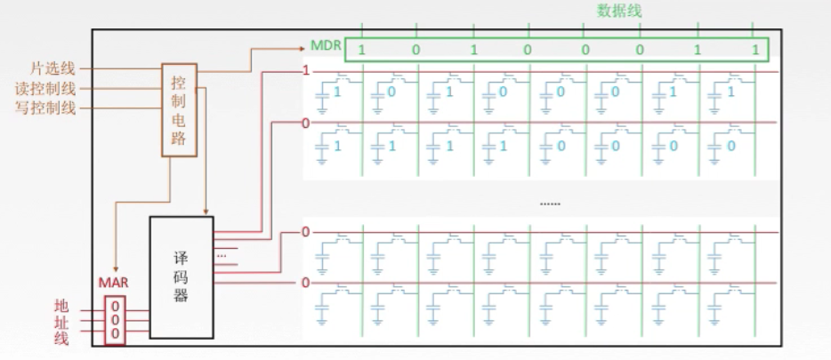
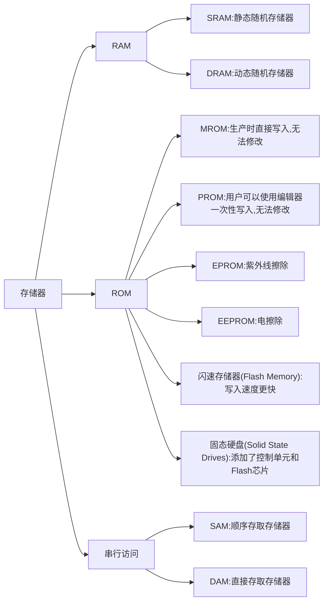
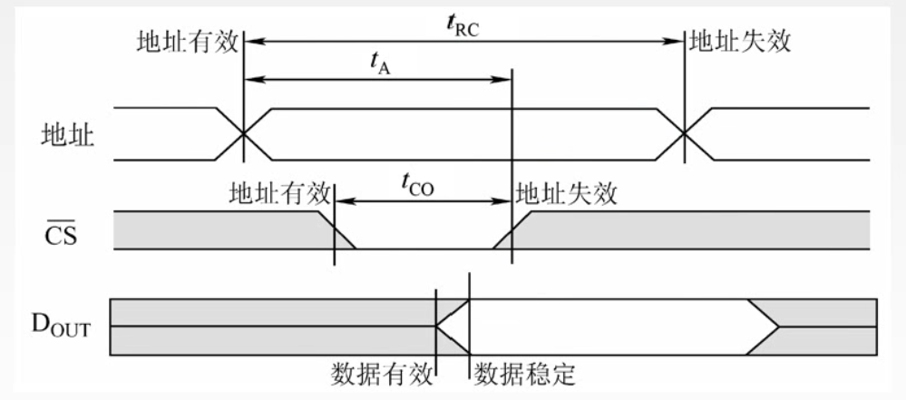
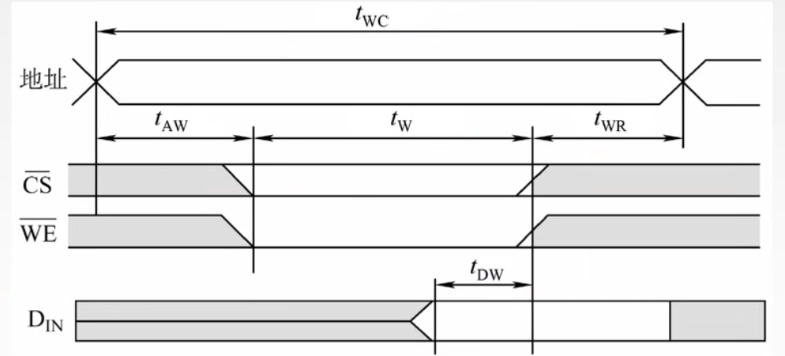
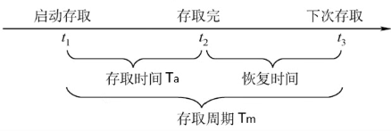
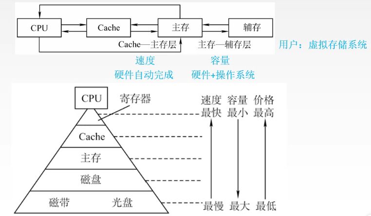
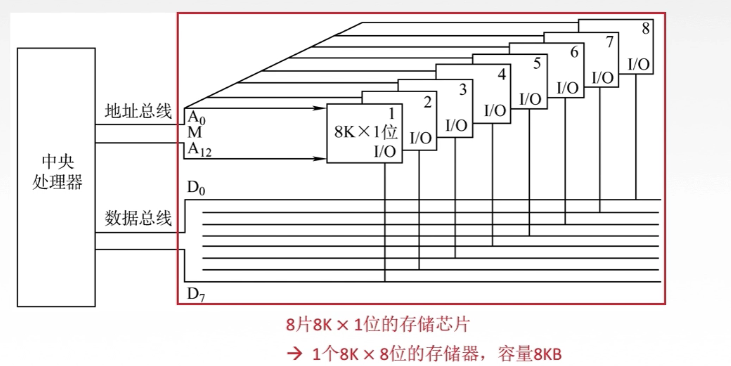
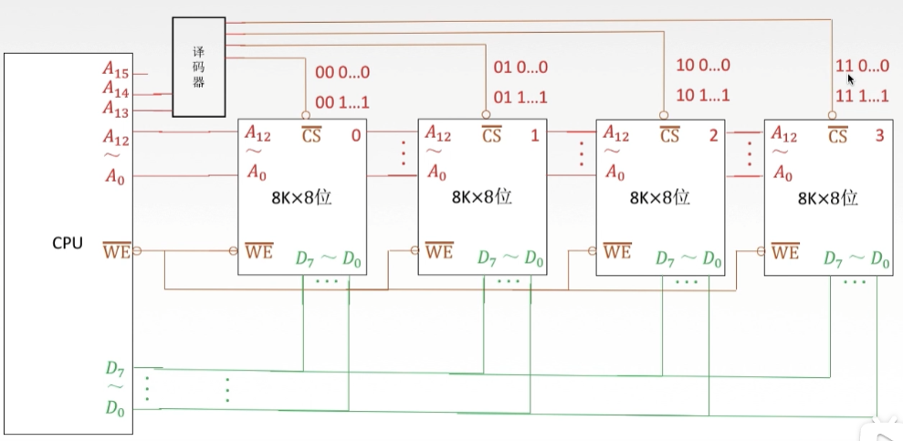
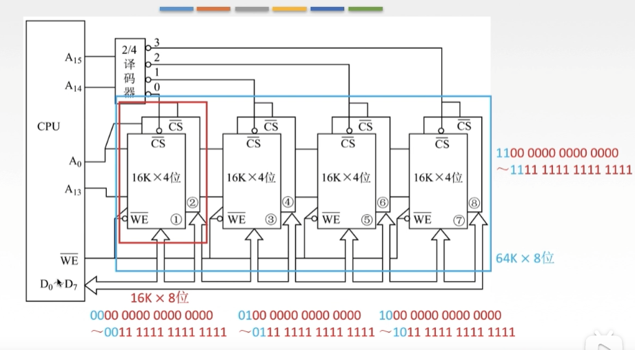
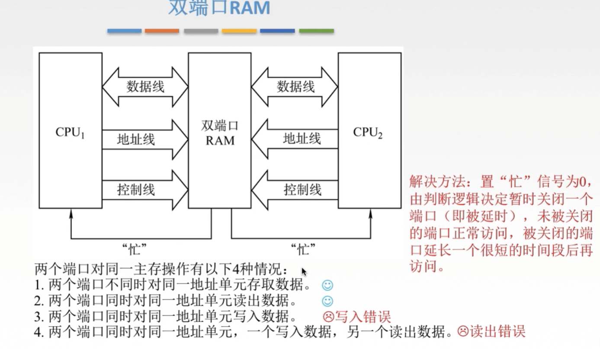

## 主存储器

存储体中有

- 存储体
  - 存放一个二进制位的装置叫做存储元
  - 若干个存储元组成一个存储单元
  - 每个存储单元里有多少个存储元就有多少个存储字
  - 一个存储单元里的多个存储字就是多少存储字长
  - 存储体中还有控制电路和译码器
- MAR ：地址寄存器 暂时存放地址
- MDR ：数据寄存器 暂时存放数据

将取值的地址放入 MAR(地址寄存器)，再经由译码将地址编译，存储体从 MAR 提供的地址中取值放入 MDR(数据寄存器)，这个流程由控制电路来协调实现，

- 这时图中显示有 4 行 4 个存储单元，每行用 1bit 来进行控制，那么就会使用 4bit 来分别读取 4 行的数据，但 4 行数据使用有 4 种状态的 2bit 便可以读取了
- 这时候便有了译码器，译码器的 n 位数就代表可以操作 2n个控制单元
- 控制电路协调整个电路，一般有三条线，
  - 片信号有两个模式，高电平有效和低电平有效，用来控制哪个存储芯片被选中
    - 高电平有效则高电平开，低电平关
    - 低电平有效则低电平开，高电平关
  - 读控制线和写控制线控制读写，有时候会合并成一条读写控制线
- 地址线：由 MAR**单向**输入，其位数与存储字的个数有关
- 数据线：由 MDR**双向**操作，其位数与存储字长相同
- 地址线与数据线共同反应存储芯片容量大小

**n 位地址-->2n个存储单元**
**存储器总容量=存储单元个数 x 存储字长**

常见描述：

例如 8\*8 位的存储芯片

代表 8 个存储单元 x8bit 的存储字长

存储单元数量单位

K：210
M: 220
G: 230
T: 240

所以 8K _ 8bit 就是说 8 _ 1K 的存储单元数量再乘以 8bit 的存储字长

#### 寻址

寻址方式：寻址就是需要多少根地址线才能管理整个存储体

- 按字寻址
  - 按字寻址，一个存储字长占用一根地址线
- 按字节寻址
  - 1Byte 也就是 1 字节为 8bit，在存储器中一个字节占用一根地址线
- 按半字寻址
  - 半个存储字长占用一根地址线
- 按双字寻址
  - 每两个存储字长占用一根地址线

## 半导体存储器

存储器分类

- RAM(random access memory)：随机存储器，速度快，内存,但断电后无法保存信息，所以也叫易失性存储器，还区分 SRAM 和 DRAM
- ROM(read only memory):只读存储器，外存，刚出现时因为无法擦鞋所以叫 ROM，后来出现了新的半导体 EPROM 和 EEPROM 可擦写
- 串行访问存储器：读写时，按照物理地址来先后寻址，区分为顺序存取存储器直接存取存储器
  - SAM:顺序存取存储器(磁带)：只能按照某种顺序存取，速度慢
  - DAM:直接存取存储器(磁盘)：先选定某一区域，在此区域内在顺序寻址

### RAM 介绍

| 类型                                     | SRAM                            | DRAM                               |
| ---------------------------------------- | ------------------------------- | ---------------------------------- |
| 如何存储信息                             | 双稳态触发器                    | 电容                               |
| 破坏性读出(读时是否对存储器进行额外处理) | 非                              | 是 (检测电流，读出后需要重新充电)  |
| 需要刷新                                 | 不要                            | 需要 (电荷一般维持 2ms)            |
| 送行列地址(一般地址分为行地址和列地址)   | 同时送行列地址                  | 分两次送(地址复用技术，组线少一半) |
| 运行速度                                 | 快(因为不需要刷新)              | 慢                                 |
| 集成度                                   | 低 (触发器一般需要六个逻辑元件) | 高 (电容一般一个或三个逻辑元件)    |
| 发热量                                   | 大                              | 小                                 |
| 存储成本                                 | 高                              | 低                                 |
| 常用                                     | Cache                           | 主存                               |
| 发展                                     |                                 | SDRAM (经过发展，主存现在使用的)   |

##### SRAM

SRAM 用来存储一个二进制的双稳态触发器(六晶体管 MOS)就好像一个开关，开关对应着 1 和 0，一个开关被称为存储元，地址码相同的多个存储元组成一个存储单元，若干存储单元组成一个存储体，因此信息被读后，仍可以保持原状(非破坏性读出)，SRAM 因为不需要刷新，所以速度快，但集成度低，功耗大，所以一般用于高速缓冲存储器(Cache)。

##### DRAM

DRAM 是利用存储元电容中的电荷来存储信息的，读时会导出里面的电荷来检测，所以是破坏性读出，因为通常一个晶体管就可以了，所以密度比 SRAM 高，而且使用了地址复用技术，一根线可以同时传送行地址和列地址，所以地址线是原本的 1/2,不过行列地址需要分两次传送

**行列地址**：存储单元保存方式为行列矩阵，n 位的选址内存，需要有 2n根选通线用来链接存储单元，太多了，所以会将存储单元分为 2n/2的行和列，地址会被分为行地址和列地址来寻找存储单元，这样选通线的数量就是 2n/2+2n/2根，每次刷新时，电荷刷新一行
电容上的电荷只能保持 1~2ms，所以需要每 2ms 刷新一次，RAM 的刷新单位是行，这 2ms 称作刷新周期，读写一次时间为一个一个读/写周期，刷新同样占用一个读/写周期，刷新时无法访问存储器，这段时间称为"死区"，常见刷新方式有三种 - **分散刷新**：将刷新分散给读/写周期，每读/写完一行就刷新，这样两个读写周期为一个工作周期，前半段工作周期为读写一行，后半段把这行刷新 - 优点是没有死区，但延长了系统的读/写周期 - **集中刷新** ：指全部行读/写完后，进行刷新， - 优点是读/写时不受刷新影响。所以读写速度较快，缺点是死区时无法访问存储器 - **异步刷新**：前两种的结合，使用刷新周期(2ms)除以行数，得到两次刷新之间的时间间隔 t，使用逻辑电路每隔 t 时间刷新一次，同样有死区，但被平均分散了
**备注**：

1. 刷新对 CPU 是透明的，不依赖于外部访问，
2. DRAM 刷新单位是行，跟列没关系
3. 刷新类似于读操作，但不同，刷新仅给栅极电容补充电荷，不进行信息输出，刷新也不选哟选片，即整个存储器中芯片同时刷新
4. 需要刷新的只有 DRAM，SRAM 不需要

### 存储器的读写周期

#### 存储器读周期

1. 首先地址传送过来，等待稳定，稳定后开启片选线(CS)
2. 芯片进行读地址操作，读取完毕后，关闭片选线，这段时间就是 tCO,同样也用来等待地址稳定。
3. 地址稳定后读取地址中的数据，等数据稳定后，才会让地址失效并关闭数据线
4. 对于最后一段用于保证数据稳定和正确性的时间，就是恢复时间

#### 存储器写周期

1. 地址传送后先等待稳定，随后开启片选线(CS)和读写控制线(WE),这段时间是 tAW
2. 写操作需要一段时间(tW)，写完后关闭片选和读写控制线
3. 写完后同样需要一段时间来恢复

### 存储器的性能指标

1. 存储容量：容量大小=存储单元数量\*存储字长
2. 单位成本：每位价格=总成本/总容量
3. 存储速度：数据传输率=数据的宽度/存储周期

1. 存取时间(Ta):从启动一次存储器操作到完成该操作所经历的时间，分为读出时间和写入时间
2. 存取周期(Tm):存取周期又称为读写周期或访问周期。他是指存储器进行一次完整读写操作所需要的时间，即连续两次独立访问存储器(读写或操作)之间所需要的最小时间间隔
3. 主存带宽(Bm):主存带宽又叫数据传输率，表示每秒从主存进出信息的最大数量，单位为字/秒,字节/秒(B/s),位/秒(b/s).

### 存储器容量扩展

#### 位扩展--线选法

地址线并行传给每个芯片，扩展数据线位数来接受每个芯片的数据

#### 字扩展--译码片选法

字扩展就是数据线不变，将地址线的高位给译码器翻译后用于片选线。

#### 字位同时扩展

**补充考点**：系统程序用 ROM，用户程序用 RAM

## 并行存储器

存储器跟不上 CPU 的速度，为了解决速度匹配问题，可以

- 用更快的主存或加长主存的字长
- 采用并行操作的双端口存储器
- 采用并行存储器
- CPU 和主存间加入 Cache 提速

### 双端口存储器

- 当两个端口对不同地址访问时，不会发生冲突，每个端口有段度的 MAR，MDR，译码器等，就好像两块存储体一样
- 当两端口对同一存储 RAM 进行有写的操作的时候，会导致混乱，所以需要一根线单独用来判断哪个端口延时访问

### 并行主存系统

- 单体多字存储器：按同一地址码并行地访问各自对应单元
- 多体并行存储器：多个相同容量的存储体，各自有独立的 MAR,MDR,译码器
