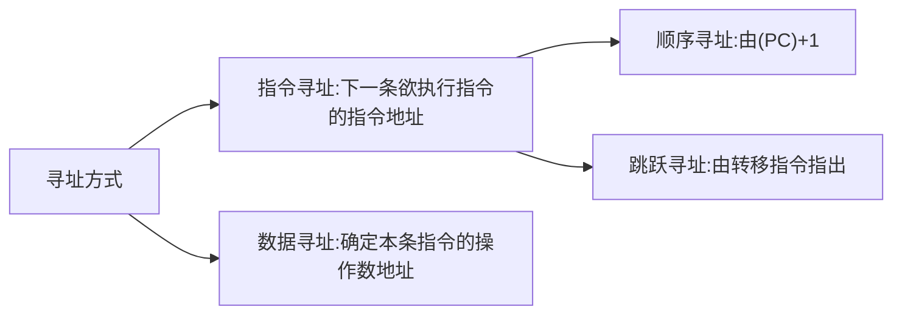

## 指令

- 计算机执行操作的命令
- 计算机运行最小执行单位
- 所有指令的集合后构成指令系统，也叫指令集
  - **注**：计算机只能执行自己的指令集

### 指令格式

指令分为地址码和操作码

- 操作码：用户要做什么
- 地址码：对谁进行操作

**四地址指令**

| OP  | A1  | A2  | A3  | A4  |
| --- | --- | --- | --- | --- |

- (A1)OP(A2)->A3
- A1与A2进行OP操作，结果存入A3，随后执行A4地址的指令

**三地址指令**

| OP  | A1  | A2  | A3  |
| --- | --- | --- | --- |

- (A1)OP(A2)->A3
- 同样A1与A2进行OP操作，结果存入A3，但将所有的地址顺序存入，使用PC自动加一，完成这条指令，PC会自动加1，执行吓一跳指令

**二地址指令**

| OP  | A1  | A2  |
| --- | --- | --- |

- (A1)OP(A2)->A1
- A1与A2进行OP操作，结果存入A1

**一地址指令**

| OP  | A1  |
| --- | --- |

- OP(A1)->A1
- 加一，减一，取反，求补等
- 或者(ACC)OP(A2)->ACC，ACC用来暂时存放结果，并用于下次运算。

**零地址指令**

| OP  |
| --- |

- 不需要操作数，如空操作，停机，关中断等指令
- 堆栈计算机，两个操作数隐含存放在栈顶和次栈顶，计算结果压回栈顶

**注意**：
- 短操作码不能与长操作码前缀相同
- 各指令操作码不能重复
地址码
  - 定长指令字节构：若存储字长不变，每次减少地址指令，其他地址指令会均摊多余的位数可以扩大寻址范围，
  - 变长指令字结构：每次减少地址指令，指令长度随着发生变化
操作码
  - 定长操作码：操作码有n位，便有2n条指令
  - 扩展操作码：操作码长度可变
    - 例如有4位操作码。那么便会有16条(0000~1111)个指令，但只有0000~1110用于存放指令，当系统读到1111时，便会将下一串地址码用于当作操作码

**操作类型**
1. 数据传送

LOAD ： 把存储器中的数据放到寄存器中
STORE ： 把寄存器中的数据放到存储器中

2. 算数逻辑操作

算数：加，减，乘，除，增1，减1，求补，浮点运算，十进制运算
逻辑：与，或，非，异或，位操作，位测试，位清除，位求反

3. 移位操作

算数移位，逻辑移位，循环移位(带进位和不带进位)

4. 转移操作
  
    无条件转义JMP
    条件转移 JZ：结果位0；JO：条件溢出；JC：结果有进位
    调用和返回 CALL和RETURN
    陷阱(Trap)与陷阱指令

5. 输入输出操作
  
    CPU寄存器与IO端口之间的数据传送(端口即IO接口中的寄存器)

### 数据存放

按字编址：每个字节一个地址编号，每个地址中有一个字节的数据
按照字节编址：给一个单元字长的地址

一个字存储单元中有好几个字节存储单元，

- 机器字长：CPU一次能处理的二进制代码  位数
- 指令字长：一个指令字中包含的二进制代码位数
- 存储字长：一个存储单元存储二进制代码位数

**上面这些字长都必须是字节的整数倍**

单字长指令：指令长度=机器字长
半字长指令，双字长指令

#### 指令寻址

