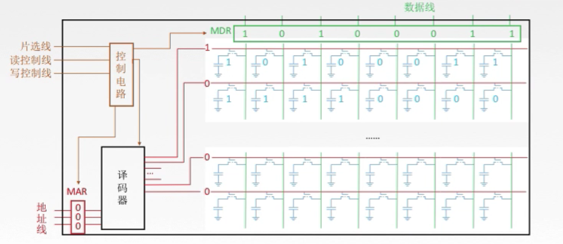
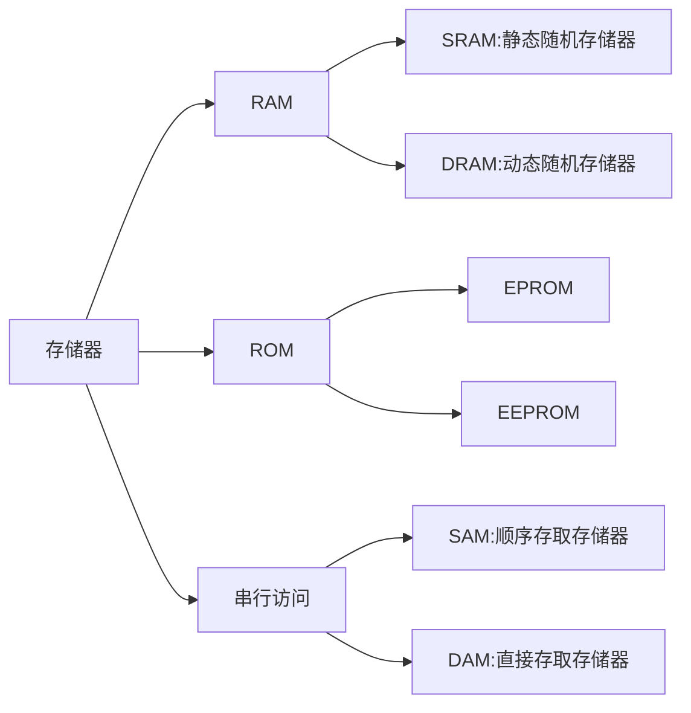

## 主存储器

存储体中有
- 存储体
  - 存放一个二进制位的装置叫做存储元
  - 若干个存储元组成一个存储单元
  - 每个存储单元里有多少个存储元就有多少个存储字
  - 一个存储单元里的多个存储字就是多少存储字长
  - 存储体中还有控制电路和译码器
- MAR ：地址寄存器  暂时存放地址
- MDR ：数据寄存器  暂时存放数据

将取值的地址放入MAR(地址寄存器)，再经由译码将地址编译，存储体从MAR提供的地址中取值放入MDR(数据寄存器)，这个流程由控制电路来协调实现，

右边矩阵是存储体，这个存储体每行代表一个存储单元，图中每行有8个位，就代表有8个存储元，8bit存储字长，每行使用另外的1bit(红线)来控制开关读取，当每行的1bit值为1时，便读取此行的值
- 这时图中显示有4行4个存储单元，每行用1bit来进行控制，那么就会使用4bit来分别读取4行的数据，但4行数据使用有4种状态的2bit便可以读取了
-  这时候便有了译码器，译码器的n位数就代表可以操作2n个控制单元
-  控制电路协调整个电路，一般有三条线，
   -  片信号有两个模式，高电平有效和低电平有效，用来控制哪个存储芯片被选中
      -  高电平有效则高电平开，低电平关
      -  低电平有效则低电平开，高电平关
   - 读控制线和写控制线控制读写，有时候会合并成一条读写控制线
 - 地址线：由MAR**单向**输入，其位数与存储字的个数有关
 - 数据线：由MDR**双向**操作，其位数与读出或写入的数据位数有关
 - 地址线与数据线共同反应存储芯片容量大小

**n位地址-->2n个存储单元**
**存储器总容量=存储单元个数x存储字长**

常见描述：

例如8*8位的存储芯片

代表8个存储单元x8bit的存储字长

存储单元数量单位

K：210
M: 220
G: 230
T: 240

所以8K * 8bit就是说8 * 1K的存储单元数量再乘以8bit的存储字长

#### 寻址
寻址方式：寻址就是需要多少根地址线才能管理整个存储体
- 按字寻址
  - 按字寻址，一个存储字长占用一根地址线
- 按字节寻址
  - 1Byte也就是1字节为8bit，在存储器中一个字节占用一根地址线
- 按半字寻址
  - 每2Byte占用一根地址线
- 按双字寻址
  - 每8Byte占用一根地址线

## 半导体存储器

存储器分类
  - RAM(random access memory)：随机存储器，速度快，内存,但断电后无法保存信息，所以也叫易失性存储器，还区分SRAM和DRAM
  - ROM(read only memory):只读存储器，外存，刚出现时因为无法擦鞋所以叫ROM，后来出现了新的半导体EPROM和EEPROM可擦写
  - 串行访问存储器：读写时，按照物理地址来先后寻址，区分为顺序存取存储器直接存取存储器
    - SAM:顺序存取存储器(磁带)：只能按照某种顺序存取，速度慢
    - DAM:直接存取存储器(磁盘)：先选定某一区域，在此区域内在顺序寻址

