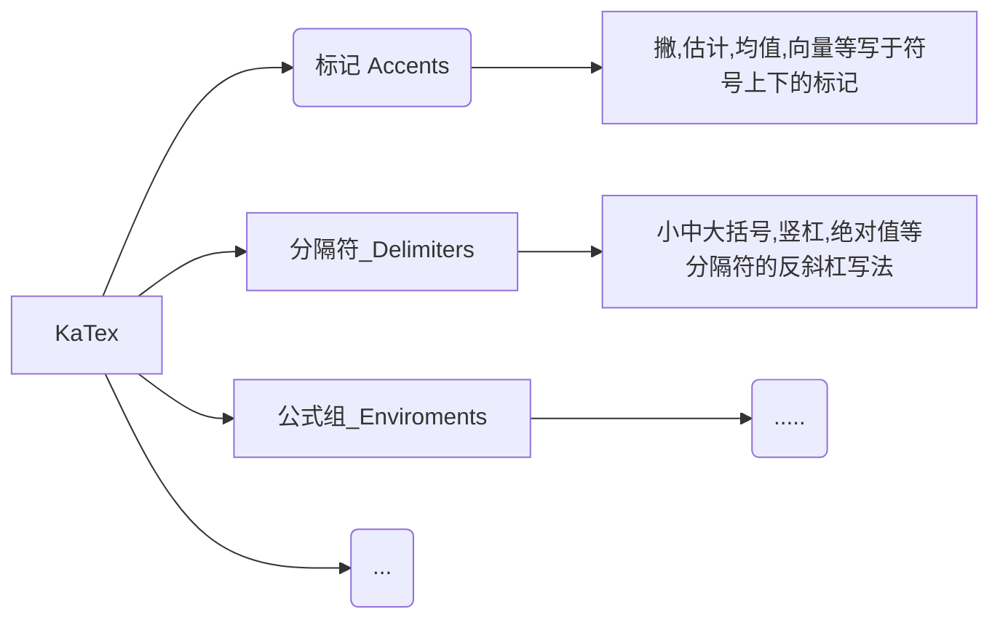
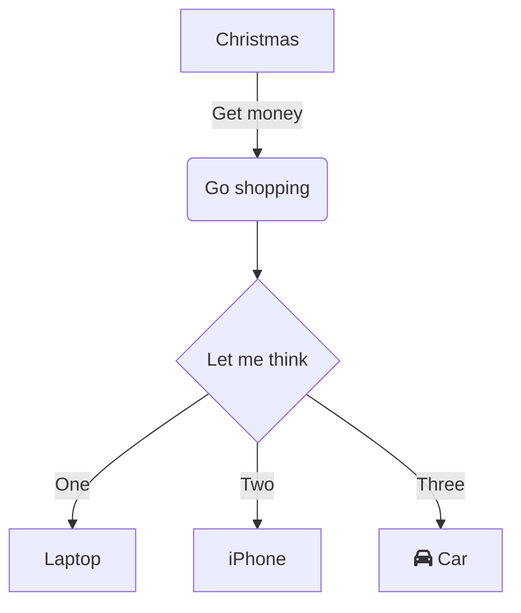

## 计算机系统的概述

**计算机系统=硬件+软件**

```mermaid
	graph LR
	KaTex--> A(标记 Accents)
	A-->撇,估计,均值,向量等写于符号上下的标记
	KaTex--> 分隔符_Delimiters
	分隔符_Delimiters-->小中大括号,竖杠,绝对值等分隔符的反斜杠写法
	KaTex--> 公式组_Enviroments
	公式组_Enviroments-->B(.....)
	KaTex-->C(...)
```

```mermaid
graph TD
    A[Christmas] -->|Get money| B(Go shopping)
    B --> C{Let me think}
    C -->|One| D[Laptop]
    C -->|Two| E[iPhone]
    C -->|Three| F[fa:fa-car Car]
```